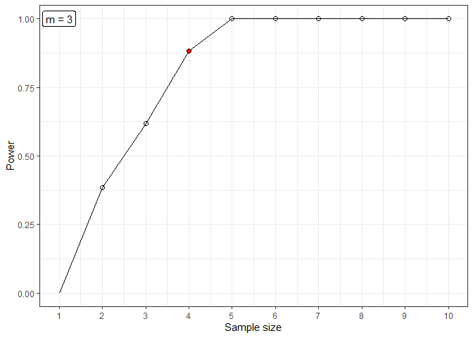

<!-- README.md is generated from README.Rmd. Please edit that file -->

```{r, include = FALSE}
knitr::opts_chunk$set(
  collapse = TRUE,
  comment = "#>",
  fig.path = "man/figures/README-",
  out.width = "100%"
)
library(ecocbo)
```

# ecocbo

<!-- badges: start -->

[](https://github.com/arturoSP/ecocbo/actions/workflows/R-CMD-check.yaml) [](https://github.com/arturoSP/ecocbo/blob/master/LICENSE.md)
 
<!-- badges: end -->

## A Tool for Calculating Optimum Sampling Effort in Community Ecology

**ecocbo** is an R package that helps scientists calculate the optimum sampling effort for community ecology projects. The package is based on the principles developed in the [SSP](https://github.com/edlinguerra/SSP) package, which simulates ecological communities by extracting and using parameters that control the simulation. The simulated communities are then compared with PERMANOVA to estimate their components of variation and consequently the optimal sampling effort.

**ecocbo** is a valuable tool for scientists who need to design efficient sampling plans. The package can help scientists to save time and money by ensuring that they collect the minimum amount of data necessary to achieve their research goals.

## Installation

You can install the development version of ecocbo from [GitHub](https://github.com/) with:

``` r
# install.packages("devtools")
devtools::install_github("edlinguerra/ecocbo")
```

## Example

This is a basic example which shows you how to use the different functions in the package:

### Prepare the data

```{r eval=FALSE}
# Load data and adjust it.
data(epiDat)

epiH0 <- epiDat
epiH0[,"site"] <- as.factor("T0")
epiHa <- epiDat
epiHa[,"site"] <- as.factor(epiHa[,"site"])

# Calculate simulation parameters.
parH0 <- SSP::assempar(data = epiH0, type = "counts", Sest.method = "average")
parHa <- SSP::assempar(data = epiHa, type = "counts", Sest.method = "average")

# Simulation.
simH0Dat <- SSP::simdata(parH0, cases = 3, N = 1000, sites = 1)
simHaDat <- SSP::simdata(parHa, cases = 3, N = 100, sites = 10)

```

### Calculate statistical power

```{r}
betaResult <- sim_beta(simH0 = simH0Dat, simHa = simHaDat, 
                       n = 10, m = 3, k = 20, alpha = 0.05)
betaResult

```

### Plot the power progression as sampling increases.

```{r eval=FALSE}
plot_power(data = betaResult, n = NULL, m = 3, method = "power")

```



### Calculate components of variation.

```{r}
compVar <- scompvar(data = betaResult)
compVar

```

### Determine optimal sampling effort

The sampling effort can be evaluated depending on an economic budget (ct) or desired precision level (multSE), depending on the proposed parameter, the function will calculate optimal values for number of treatments (bOpt) and replicates (nOpt).

```{r}
cboCost <- sim_cbo(comp.var = compVar, ct = 20000, ck = 100, cj = 2500)
cboPrecision <- sim_cbo(comp.var = compVar, multSE = 0.10, ck = 100, cj = 2500)
cboCost
cboPrecision

```

## R packages required for running ecocbo

- Required: ggplot2, ggpubr, sampling, stats, vegan
- Suggested: SSP, knitr, rmarkdown, testthat
    
## Sponsored by

{height=121}  {height=121} 
