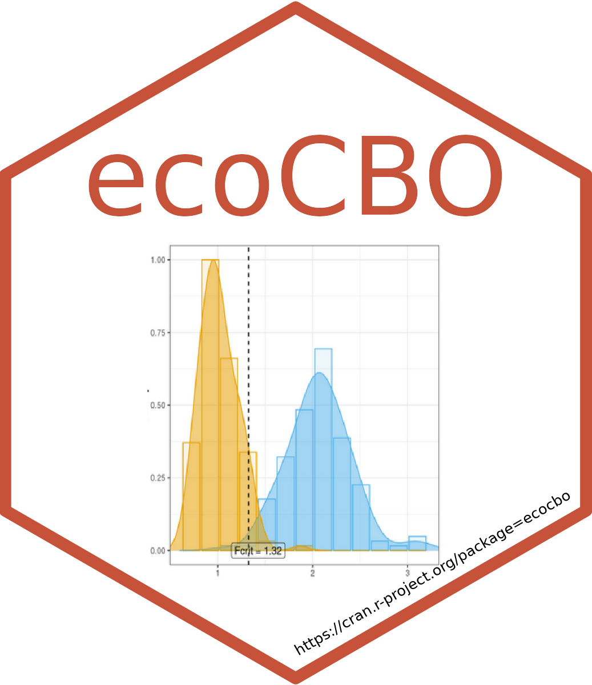
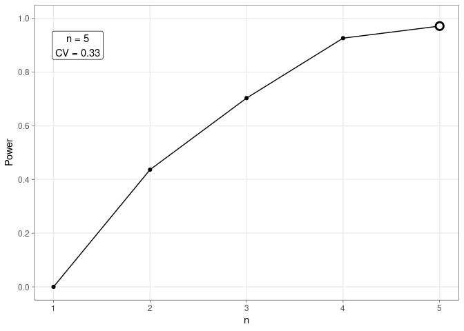

<!-- README.md is generated from README.Rmd. Please edit that file -->

# ecocbo <a href="https://cran.r-project.org/package=ecocbo"></a>

<!-- badges: start -->

[](https://github.com/arturoSP/ecocbo/actions/workflows/R-CMD-check.yaml)
[](https://github.com/arturoSP/ecocbo/blob/master/LICENSE.md)
[](https://cran.r-project.org/package=ecocbo)
[](https://github.com/arturoSP/ecocbo/tree/master)


<!-- badges: end -->

## Calculating Optimum Sampling Effort in Community Ecology

**ecocbo** is an R package that helps scientists calculate the optimum
sampling effort for community ecology projects. The package is based on
the principles developed in the
[SSP](https://github.com/edlinguerra/SSP) package, which simulates
ecological communities by extracting and using parameters that control
the simulation. The simulated communities are then compared with
PERMANOVA to estimate their components of variation and consequently the
optimal sampling effort.

**ecocbo** is a valuable tool for scientists who need to design
efficient sampling plans. The package can help scientists to save time
and money by ensuring that they collect the minimum amount of data
necessary to achieve their research goals.

## Installation

You can easily obtain ‘ecocbo’ from CRAN:

``` r
install.packages("ecocbo")
```

Alternatively, you can install the development version of ecocbo from
[GitHub](https://github.com/):

``` r
install.packages("devtools")
devtools::install_github("arturoSP/ecocbo")
```

## Example

This is a basic example which shows you how to use the different
functions in the package:

### Prepare the data

``` r
# Load data and pre-process it.
data(epiDat)

simResults <- prep_data(data = epiDat, 
                        type = "counts", Sest.method = "average",
                        cases = 5, N = 100, M = 10,
                        n = 5, m = 5, k = 30,
                        transformation = "none", method = "bray",
                        dummy = FALSE, useParallel = FALSE,
                        model = "single.factor")
```

### Calculate components of variation.

``` r
compVar <- scompvar(data = simResults)
compVar
#>     Source Est.var.comp
#> 1 Residual     0.331926
```

### Determine optimal sampling effort

The sampling effort can be evaluated depending on an economic budget
(ct) or desired precision level (multSE), depending on the proposed
parameter, the function will calculate optimal values for number of
treatments (bOpt) and replicates (nOpt).

``` r
cboCost <- sim_cbo(comp.var = compVar, budget = 20000, 
                   a = 3, ca = 100, cn = 2500)
cboCost
#>   nOpt
#> 1    7
```

``` r
cboPrecision <- sim_cbo(comp.var = compVar, multSE = 0.10, cn = 100, cm = 2500)
cboPrecision
#>   nOpt
#> 1   33
```

## Additionally…

### Calculate statistical power

``` r
betaResult <- sim_beta(simResults, alpha = 0.05)
betaResult
#> $Power
#>   n     Power       Beta    fCrit
#> 1 2 0.4366667 0.56333333 1.491241
#> 2 3 0.7033333 0.29666667 1.462984
#> 3 4 0.9266667 0.07333333 1.408674
#> 4 5 0.9716194 0.02838063 1.332345
#> 
#> $Results
#>      dat.sim  k m n pseudoFH0 pseudoFHa       MSA       MSR
#> 1          1  1 2 2 0.3665672 3.5187731 0.6563363 0.1865242
#> 2          1  2 2 2 1.4168028 2.0392052 0.6215481 0.3047992
#> 3          1  3 2 2 0.9469246 1.0318299 0.4156565 0.4028343
#> 4          1  4 2 2 0.6477698 2.2828041 0.5638390 0.2469940
#> 5          1  5 2 2 1.2753714 1.4272990 0.4593535 0.3218341
#> 6          1  6 2 2 1.3135351 1.5250399 0.3718746 0.2438458
#> 7          1  7 2 2 0.4197847 0.9657628 0.4202753 0.4351745
#> 8          1  8 2 2 1.0698888 1.1616572 0.4764994 0.4101893
#> 9          1  9 2 2 0.7130566 1.0108363 0.3828005 0.3786968
#> 10         1 10 2 2 1.7387194 0.7089097 0.1648900 0.2325967
#> 11         1 11 2 2 1.9221556 2.5096464 0.7017711 0.2796295
#> 12         1 12 2 2 0.6399438 2.7096876 0.4512877 0.1665460
#> 13         1 13 2 2 0.7466859 1.8438326 0.6125238 0.3322014
#> 14         1 14 2 2 1.0022942 1.1670679 0.4080877 0.3496692
#> 15         1 15 2 2 0.8620499 1.2109002 0.5017948 0.4143981
#> 16         1 16 2 2 1.3359528 1.7239211 0.5798660 0.3363646
#> 17         1 17 2 2 1.1121666 2.2899730 0.5914194 0.2582648
#> 18         1 18 2 2 1.1108694 2.5800227 0.6406999 0.2483311
#> 19         1 19 2 2 1.1185540 1.3961486 0.3533846 0.2531139
#> 20         1 20 2 2 1.1189224 1.5202912 0.5219398 0.3433157
#> 21         1 21 2 2 1.0392773 1.0535727 0.3226758 0.3062682
#> 22         1 22 2 2 0.7654692 1.0874677 0.4633693 0.4260994
#> 23         1 23 2 2 0.8873602 0.8915145 0.4043461 0.4535496
#> 24         1 24 2 2 0.8350079 2.1716007 0.6003622 0.2764607
#> 25         1 25 2 2 0.9382869 1.8089868 0.6246635 0.3453113
#> 26         1 26 2 2 1.0077176 1.3348284 0.4391008 0.3289567
#> 27         1 27 2 2 1.3196737 1.3843303 0.4380294 0.3164197
#> 28         1 28 2 2 0.6656568 3.8504640 0.7248571 0.1882519
#> 29         1 29 2 2 0.8433773 1.2018854 0.3103156 0.2581906
#> 30         1 30 2 2 0.7924223 1.3527189 0.4376133 0.3235065
#> 31         1  1 3 2 0.8277874 1.1626787 0.4154843 0.3573509
#> 32         1  2 3 2 0.8624099 1.0787528 0.4017470 0.3724181
#> 33         1  3 3 2 1.1895844 1.4954958 0.4985073 0.3333392
#> 34         1  4 3 2 1.0516520 1.6276209 0.5005157 0.3075137
#> 35         1  5 3 2 0.8323100 1.6366498 0.5051272 0.3086348
#> 36         1  6 3 2 0.9385776 1.3471739 0.4932770 0.3661569
#> 37         1  7 3 2 0.7431760 2.3908892 0.6126525 0.2562446
#> 38         1  8 3 2 0.8838766 1.5286608 0.4140241 0.2708411
#> 39         1  9 3 2 0.6689108 2.5259464 0.5084590 0.2012945
#> 40         1 10 3 2 0.9190322 1.4001302 0.4530452 0.3235736
#> 41         1 11 3 2 0.9941072 1.0053386 0.4012455 0.3991148
#> 42         1 12 3 2 1.1139424 1.5314752 0.4715764 0.3079230
#> 43         1 13 3 2 1.0257093 1.2403420 0.4503277 0.3630674
#> 44         1 14 3 2 0.9425776 1.2290104 0.2956802 0.2405840
#> 45         1 15 3 2 1.0648320 0.8838909 0.3577033 0.4046917
#> 46         1 16 3 2 0.9704307 1.2847865 0.4787577 0.3726360
#> 47         1 17 3 2 1.2751153 1.4237839 0.4076864 0.2863401
#> 48         1 18 3 2 1.2274677 1.3765955 0.4785154 0.3476078
#> 49         1 19 3 2 0.8113415 1.3068377 0.4095317 0.3133761
#> 50         1 20 3 2 1.6392923 2.0337111 0.5693504 0.2799564
#> 51         1 21 3 2 1.3211922 1.9673444 0.5442437 0.2766388
#> 52         1 22 3 2 0.8380562 1.0406629 0.3990030 0.3834124
#> 53         1 23 3 2 1.5332806 1.8367534 0.5121882 0.2788552
#> 54         1 24 3 2 1.1398972 1.3746288 0.4573843 0.3327330
#> 55         1 25 3 2 0.6364332 1.2705004 0.3656500 0.2878000
#> 56         1 26 3 2 1.4171168 1.5256905 0.5451522 0.3573151
#> 57         1 27 3 2 0.9027899 2.4913897 0.5749610 0.2307792
#> 58         1 28 3 2 1.0427577 1.5707798 0.4295325 0.2734517
#> 59         1 29 3 2 0.9252748 1.4922273 0.5446432 0.3649867
#> 60         1 30 3 2 0.5754769 1.5511628 0.4457478 0.2873636
#> 61         1  1 4 2 0.9101343 1.0197203 0.3698866 0.3627334
#> 62         1  2 4 2 0.9710996 1.1537216 0.4430547 0.3840222
#> 63         1  3 4 2 0.7820402 0.9783087 0.4043431 0.4133083
#> 64         1  4 4 2 1.0947591 1.0890659 0.3625894 0.3329361
#> 65         1  5 4 2 1.1696199 1.3169312 0.4384271 0.3329157
#> 66         1  6 4 2 1.2236652 1.8864174 0.5511412 0.2921629
#> 67         1  7 4 2 1.2455011 1.8546565 0.4841220 0.2610305
#> 68         1  8 4 2 0.7330335 1.9017062 0.5116066 0.2690250
#> 69         1  9 4 2 0.8446529 1.4616950 0.4678082 0.3200450
#> 70         1 10 4 2 0.9150410 1.2308832 0.4145558 0.3367954
#> 71         1 11 4 2 1.0621355 1.7934646 0.5194179 0.2896170
#> 72         1 12 4 2 0.9218410 2.2252109 0.5334230 0.2397180
#> 73         1 13 4 2 1.8875209 0.9660902 0.2853952 0.2954126
#> 74         1 14 4 2 0.7894621 1.3951965 0.4830829 0.3462472
#> 75         1 15 4 2 1.0963209 1.7972084 0.5018083 0.2792154
#> 76         1 16 4 2 0.9196183 1.1706180 0.4381266 0.3742695
#> 77         1 17 4 2 1.1080026 1.6512740 0.4742290 0.2871898
#> 78         1 18 4 2 1.0111714 1.4800994 0.4842377 0.3271657
#> 79         1 19 4 2 0.8286357 1.5321273 0.5073248 0.3311244
#> 80         1 20 4 2 1.5494638 1.4516741 0.5063580 0.3488097
#> 81         1 21 4 2 0.7345647 1.0111864 0.3875852 0.3832975
#> 82         1 22 4 2 1.0032716 1.9253722 0.5000294 0.2597053
#> 83         1 23 4 2 1.4807393 1.4478124 0.4987797 0.3445058
#> 84         1 24 4 2 1.1213336 1.7742405 0.5017141 0.2827768
#> 85         1 25 4 2 1.6194447 1.3064694 0.4817480 0.3687403
#> 86         1 26 4 2 0.7551166 1.4592842 0.4831696 0.3311004
#> 87         1 27 4 2 1.4892851 1.3494621 0.4561994 0.3380602
#> 88         1 28 4 2 1.1989392 1.4399314 0.5038413 0.3499064
#> 89         1 29 4 2 0.9766089 1.8388018 0.4519900 0.2458068
#> 90         1 30 4 2 1.1200341 1.6697418 0.5067996 0.3035198
#> 91         1  1 5 2 1.2808642 1.0524204 0.4342184 0.4125902
#> 92         1  2 5 2 1.1497130 1.6947669 0.5128745 0.3026224
#> 93         1  3 5 2 0.9149159 1.4551828 0.4557805 0.3132119
#> 94         1  4 5 2 1.1039985 1.3583833 0.4553633 0.3352244
#> 95         1  5 5 2 0.9096323 1.1794498 0.4384325 0.3717263
#> 96         1  6 5 2 0.6545904 0.9370204 0.4159562 0.4439137
#> 97         1  7 5 2 1.0534468 1.3022963 0.4109046 0.3155231
#> 98         1  8 5 2 0.7624263 1.2909451 0.4485250 0.3474392
#> 99         1  9 5 2 1.0807821 1.2141408 0.4495669 0.3702757
#> 100        1 10 5 2 0.8357763 1.1028212 0.4314743 0.3912459
#> 101        1 11 5 2 0.7262126 2.1197910 0.5087462 0.2399983
#> 102        1 12 5 2 0.7709197 1.5342415 0.4875463 0.3177768
#> 103        1 13 5 2 0.9920634 1.3366935 0.4390814 0.3284832
#> 104        1 14 5 2 1.0405063 1.4864641 0.4775706 0.3212796
#> 105        1 15 5 2 0.9679563 1.5715229 0.4459325 0.2837582
#> 106        1 16 5 2 1.3354557 1.0556667 0.3902570 0.3696782
#> 107        1 17 5 2 0.9345289 1.1636948 0.3855461 0.3313121
#> 108        1 18 5 2 1.2493052 1.1121385 0.3858558 0.3469494
#> 109        1 19 5 2 0.7902398 2.3661015 0.4683665 0.1979486
#> 110        1 20 5 2 0.9013235 1.8995326 0.5528879 0.2910652
#> 111        1 21 5 2 1.0047788 1.2831778 0.4352048 0.3391617
#> 112        1 22 5 2 1.3177641 1.2703643 0.4206337 0.3311126
#> 113        1 23 5 2 0.7451594 1.2818729 0.4303654 0.3357317
#> 114        1 24 5 2 1.3561530 1.1390710 0.4254180 0.3734780
#> 115        1 25 5 2 1.0607188 1.2026964 0.4118598 0.3424470
#> 116        1 26 5 2 0.9711752 1.3789743 0.4580549 0.3321707
#> 117        1 27 5 2 1.0257247 1.1946521 0.4299794 0.3599202
#> 118        1 28 5 2 1.0472721 1.0873356 0.4125168 0.3793832
#> 119        1 29 5 2 1.1876424 1.7871744 0.4912462 0.2748731
#> 120        1 30 5 2 0.8370879 1.6939473 0.5097978 0.3009526
#> 121        1  1 2 3 1.4848165 2.2691652 0.5710141 0.2516406
#> 122        1  2 2 3 0.8638382 1.3159462 0.5032459 0.3824214
#> 123        1  3 2 3 1.3947893 0.4569756 0.1894047 0.4144744
#> 124        1  4 2 3 1.2378103 3.0539358 0.8516347 0.2788646
#> 125        1  5 2 3 1.4494167 1.5346261 0.4986068 0.3249044
#> 126        1  6 2 3 0.6336157 1.3006146 0.3852807 0.2962298
#> 127        1  7 2 3 0.7196452 1.0508575 0.4155371 0.3954267
#> 128        1  8 2 3 0.8365922 2.8561659 0.8316131 0.2911641
#> 129        1  9 2 3 0.8423348 2.4219534 0.6920783 0.2857521
#> 130        1 10 2 3 1.0529161 1.6444186 0.6176031 0.3755753
#> 131        1 11 2 3 1.0630080 4.7018053 0.8974954 0.1908832
#> 132        1 12 2 3 0.9922959 2.6519155 0.7687330 0.2898784
#> 133        1 13 2 3 1.5018115 2.4307939 0.7750957 0.3188653
#> 134        1 14 2 3 0.9785054 1.8922043 0.5582491 0.2950258
#> 135        1 15 2 3 1.0134105 0.9165614 0.3519479 0.3839873
#> 136        1 16 2 3 1.4857977 1.5244801 0.5671882 0.3720535
#> 137        1 17 2 3 1.2415883 1.3488863 0.4879302 0.3617282
#> 138        1 18 2 3 0.6689251 1.3114753 0.4500888 0.3431927
#> 139        1 19 2 3 1.2324040 1.1225310 0.4332084 0.3859211
#> 140        1 20 2 3 1.0876277 1.1229676 0.4404514 0.3922209
#> 141        1 21 2 3 1.1040717 1.2007381 0.3784687 0.3151967
#> 142        1 22 2 3 0.9655842 1.9140621 0.6101236 0.3187585
#> 143        1 23 2 3 1.3570829 2.1746540 0.7335771 0.3373305
#> 144        1 24 2 3 0.7126393 1.1846886 0.4393916 0.3708920
#> 145        1 25 2 3 0.6319432 1.0754419 0.3514164 0.3267646
#> 146        1 26 2 3 1.2958272 2.0012184 0.6379678 0.3187897
#> 147        1 27 2 3 0.7961074 1.8926699 0.6403944 0.3383550
#> 148        1 28 2 3 1.3212761 1.6190873 0.5444104 0.3362453
#> 149        1 29 2 3 0.4799986 0.9918215 0.4008722 0.4041777
#> 150        1 30 2 3 0.8916364 1.0537460 0.4161196 0.3948955
#> 151        1  1 3 3 1.2955552 1.7306451 0.5521334 0.3190333
#> 152        1  2 3 3 1.1131723 1.2851247 0.4948778 0.3850815
#> 153        1  3 3 3 1.1319502 1.7824619 0.5556192 0.3117145
#> 154        1  4 3 3 1.0246786 2.1190623 0.6482609 0.3059187
#> 155        1  5 3 3 0.8714931 1.4501073 0.4269084 0.2943978
#> 156        1  6 3 3 1.0893466 1.3312996 0.4600081 0.3455331
#> 157        1  7 3 3 1.2884450 1.5548809 0.5736703 0.3689481
#> 158        1  8 3 3 0.8446752 0.9528136 0.3591806 0.3769684
#> 159        1  9 3 3 0.8543652 2.1248476 0.5765123 0.2713194
#> 160        1 10 3 3 0.8868076 1.8151544 0.6165728 0.3396806
#> 161        1 11 3 3 1.1133299 1.4983879 0.4698030 0.3135389
#> 162        1 12 3 3 0.8353619 1.7861119 0.5920301 0.3314631
#> 163        1 13 3 3 1.1192529 1.4969940 0.5258233 0.3512528
#> 164        1 14 3 3 0.7738141 1.2689189 0.4623577 0.3643713
#> 165        1 15 3 3 0.7920423 1.7136019 0.5671670 0.3309794
#> 166        1 16 3 3 1.6010078 1.5709809 0.4982743 0.3171740
#> 167        1 17 3 3 0.9745212 1.3318787 0.5005359 0.3758119
#> 168        1 18 3 3 0.8180184 1.8698723 0.5995608 0.3206427
#> 169        1 19 3 3 0.5685036 1.5554338 0.4984579 0.3204623
#> 170        1 20 3 3 0.8679473 1.7389984 0.5687272 0.3270430
#> 171        1 21 3 3 1.0425695 1.6185604 0.4962560 0.3066033
#> 172        1 22 3 3 1.3930396 1.6592888 0.5828243 0.3512495
#> 173        1 23 3 3 1.0643727 1.0655264 0.3631190 0.3407884
#> 174        1 24 3 3 0.8230227 2.0133056 0.6313153 0.3135715
#> 175        1 25 3 3 0.9891341 1.4936649 0.5005581 0.3351208
#> 176        1 26 3 3 0.9343813 1.2215771 0.4361227 0.3570161
#> 177        1 27 3 3 1.1593295 1.1788133 0.4694122 0.3982074
#> 178        1 28 3 3 0.9877621 2.0467955 0.6352928 0.3103841
#> 179        1 29 3 3 1.3030367 1.3004476 0.4613810 0.3547863
#> 180        1 30 3 3 1.4018530 1.6630333 0.5568515 0.3348408
#> 181        1  1 4 3 1.1573453 1.1498902 0.4297247 0.3737094
#> 182        1  2 4 3 0.9121984 1.2036672 0.3980404 0.3306897
#> 183        1  3 4 3 1.7383944 1.5349400 0.5122940 0.3337551
#> 184        1  4 4 3 1.4633469 1.5571871 0.5294405 0.3399980
#> 185        1  5 4 3 0.7421819 1.3146408 0.4502738 0.3425071
#> 186        1  6 4 3 0.8905406 1.4539446 0.5031689 0.3460716
#> 187        1  7 4 3 1.0957163 1.8708848 0.5546205 0.2964482
#> 188        1  8 4 3 1.2441430 1.5028527 0.5570097 0.3706349
#> 189        1  9 4 3 1.1477862 1.2999031 0.4795651 0.3689237
#> 190        1 10 4 3 0.8354154 1.4045353 0.4603252 0.3277420
#> 191        1 11 4 3 1.1353048 1.5713428 0.4898262 0.3117246
#> 192        1 12 4 3 0.9944520 1.1550018 0.4570109 0.3956798
#> 193        1 13 4 3 0.8869325 1.8308992 0.6034436 0.3295887
#> 194        1 14 4 3 0.8696748 1.7396226 0.5560581 0.3196430
#> 195        1 15 4 3 1.0165835 1.3090894 0.4698455 0.3589102
#> 196        1 16 4 3 0.8063852 1.2777859 0.3967366 0.3104876
#> 197        1 17 4 3 1.3573751 1.0798016 0.3671938 0.3400568
#> 198        1 18 4 3 1.0004814 1.3403017 0.4175516 0.3115355
#> 199        1 19 4 3 0.9043608 1.1344793 0.4479675 0.3948662
#> 200        1 20 4 3 0.9535938 1.7365982 0.5456780 0.3142224
#> 201        1 21 4 3 0.5897885 1.3503290 0.4966917 0.3678301
#> 202        1 22 4 3 1.2001124 1.9196500 0.5354094 0.2789099
#> 203        1 23 4 3 1.2209643 1.6158185 0.5858742 0.3625867
#> 204        1 24 4 3 1.1181650 1.7673158 0.4739259 0.2681614
#> 205        1 25 4 3 0.9125753 1.6475932 0.5847427 0.3549072
#> 206        1 26 4 3 0.8248073 1.8086993 0.6078419 0.3360658
#> 207        1 27 4 3 1.0723136 1.6018886 0.4932532 0.3079198
#> 208        1 28 4 3 0.7571528 1.5818810 0.5028565 0.3178851
#> 209        1 29 4 3 0.9785381 1.7677538 0.4986989 0.2821088
#> 210        1 30 4 3 1.0266313 1.2801704 0.4802701 0.3751611
#> 211        1  1 5 3 0.8314774 1.1020008 0.4150175 0.3766036
#> 212        1  2 5 3 1.5099695 2.2188355 0.6230325 0.2807926
#> 213        1  3 5 3 0.8145182 1.6255986 0.5365928 0.3300894
#> 214        1  4 5 3 0.9730648 1.6675703 0.5526667 0.3314203
#> 215        1  5 5 3 1.3037274 1.3905922 0.4787816 0.3443005
#> 216        1  6 5 3 0.8907844 1.4302882 0.4325283 0.3024064
#> 217        1  7 5 3 0.8485722 1.4990029 0.5138244 0.3427774
#> 218        1  8 5 3 0.9121022 1.6895720 0.5790758 0.3427352
#> 219        1  9 5 3 1.0514222 1.2132666 0.4164590 0.3432543
#> 220        1 10 5 3 0.9767359 1.9207433 0.6304640 0.3282396
#> 221        1 11 5 3 1.2559083 1.8271667 0.5500369 0.3010327
#> 222        1 12 5 3 1.1306852 1.7394502 0.6021376 0.3461655
#> 223        1 13 5 3 0.9734313 1.9616304 0.5957932 0.3037235
#> 224        1 14 5 3 0.9705317 1.8385038 0.5722728 0.3112709
#> 225        1 15 5 3 0.9246937 1.8728656 0.5687906 0.3037007
#> 226        1 16 5 3 1.2487307 1.5017672 0.4752502 0.3164607
#> 227        1 17 5 3 0.7056039 1.7553311 0.5762890 0.3283078
#> 228        1 18 5 3 0.8463710 1.5085815 0.5393581 0.3575266
#> 229        1 19 5 3 0.9971989 1.6813326 0.5636316 0.3352291
#> 230        1 20 5 3 1.3416893 1.7022487 0.5273599 0.3098019
#> 231        1 21 5 3 1.2535885 1.8825293 0.5958155 0.3164973
#> 232        1 22 5 3 0.8285224 1.4902599 0.5256844 0.3527468
#> 233        1 23 5 3 0.9077677 1.6776249 0.5735424 0.3418776
#> 234        1 24 5 3 0.8509003 1.5671204 0.5283345 0.3371372
#> 235        1 25 5 3 1.0381501 2.1155368 0.6178242 0.2920413
#> 236        1 26 5 3 1.1233080 1.6004422 0.4961846 0.3100297
#> 237        1 27 5 3 0.9979962 1.5933496 0.5179787 0.3250879
#> 238        1 28 5 3 0.7501080 1.4368822 0.4696230 0.3268347
#> 239        1 29 5 3 0.9293114 1.6061315 0.5414467 0.3371123
#> 240        1 30 5 3 0.8393358 1.7462701 0.5535225 0.3169742
#> 241        1  1 2 4 0.7649587 2.8481166 0.8474558 0.2975495
#> 242        1  2 2 4 0.9220735 1.7592266 0.6215049 0.3532830
#> 243        1  3 2 4 0.9812234 1.3503783 0.4899187 0.3628011
#> 244        1  4 2 4 0.4960360 1.8122153 0.6080466 0.3355267
#> 245        1  5 2 4 1.3738090 2.2965788 0.7207313 0.3138282
#> 246        1  6 2 4 0.9059126 2.0759932 0.6206438 0.2989624
#> 247        1  7 2 4 0.8225655 2.0967613 0.7081071 0.3377147
#> 248        1  8 2 4 1.0386955 3.5426912 0.8938198 0.2522997
#> 249        1  9 2 4 0.4446859 1.4130796 0.5290811 0.3744171
#> 250        1 10 2 4 1.2745120 2.5759639 0.6984243 0.2711312
#> 251        1 11 2 4 0.8141748 1.3842873 0.5435135 0.3926305
#> 252        1 12 2 4 0.8596499 1.0901168 0.4048983 0.3714266
#> 253        1 13 2 4 1.2630348 1.9772043 0.6657049 0.3366900
#> 254        1 14 2 4 1.2371216 3.4650770 0.9162457 0.2644229
#> 255        1 15 2 4 0.9856615 2.2098524 0.6668772 0.3017745
#> 256        1 16 2 4 1.1695688 1.5988183 0.5053110 0.3160528
#> 257        1 17 2 4 0.7319609 3.3651404 0.9057412 0.2691541
#> 258        1 18 2 4 0.9534034 1.5902252 0.5380951 0.3383766
#> 259        1 19 2 4 0.6908908 2.4601803 0.6674910 0.2713179
#> 260        1 20 2 4 0.7165883 1.9235769 0.6438391 0.3347093
#> 261        1 21 2 4 1.5237974 1.8733741 0.6309685 0.3368086
#> 262        1 22 2 4 1.2900567 1.8478399 0.6088701 0.3295037
#> 263        1 23 2 4 0.9277276 2.7367808 0.7950772 0.2905155
#> 264        1 24 2 4 0.9516174 2.0039436 0.6293070 0.3140343
#> 265        1 25 2 4 1.1307952 1.1964240 0.3953217 0.3304194
#> 266        1 26 2 4 0.7782895 2.5838396 0.7757694 0.3002390
#> 267        1 27 2 4 0.9122977 1.1078050 0.4031418 0.3639104
#> 268        1 28 2 4 0.8694853 1.7312408 0.5784147 0.3341042
#> 269        1 29 2 4 0.9732287 1.9401223 0.5842089 0.3011196
#> 270        1 30 2 4 1.0037774 1.5142642 0.5696452 0.3761861
#> 271        1  1 3 4 0.9897863 1.7992019 0.6337113 0.3522180
#> 272        1  2 3 4 0.7339522 1.4542984 0.5144216 0.3537249
#> 273        1  3 3 4 1.0795258 2.0672462 0.6449359 0.3119783
#> 274        1  4 3 4 1.0005168 2.0570092 0.5907485 0.2871881
#> 275        1  5 3 4 0.9741240 1.9118554 0.6355087 0.3324042
#> 276        1  6 3 4 0.7869424 1.5803934 0.5463773 0.3457223
#> 277        1  7 3 4 0.8550256 2.2428969 0.6762139 0.3014913
#> 278        1  8 3 4 0.9135901 1.0579892 0.3522643 0.3329564
#> 279        1  9 3 4 1.2340872 2.2304297 0.7361624 0.3300541
#> 280        1 10 3 4 0.9261645 1.4035392 0.4886109 0.3481277
#> 281        1 11 3 4 0.7386298 1.8527343 0.6133934 0.3310747
#> 282        1 12 3 4 0.9041419 1.9666258 0.6709629 0.3411747
#> 283        1 13 3 4 1.1518595 1.3598453 0.4633918 0.3407680
#> 284        1 14 3 4 0.6971881 1.4891342 0.5366228 0.3603590
#> 285        1 15 3 4 0.9185308 2.4532640 0.7288839 0.2971078
#> 286        1 16 3 4 0.9879120 1.7546541 0.5279785 0.3009018
#> 287        1 17 3 4 0.8546943 1.6914001 0.5919306 0.3499649
#> 288        1 18 3 4 0.9450410 1.4919564 0.5214461 0.3495049
#> 289        1 19 3 4 1.0930540 2.4012313 0.6853994 0.2854366
#> 290        1 20 3 4 0.8472468 2.0526204 0.6272893 0.3056042
#> 291        1 21 3 4 1.1436049 1.7574857 0.5657031 0.3218821
#> 292        1 22 3 4 1.1490796 1.3618382 0.4628143 0.3398453
#> 293        1 23 3 4 0.7224693 1.8820319 0.6021119 0.3199265
#> 294        1 24 3 4 0.7498393 1.7916299 0.6403370 0.3574047
#> 295        1 25 3 4 0.8514991 2.2020487 0.7699154 0.3496360
#> 296        1 26 3 4 1.1001353 2.4093030 0.7511024 0.3117509
#> 297        1 27 3 4 0.8399623 1.9875883 0.6759411 0.3400810
#> 298        1 28 3 4 0.7376197 1.8749406 0.6609047 0.3524937
#> 299        1 29 3 4 0.9254661 1.0645179 0.3986403 0.3744797
#> 300        1 30 3 4 0.7476408 2.7055243 0.7839502 0.2897591
#> 301        1  1 4 4 1.0193363 2.3567560 0.7194379 0.3052662
#> 302        1  2 4 4 0.9724834 1.1906990 0.3966433 0.3331180
#> 303        1  3 4 4 0.8632794 2.0048014 0.6185957 0.3085571
#> 304        1  4 4 4 1.1028721 1.4817427 0.5382545 0.3632577
#> 305        1  5 4 4 0.7526104 2.8535170 0.8139534 0.2852457
#> 306        1  6 4 4 1.1087493 1.9889425 0.6907975 0.3473190
#> 307        1  7 4 4 0.8187252 1.2431961 0.4243680 0.3413524
#> 308        1  8 4 4 0.8208136 1.8197263 0.5631618 0.3094761
#> 309        1  9 4 4 0.8240252 1.7072014 0.5974425 0.3499543
#> 310        1 10 4 4 1.3393550 1.9620082 0.5949876 0.3032544
#> 311        1 11 4 4 1.2633802 1.8315746 0.5668452 0.3094852
#> 312        1 12 4 4 1.1196023 1.4866351 0.4935367 0.3319824
#> 313        1 13 4 4 1.0144516 1.7582833 0.6002413 0.3413792
#> 314        1 14 4 4 1.2246189 1.9712497 0.6580040 0.3338004
#> 315        1 15 4 4 1.5070214 1.5244952 0.5107489 0.3350282
#> 316        1 16 4 4 1.0194981 1.9838812 0.6645876 0.3349936
#> 317        1 17 4 4 1.2174592 1.8324001 0.5706828 0.3114401
#> 318        1 18 4 4 0.9994949 1.3214472 0.4766066 0.3606702
#> 319        1 19 4 4 1.7583350 1.4763256 0.5241770 0.3550551
#> 320        1 20 4 4 0.8630100 1.3846071 0.4652085 0.3359859
#> 321        1 21 4 4 0.9466796 2.1132338 0.6583374 0.3115308
#> 322        1 22 4 4 0.8014885 1.8318763 0.5567529 0.3039249
#> 323        1 23 4 4 1.0506945 1.7776689 0.5837384 0.3283729
#> 324        1 24 4 4 0.8083026 2.0495812 0.6525134 0.3183643
#> 325        1 25 4 4 1.2852070 2.0057790 0.6597570 0.3289281
#> 326        1 26 4 4 0.7398154 1.5744351 0.5406349 0.3433834
#> 327        1 27 4 4 1.0063434 1.9333380 0.6760859 0.3496988
#> 328        1 28 4 4 1.0278267 1.3798862 0.4845943 0.3511842
#> 329        1 29 4 4 1.0624622 1.4671199 0.4905653 0.3343730
#> 330        1 30 4 4 1.1853919 1.4217279 0.5234037 0.3681462
#> 331        1  1 5 4 0.9170550 1.5878769 0.5494574 0.3460328
#> 332        1  2 5 4 1.0545607 2.6058965 0.7277736 0.2792796
#> 333        1  3 5 4 0.9930046 2.2517790 0.7316639 0.3249270
#> 334        1  4 5 4 0.8075988 1.7903189 0.5779791 0.3228359
#> 335        1  5 5 4 0.9581510 1.7487338 0.6023135 0.3444283
#> 336        1  6 5 4 1.1719462 1.7479784 0.5864683 0.3355123
#> 337        1  7 5 4 0.9513374 1.7451815 0.5879447 0.3368960
#> 338        1  8 5 4 1.0401699 1.7859074 0.5623465 0.3148800
#> 339        1  9 5 4 1.2374966 2.4997765 0.6767081 0.2707074
#> 340        1 10 5 4 1.1199876 1.7672647 0.5537399 0.3133316
#> 341        1 11 5 4 0.8539292 1.9293575 0.6265740 0.3247578
#> 342        1 12 5 4 0.8118619 1.4625591 0.5241167 0.3583559
#> 343        1 13 5 4 0.8337203 1.4366423 0.5022879 0.3496263
#> 344        1 14 5 4 1.0405899 1.9614335 0.6230837 0.3176675
#> 345        1 15 5 4 0.8772988 2.0342072 0.6442876 0.3167267
#> 346        1 16 5 4 0.9062195 1.7309209 0.5538187 0.3199561
#> 347        1 17 5 4 1.1504847 1.7443277 0.5878132 0.3369855
#> 348        1 18 5 4 1.0389544 1.8736268 0.6016326 0.3211059
#> 349        1 19 5 4 1.0977696 1.4212569 0.5430602 0.3820985
#> 350        1 20 5 4 1.0728271 1.9168027 0.6198081 0.3233552
#> 351        1 21 5 4 0.9722144 1.6258498 0.5772008 0.3550148
#> 352        1 22 5 4 0.8882853 1.5444381 0.5773286 0.3738114
#> 353        1 23 5 4 0.9619811 1.7810379 0.5988624 0.3362435
#> 354        1 24 5 4 1.1830060 1.3238330 0.4788913 0.3617460
#> 355        1 25 5 4 1.1482728 1.5184785 0.5859033 0.3858489
#> 356        1 26 5 4 1.1615130 1.5664859 0.5148196 0.3286462
#> 357        1 27 5 4 1.0230760 1.8290796 0.5926015 0.3239889
#> 358        1 28 5 4 1.0384639 1.7465410 0.5556996 0.3181715
#> 359        1 29 5 4 1.0440936 2.3547062 0.7685683 0.3263967
#> 360        1 30 5 4 1.0122204 2.1297162 0.6500515 0.3052291
#> 361        1  1 2 5 0.9107635 2.2777696 0.7144294 0.3136531
#> 362        1  2 2 5 0.9600678 1.5569941 0.4692853 0.3014047
#> 363        1  3 2 5 0.8796624 2.7950707 0.9263755 0.3314319
#> 364        1  4 2 5 1.0940139 1.9544701 0.6020577 0.3080414
#> 365        1  5 2 5 0.6660039 1.5976416 0.5367738 0.3359789
#> 366        1  6 2 5 1.1892507 1.4209144 0.5374607 0.3782499
#> 367        1  7 2 5 0.7795273 3.0136843 0.8526166 0.2829150
#> 368        1  8 2 5 0.6866822 1.8127785 0.6070677 0.3348824
#> 369        1  9 2 5 1.5006450 2.4441737 0.7677594 0.3141182
#> 370        1 10 2 5 0.8760415 1.9924590 0.6904512 0.3465322
#> 371        1 11 2 5 0.7605184 1.8666892 0.6003003 0.3215856
#> 372        1 12 2 5 0.9424897 2.0127205 0.6675407 0.3316609
#> 373        1 13 2 5 1.2838552 1.1285780 0.3747552 0.3320596
#> 374        1 14 2 5 0.8493000 1.9396901 0.6333873 0.3265405
#> 375        1 15 2 5 1.1699180 1.8351572 0.6263665 0.3413149
#> 376        1 16 2 5 1.0680462 2.6367283 0.8244063 0.3126626
#> 377        1 17 2 5 0.8479374 1.4895351 0.4778238 0.3207872
#> 378        1 18 2 5 1.3138980 1.8909465 0.6657399 0.3520670
#> 379        1 19 2 5 1.0411056 1.9922563 0.6387565 0.3206196
#> 380        1 20 2 5 1.7958433 2.4975395 0.7710241 0.3087135
#> 381        1 21 2 5 0.9725771 2.4552593 0.8243564 0.3357512
#> 382        1 22 2 5 1.9125433 1.5693982 0.4668245 0.2974545
#> 383        1 23 2 5 0.7544857 1.4388197 0.4674737 0.3249008
#> 384        1 24 2 5 0.9927800 2.0277842 0.6947823 0.3426313
#> 385        1 25 2 5 0.5723972 1.3057176 0.4269423 0.3269791
#> 386        1 26 2 5 1.0449726 2.5520902 0.8400015 0.3291425
#> 387        1 27 2 5 1.0848613 1.3047181 0.4911078 0.3764092
#> 388        1 28 2 5 1.1602026 2.6774915 0.8575261 0.3202722
#> 389        1 29 2 5 0.9083843 2.3872558 0.8034712 0.3365669
#> 390        1 30 2 5 0.8980273 2.8876432 0.9084742 0.3146075
#> 391        1  1 3 5 1.7841801 2.6405851 0.8474269 0.3209239
#> 392        1  2 3 5 1.5908464 1.7333142 0.6158792 0.3553189
#> 393        1  3 3 5 1.1407325 1.7659992 0.5911591 0.3347448
#> 394        1  4 3 5 1.3809332 3.0056265 0.8584750 0.2856227
#> 395        1  5 3 5 0.9830328 3.6867141 0.9459424 0.2565814
#> 396        1  6 3 5 0.9740261 2.4242538 0.7329434 0.3023377
#> 397        1  7 3 5 1.2901100 2.0626284 0.6767120 0.3280824
#> 398        1  8 3 5 1.0270126 2.7562429 0.8943455 0.3244799
#> 399        1  9 3 5 0.8886714 1.8836933 0.6205750 0.3294459
#> 400        1 10 3 5 1.0359865 2.0049758 0.6787851 0.3385503
#> 401        1 11 3 5 1.0523209 1.9686901 0.6194690 0.3146605
#> 402        1 12 3 5 1.0187967 1.8956138 0.5690860 0.3002120
#> 403        1 13 3 5 0.7295689 2.1949522 0.6588608 0.3001709
#> 404        1 14 3 5 0.9381786 2.9074735 0.7909415 0.2720374
#> 405        1 15 3 5 1.2556327 1.1103929 0.3836111 0.3454733
#> 406        1 16 3 5 1.1614954 2.0141145 0.6691864 0.3322484
#> 407        1 17 3 5 1.2018662 1.8117039 0.6001175 0.3312448
#> 408        1 18 3 5 1.2407901 1.4834070 0.5468688 0.3686573
#> 409        1 19 3 5 0.9271026 1.2039267 0.4297075 0.3569217
#> 410        1 20 3 5 0.7657239 1.9264329 0.6306073 0.3273445
#> 411        1 21 3 5 1.2048290 1.7180472 0.6251067 0.3638472
#> 412        1 22 3 5 1.0337781 2.2686800 0.7611300 0.3354946
#> 413        1 23 3 5 1.0707513 1.3913690 0.4831452 0.3472445
#> 414        1 24 3 5 1.0219543 2.2847295 0.7738001 0.3386835
#> 415        1 25 3 5 0.9187864 1.4881295 0.5383433 0.3617584
#> 416        1 26 3 5 0.7865671 2.0715911 0.6507432 0.3141272
#> 417        1 27 3 5 0.8934599 2.6792403 0.8472754 0.3162372
#> 418        1 28 3 5 1.1135208 2.0411109 0.6521584 0.3195115
#> 419        1 29 3 5 1.4539337 2.2762596 0.7605250 0.3341117
#> 420        1 30 3 5 1.1226274 1.7881194 0.5869332 0.3282405
#> 421        1  1 4 5 0.9861895 2.0904674 0.6825288 0.3264958
#> 422        1  2 4 5 0.9827210 1.5270178 0.5479030 0.3588059
#> 423        1  3 4 5 0.9134018 1.3886767 0.4921572 0.3544073
#> 424        1  4 4 5 1.2870663 1.9169758 0.6283553 0.3277847
#> 425        1  5 4 5 0.9683926 2.1371309 0.6987989 0.3269799
#> 426        1  6 4 5 0.8962946 2.1437878 0.7653765 0.3570207
#> 427        1  7 4 5 1.0371577 2.0660926 0.6889894 0.3334746
#> 428        1  8 4 5 1.0868302 1.5957276 0.5136433 0.3218866
#> 429        1  9 4 5 1.0063040 1.4008092 0.5187042 0.3702890
#> 430        1 10 4 5 1.0230235 1.7552338 0.6349113 0.3617247
#> 431        1 11 4 5 1.1074648 2.2278913 0.7256941 0.3257314
#> 432        1 12 4 5 1.3089438 2.1551466 0.7288666 0.3381981
#> 433        1 13 4 5 1.1214873 2.0466715 0.7003326 0.3421813
#> 434        1 14 4 5 0.9831713 2.1053617 0.7222766 0.3430654
#> 435        1 15 4 5 0.8281160 2.0742437 0.7133454 0.3439063
#> 436        1 16 4 5 1.0424147 1.7914691 0.6032428 0.3367308
#> 437        1 17 4 5 1.0333674 2.1181985 0.7045819 0.3326326
#> 438        1 18 4 5 1.3290552 2.1917896 0.7219638 0.3293946
#> 439        1 19 4 5 0.8266541 1.6825449 0.5962069 0.3543483
#> 440        1 20 4 5 1.0717858 1.7308202 0.6120672 0.3536284
#> 441        1 21 4 5 1.1238141 2.3772144 0.7162262 0.3012880
#> 442        1 22 4 5 1.1336299 1.7146754 0.6019359 0.3510495
#> 443        1 23 4 5 1.1450974 2.0362241 0.7078891 0.3476479
#> 444        1 24 4 5 1.0775703 2.0503295 0.6735134 0.3284903
#> 445        1 25 4 5 1.0693139 1.2932789 0.4731118 0.3658234
#> 446        1 26 4 5 0.9927230 1.7687594 0.6019655 0.3403320
#> 447        1 27 4 5 0.9627834 1.9786637 0.6878973 0.3476575
#> 448        1 28 4 5 1.2175683 2.0859870 0.7016261 0.3363521
#> 449        1 29 4 5 0.8759137 1.9610223 0.6728198 0.3430965
#> 450        1 30 4 5 0.8341136 2.2663331 0.7532904 0.3323829
#> 451        1  1 5 5 1.2184545 1.8184836 0.6400215 0.3519534
#> 452        1  2 5 5 0.9853073 1.8233998 0.6038898 0.3311889
#> 453        1  3 5 5 1.2285290 1.9526377 0.6764834 0.3464459
#> 454        1  4 5 5 0.8459038 2.4537427 0.7901895 0.3220344
#> 455        1  5 5 5 1.0048184 1.8757397 0.6307936 0.3362906
#> 456        1  6 5 5 0.9267291 2.0794503 0.6850320 0.3294294
#> 457        1  7 5 5 1.1436089 1.4283619 0.5440027 0.3808578
#> 458        1  8 5 5 1.0519288 2.2988460 0.7094790 0.3086240
#> 459        1  9 5 5 0.9398712 1.5291302 0.5396932 0.3529413
#> 460        1 10 5 5 0.8504183 2.5608629 0.7831339 0.3058086
#> 461        1 11 5 5 1.0466942 1.7910341 0.6461084 0.3607460
#> 462        1 12 5 5 1.0135849 1.7460566 0.5878255 0.3366589
#> 463        1 13 5 5 1.3617233 2.3251129 0.7456098 0.3206768
#> 464        1 14 5 5 1.0737622 2.1202139 0.7088948 0.3343506
#> 465        1 15 5 5 0.9810192 1.6490850 0.5666979 0.3436439
#> 466        1 16 5 5 0.8750368 1.8924903 0.6583433 0.3478714
#> 467        1 17 5 5 1.1185142 2.1941140 0.6761300 0.3081563
#> 468        1 18 5 5 0.8020421 2.1129826 0.6757018 0.3197858
#> 469        1 19 5 5 1.1477093 1.5057185 0.5737020 0.3810154
#> 470        1 20 5 5 1.3324597 2.0024083 0.6727438 0.3359673
#> 471        1 21 5 5 0.8484874 1.7892496 0.5948245 0.3324435
#> 472        1 22 5 5 1.2009970 1.6673224 0.6074386 0.3643198
#> 473        1 23 5 5 1.2549324 2.3247813 0.6905668 0.2970459
#> 474        1 24 5 5 1.0867174 1.9483840 0.6429756 0.3300046
#> 475        1 25 5 5 1.0750373 2.0886299 0.7083653 0.3391531
#> 476        1 26 5 5 0.9415217 2.0008548 0.6362072 0.3179677
#> 477        1 27 5 5 0.9828177 2.3333601 0.7025046 0.3010699
#> 478        1 28 5 5 1.0310248 1.6263120 0.5489819 0.3375625
#> 479        1 29 5 5 1.1113996 2.5146944 0.7384370 0.2936488
#> 480        1 30 5 5 0.8608671 1.9355328 0.6317628 0.3264025
#> 481        2  1 2 2 1.1750677 2.0746793 0.4645643 0.2239210
#> 482        2  2 2 2 0.5949056 1.4065610 0.4847027 0.3446012
#> 483        2  3 2 2 0.4643079 0.8341918 0.3276546 0.3927808
#> 484        2  4 2 2 1.1450237 1.6521013 0.5694342 0.3446727
#> 485        2  5 2 2 2.2261831 1.3051843 0.3908141 0.2994321
#> 486        2  6 2 2 0.8057475 1.9346986 0.4956485 0.2561890
#> 487        2  7 2 2 0.9870623 1.3496784 0.4769996 0.3534172
#> 488        2  8 2 2 0.8318847 1.1595086 0.4138764 0.3569412
#> 489        2  9 2 2 1.2376076 0.8884540 0.2410268 0.2712879
#> 490        2 10 2 2 1.0554176 0.8103717 0.3163269 0.3903479
#> 491        2 11 2 2 3.1617352 1.0597671 0.4579020 0.4320779
#> 492        2 12 2 2 0.7794040 1.9330321 0.5950520 0.3078335
#> 493        2 13 2 2 0.8405541 1.6592383 0.5832982 0.3515458
#> 494        2 14 2 2 0.9881811 1.6234574 0.4770196 0.2938295
#> 495        2 15 2 2 0.4705960 0.9009753 0.3187499 0.3537831
#> 496        2 16 2 2 0.8597832 1.1793285 0.4884809 0.4142026
#> 497        2 17 2 2 0.9380221 1.5110081 0.5107676 0.3380310
#> 498        2 18 2 2 0.9929347 2.4891015 0.6420681 0.2579518
#> 499        2 19 2 2 1.0228787 1.9756913 0.5291207 0.2678155
#> 500        2 20 2 2 1.6488455 1.1283199 0.2857414 0.2532451
#> 501        2 21 2 2 0.9043026 1.4830653 0.5378173 0.3626390
#> 502        2 22 2 2 0.7492747 1.3406568 0.5160298 0.3849082
#> 503        2 23 2 2 3.0683641 1.1735923 0.5086188 0.4333863
#> 504        2 24 2 2 1.0933037 0.8806897 0.3607257 0.4095946
#> 505        2 25 2 2 0.9492344 5.2337390 0.8380533 0.1601252
#> 506        2 26 2 2 0.6978207 0.8541090 0.3655774 0.4280220
#> 507        2 27 2 2 1.0091471 1.7217703 0.5495763 0.3191926
#> 508        2 28 2 2 0.6252167 1.6900332 0.5038305 0.2981187
#> 509        2 29 2 2 1.1864392 2.7611940 0.6352198 0.2300526
#> 510        2 30 2 2 0.7618966 2.8017568 0.6577272 0.2347553
#> 511        2  1 3 2 0.8025025 1.3349772 0.4132265 0.3095383
#> 512        2  2 3 2 1.4046955 1.9316374 0.5331465 0.2760076
#> 513        2  3 3 2 1.0436914 1.5002197 0.5451059 0.3633507
#> 514        2  4 3 2 1.1498361 1.7082477 0.5249144 0.3072823
#> 515        2  5 3 2 1.0856311 1.6103928 0.4830908 0.2999832
#> 516        2  6 3 2 1.2831538 1.2347323 0.3912160 0.3168427
#> 517        2  7 3 2 0.8196847 1.0142800 0.4067053 0.4009793
#> 518        2  8 3 2 0.6712348 1.4992227 0.4682098 0.3123017
#> 519        2  9 3 2 1.3753026 2.8261399 0.6908779 0.2444599
#> 520        2 10 3 2 1.2269290 1.2284150 0.4313328 0.3511295
#> 521        2 11 3 2 0.8961869 0.7129523 0.2952367 0.4141044
#> 522        2 12 3 2 0.9391848 1.7431912 0.5541634 0.3179017
#> 523        2 13 3 2 0.7457643 1.4592135 0.4782883 0.3277713
#> 524        2 14 3 2 1.0415172 1.1852128 0.4490077 0.3788414
#> 525        2 15 3 2 0.9331784 1.2959888 0.4943729 0.3814639
#> 526        2 16 3 2 1.0749002 1.0387416 0.4388919 0.4225227
#> 527        2 17 3 2 1.4910371 1.9523161 0.5395179 0.2763476
#> 528        2 18 3 2 0.8766399 1.3302698 0.4505527 0.3386927
#> 529        2 19 3 2 1.1342063 3.1310538 0.6489011 0.2072469
#> 530        2 20 3 2 0.7566583 1.6436766 0.5102600 0.3104382
#> 531        2 21 3 2 1.2873365 1.1789972 0.4944001 0.4193395
#> 532        2 22 3 2 1.2732119 1.3883967 0.4325413 0.3115401
#> 533        2 23 3 2 0.8944072 1.7408016 0.5442726 0.3126563
#> 534        2 24 3 2 0.9472126 1.7353626 0.5148132 0.2966603
#> 535        2 25 3 2 0.9662683 1.5676506 0.4320890 0.2756284
#> 536        2 26 3 2 0.8848168 1.3262923 0.5079975 0.3830207
#> 537        2 27 3 2 0.8124564 0.9675310 0.3767565 0.3894000
#> 538        2 28 3 2 1.1615067 1.1066068 0.4335915 0.3918207
#> 539        2 29 3 2 1.0002401 1.3354173 0.4566340 0.3419410
#> 540        2 30 3 2 1.0409848 1.3322955 0.4407146 0.3307934
#> 541        2  1 4 2 1.6033334 1.1462655 0.4117786 0.3592350
#> 542        2  2 4 2 0.8240267 1.1996170 0.4081121 0.3402020
#> 543        2  3 4 2 1.0241339 1.8805509 0.5509983 0.2929984
#> 544        2  4 4 2 1.0326616 1.9602504 0.5702016 0.2908820
#> 545        2  5 4 2 1.0685464 1.6857319 0.5041519 0.2990700
#> 546        2  6 4 2 1.0957798 1.0950188 0.4065973 0.3713153
#> 547        2  7 4 2 0.6507302 1.4244326 0.4693745 0.3295168
#> 548        2  8 4 2 1.0952191 1.3063886 0.4268806 0.3267639
#> 549        2  9 4 2 0.6385095 1.6216968 0.5074010 0.3128828
#> 550        2 10 4 2 0.7573189 1.1691800 0.4278256 0.3659193
#> 551        2 11 4 2 0.9127905 1.8288053 0.5187325 0.2836456
#> 552        2 12 4 2 0.8459761 0.9749526 0.4068560 0.4173086
#> 553        2 13 4 2 0.5809895 1.4892343 0.5094920 0.3421168
#> 554        2 14 4 2 1.2283250 1.1609464 0.4548452 0.3917883
#> 555        2 15 4 2 0.9800140 1.4017826 0.4740996 0.3382119
#> 556        2 16 4 2 1.1826519 1.7295067 0.5781825 0.3343049
#> 557        2 17 4 2 1.3912385 1.3946920 0.4430308 0.3176549
#> 558        2 18 4 2 0.9697059 2.2090108 0.5434682 0.2460233
#> 559        2 19 4 2 1.1937386 1.0577829 0.4209881 0.3979910
#> 560        2 20 4 2 0.8469894 1.1861451 0.4376132 0.3689374
#> 561        2 21 4 2 0.8073385 2.1727116 0.5639617 0.2595658
#> 562        2 22 4 2 1.4913515 1.5713279 0.4902390 0.3119903
#> 563        2 23 4 2 0.9507324 1.9691326 0.5167581 0.2624293
#> 564        2 24 4 2 0.7735614 1.0240081 0.3774238 0.3685750
#> 565        2 25 4 2 1.5379587 1.7880714 0.5121568 0.2864298
#> 566        2 26 4 2 1.6740458 1.6869396 0.4909189 0.2910115
#> 567        2 27 4 2 0.9233534 1.2603981 0.4117714 0.3266995
#> 568        2 28 4 2 0.8055435 1.6351043 0.5324960 0.3256648
#> 569        2 29 4 2 1.0549516 1.6219255 0.5085882 0.3135706
#> 570        2 30 4 2 0.9452594 1.9507868 0.5567775 0.2854118
#> 571        2  1 5 2 0.7754654 1.1075684 0.4183921 0.3777573
#> 572        2  2 5 2 0.9084264 1.4703134 0.4728069 0.3215688
#> 573        2  3 5 2 1.1381615 1.2357630 0.4697683 0.3801443
#> 574        2  4 5 2 1.4536938 1.1564752 0.4178371 0.3613023
#> 575        2  5 5 2 1.1928784 1.3854541 0.4334556 0.3128618
#> 576        2  6 5 2 0.8866121 1.6195820 0.4979239 0.3074397
#> 577        2  7 5 2 0.8666123 1.7154674 0.5526900 0.3221804
#> 578        2  8 5 2 0.8592935 1.3478639 0.4460511 0.3309318
#> 579        2  9 5 2 0.7686575 1.2657248 0.4161872 0.3288133
#> 580        2 10 5 2 1.4063608 1.1410893 0.3897987 0.3416022
#> 581        2 11 5 2 0.9801307 1.4256523 0.5019162 0.3520608
#> 582        2 12 5 2 1.3383901 2.1851743 0.5791390 0.2650310
#> 583        2 13 5 2 0.9783323 1.6047524 0.5308474 0.3307971
#> 584        2 14 5 2 1.0432141 1.7747517 0.5474316 0.3084553
#> 585        2 15 5 2 0.8544063 1.7303755 0.4999718 0.2889383
#> 586        2 16 5 2 1.0582576 1.3283697 0.4775438 0.3594962
#> 587        2 17 5 2 1.1544307 1.0858323 0.4143017 0.3815522
#> 588        2 18 5 2 1.0018054 1.2946345 0.4801966 0.3709129
#> 589        2 19 5 2 0.9198415 1.2332037 0.4464606 0.3620332
#> 590        2 20 5 2 0.8077946 1.4619774 0.4857085 0.3322271
#> 591        2 21 5 2 1.1734087 1.3654413 0.4373788 0.3203205
#> 592        2 22 5 2 0.7467093 1.8732681 0.5443549 0.2905910
#> 593        2 23 5 2 0.9847085 1.7486453 0.4927730 0.2818027
#> 594        2 24 5 2 0.9779126 1.5377259 0.4700939 0.3057072
#> 595        2 25 5 2 0.7609864 1.3470984 0.4539093 0.3369533
#> 596        2 26 5 2 0.9085087 2.0468744 0.5350970 0.2614215
#> 597        2 27 5 2 1.2120431 1.4760919 0.4679465 0.3170172
#> 598        2 28 5 2 1.0517163 1.7529378 0.5189289 0.2960338
#> 599        2 29 5 2 1.0057512 1.6402362 0.5012935 0.3056228
#> 600        2 30 5 2 0.8116310 1.1525901 0.4408409 0.3824785
#> 601        2  1 2 3 1.2794995 1.7604257 0.6051631 0.3437595
#> 602        2  2 2 3 0.9620377 1.0133549 0.3850281 0.3799538
#> 603        2  3 2 3 0.3919923 1.3869350 0.4688946 0.3380798
#> 604        2  4 2 3 0.9397113 1.5444974 0.5755784 0.3726639
#> 605        2  5 2 3 1.2128676 1.9417941 0.6323495 0.3256522
#> 606        2  6 2 3 0.9866660 1.2359636 0.4639036 0.3753376
#> 607        2  7 2 3 1.4418843 1.6287771 0.4766375 0.2926352
#> 608        2  8 2 3 0.9680928 1.5857995 0.5506712 0.3472515
#> 609        2  9 2 3 0.7810632 3.1628702 0.7924952 0.2505620
#> 610        2 10 2 3 0.6106776 2.6773186 0.7541030 0.2816635
#> 611        2 11 2 3 0.5206526 1.4981857 0.5216217 0.3481689
#> 612        2 12 2 3 0.6747023 0.9026572 0.3590840 0.3978077
#> 613        2 13 2 3 1.0419537 1.1401511 0.4350200 0.3815459
#> 614        2 14 2 3 0.6300307 1.4771624 0.6161151 0.4170937
#> 615        2 15 2 3 0.9815693 1.1380907 0.4263273 0.3745988
#> 616        2 16 2 3 1.5901417 1.4582728 0.5402704 0.3704865
#> 617        2 17 2 3 0.9442814 2.6642822 0.8079827 0.3032647
#> 618        2 18 2 3 1.3980883 1.8812768 0.6305442 0.3351682
#> 619        2 19 2 3 1.3503326 1.6631295 0.5064123 0.3044936
#> 620        2 20 2 3 0.9063222 1.5910576 0.5359169 0.3368306
#> 621        2 21 2 3 0.8133211 1.4649393 0.4289505 0.2928111
#> 622        2 22 2 3 0.9872168 2.4952053 0.6507954 0.2608184
#> 623        2 23 2 3 0.7888667 3.5021924 0.8820641 0.2518605
#> 624        2 24 2 3 0.8692785 1.1939856 0.4271489 0.3577504
#> 625        2 25 2 3 0.6972368 1.9474023 0.5378962 0.2762121
#> 626        2 26 2 3 1.5504415 1.6808717 0.5220496 0.3105826
#> 627        2 27 2 3 1.0954883 1.8519904 0.4659688 0.2516043
#> 628        2 28 2 3 0.6563803 1.2673514 0.5236108 0.4131536
#> 629        2 29 2 3 1.1153335 1.1687489 0.3963734 0.3391433
#> 630        2 30 2 3 0.9233700 2.1243043 0.7238441 0.3407441
#> 631        2  1 3 3 0.8512357 2.3015906 0.6394444 0.2778272
#> 632        2  2 3 3 0.6048563 1.0160659 0.3352884 0.3299868
#> 633        2  3 3 3 0.7897186 1.6197252 0.5213861 0.3218979
#> 634        2  4 3 3 0.9142792 1.4800697 0.5062303 0.3420314
#> 635        2  5 3 3 0.9417464 1.9398817 0.6371332 0.3284392
#> 636        2  6 3 3 2.2274028 2.3258354 0.6659945 0.2863464
#> 637        2  7 3 3 0.9047737 1.9229596 0.4958128 0.2578384
#> 638        2  8 3 3 1.2220731 1.6384761 0.5641268 0.3442997
#> 639        2  9 3 3 0.8543644 1.1919487 0.4550194 0.3817441
#> 640        2 10 3 3 1.3003858 2.2555246 0.6366805 0.2822760
#> 641        2 11 3 3 1.5493711 2.0197632 0.6909298 0.3420846
#> 642        2 12 3 3 1.2918779 1.4456924 0.5372697 0.3716349
#> 643        2 13 3 3 0.9798500 1.1799579 0.3911900 0.3315288
#> 644        2 14 3 3 1.0625877 1.9473825 0.5843039 0.3000458
#> 645        2 15 3 3 0.7864524 1.8738458 0.5857842 0.3126106
#> 646        2 16 3 3 0.9335170 1.5866565 0.4359029 0.2747305
#> 647        2 17 3 3 1.3219325 1.1221329 0.4070923 0.3627844
#> 648        2 18 3 3 1.2858073 1.2593219 0.4644517 0.3688109
#> 649        2 19 3 3 0.6878311 1.2402149 0.4498616 0.3627287
#> 650        2 20 3 3 1.0259568 1.6503412 0.5467922 0.3313207
#> 651        2 21 3 3 0.7607181 1.7686120 0.6158111 0.3481889
#> 652        2 22 3 3 0.7414172 1.5005273 0.5273160 0.3514205
#> 653        2 23 3 3 1.0189191 1.5097011 0.5016826 0.3323059
#> 654        2 24 3 3 1.0367391 1.2168248 0.4775615 0.3924653
#> 655        2 25 3 3 0.9431155 1.8171632 0.6310556 0.3472751
#> 656        2 26 3 3 0.8417978 1.4686318 0.4758329 0.3239974
#> 657        2 27 3 3 1.1864708 1.7873343 0.6221999 0.3481161
#> 658        2 28 3 3 1.1078851 1.5510800 0.5517365 0.3557112
#> 659        2 29 3 3 1.1431588 2.0892564 0.6165422 0.2951013
#> 660        2 30 3 3 0.8355126 1.4004586 0.5172284 0.3693279
#> 661        2  1 4 3 1.0700096 1.1389307 0.4584283 0.4025076
#> 662        2  2 4 3 0.9479534 1.9404691 0.5695961 0.2935353
#> 663        2  3 4 3 1.2564288 1.2360752 0.4371060 0.3536242
#> 664        2  4 4 3 1.0315325 2.0698651 0.6404432 0.3094130
#> 665        2  5 4 3 0.8023126 1.3517191 0.4733742 0.3502016
#> 666        2  6 4 3 1.1864927 1.5636553 0.5372225 0.3435684
#> 667        2  7 4 3 0.9689452 2.1437833 0.5930658 0.2766445
#> 668        2  8 4 3 0.7829493 2.1943375 0.6608353 0.3011548
#> 669        2  9 4 3 0.9599224 1.9039942 0.5878120 0.3087257
#> 670        2 10 4 3 1.1036675 2.4212974 0.6155297 0.2542148
#> 671        2 11 4 3 1.2796103 1.5454207 0.5071865 0.3281867
#> 672        2 12 4 3 0.7982579 2.4175355 0.6931840 0.2867317
#> 673        2 13 4 3 0.8520084 2.0244277 0.6428260 0.3175347
#> 674        2 14 4 3 1.0831985 1.8987517 0.5523763 0.2909155
#> 675        2 15 4 3 0.9242045 1.4076911 0.4789558 0.3402421
#> 676        2 16 4 3 0.9093377 2.1233973 0.5984929 0.2818563
#> 677        2 17 4 3 1.0537676 1.8476547 0.5523472 0.2989450
#> 678        2 18 4 3 1.0127088 2.4223290 0.6324729 0.2611011
#> 679        2 19 4 3 1.3453407 1.5663223 0.4925357 0.3144536
#> 680        2 20 4 3 0.8217369 1.7756006 0.5767838 0.3248387
#> 681        2 21 4 3 0.9178444 1.6666077 0.5659892 0.3396055
#> 682        2 22 4 3 0.8802106 1.5382413 0.4922756 0.3200250
#> 683        2 23 4 3 0.8615892 1.4232950 0.5246897 0.3686444
#> 684        2 24 4 3 0.9011902 2.0486445 0.6042351 0.2949438
#> 685        2 25 4 3 0.7191676 1.9303664 0.5770574 0.2989367
#> 686        2 26 4 3 1.0610332 1.6694882 0.5554536 0.3327089
#> 687        2 27 4 3 0.9039022 1.8056492 0.5400079 0.2990658
#> 688        2 28 4 3 0.9635112 1.8216206 0.4857143 0.2666386
#> 689        2 29 4 3 1.0700393 1.5912192 0.4868693 0.3059725
#> 690        2 30 4 3 1.1829636 1.5454137 0.5608359 0.3629034
#> 691        2  1 5 3 0.7692242 2.1418583 0.6435501 0.3004635
#> 692        2  2 5 3 0.7564214 1.5945951 0.5254823 0.3295397
#> 693        2  3 5 3 1.0719706 1.8901644 0.6144595 0.3250826
#> 694        2  4 5 3 0.8277518 1.4890914 0.4640101 0.3116062
#> 695        2  5 5 3 1.0857747 2.1768605 0.6407245 0.2943342
#> 696        2  6 5 3 1.2059600 1.3472318 0.5013814 0.3721567
#> 697        2  7 5 3 0.8487241 1.5417458 0.5320212 0.3450771
#> 698        2  8 5 3 1.1328475 1.5711759 0.5125169 0.3261996
#> 699        2  9 5 3 1.4623106 1.8797768 0.5734012 0.3050369
#> 700        2 10 5 3 0.9449645 1.6278988 0.5204653 0.3197160
#> 701        2 11 5 3 0.9729975 2.2468840 0.6608419 0.2941148
#> 702        2 12 5 3 1.0648677 2.0975479 0.5488137 0.2616454
#> 703        2 13 5 3 0.9115973 1.8069686 0.5566107 0.3080356
#> 704        2 14 5 3 1.0665815 1.7537291 0.5643416 0.3217952
#> 705        2 15 5 3 0.9363509 1.8316142 0.5312929 0.2900681
#> 706        2 16 5 3 1.1028750 1.9939753 0.6036330 0.3027284
#> 707        2 17 5 3 1.1055143 1.3656030 0.4862638 0.3560799
#> 708        2 18 5 3 0.9969988 1.4263664 0.5305068 0.3719288
#> 709        2 19 5 3 0.8324284 1.6434242 0.5569331 0.3388858
#> 710        2 20 5 3 0.9401020 1.6719442 0.5730676 0.3427552
#> 711        2 21 5 3 0.9630456 1.9711232 0.6049627 0.3069127
#> 712        2 22 5 3 1.1874009 1.7332941 0.5736450 0.3309565
#> 713        2 23 5 3 0.8506503 2.2564819 0.6621447 0.2934412
#> 714        2 24 5 3 0.8663689 1.2045776 0.4517248 0.3750068
#> 715        2 25 5 3 0.8074812 2.2402899 0.6188740 0.2762473
#> 716        2 26 5 3 0.9724321 1.5644109 0.5623760 0.3594810
#> 717        2 27 5 3 0.8846741 1.5667407 0.5195988 0.3316431
#> 718        2 28 5 3 0.9364222 1.4562063 0.5103398 0.3504584
#> 719        2 29 5 3 0.7385847 1.4992423 0.5076895 0.3386307
#> 720        2 30 5 3 0.8389378 1.5426538 0.5182129 0.3359230
#> 721        2  1 2 4 1.2160432 1.1296760 0.3819143 0.3380742
#> 722        2  2 2 4 0.8639122 1.5194674 0.5014575 0.3300219
#> 723        2  3 2 4 1.1049624 2.4115395 0.7838798 0.3250537
#> 724        2  4 2 4 0.8155242 2.0331419 0.5716799 0.2811805
#> 725        2  5 2 4 0.7968897 2.0569442 0.7023300 0.3414434
#> 726        2  6 2 4 0.8306799 3.6180726 0.9743055 0.2692886
#> 727        2  7 2 4 1.3130099 2.4124476 0.7211050 0.2989101
#> 728        2  8 2 4 1.2530448 1.3924821 0.5093038 0.3657525
#> 729        2  9 2 4 1.0005714 1.5405434 0.5648596 0.3666626
#> 730        2 10 2 4 1.1721714 0.8514590 0.3223196 0.3785498
#> 731        2 11 2 4 1.3084644 1.1552368 0.3526305 0.3052452
#> 732        2 12 2 4 1.4591208 2.2075229 0.7350950 0.3329954
#> 733        2 13 2 4 1.1200711 1.2566511 0.4420347 0.3517561
#> 734        2 14 2 4 0.6401813 1.4339603 0.3855086 0.2688419
#> 735        2 15 2 4 1.1481828 1.7853878 0.6211552 0.3479105
#> 736        2 16 2 4 1.5038277 0.8115739 0.3107982 0.3829573
#> 737        2 17 2 4 0.9821935 2.4337749 0.7556563 0.3104873
#> 738        2 18 2 4 0.6708022 2.0229270 0.5248433 0.2594475
#> 739        2 19 2 4 1.1707916 2.7717413 0.7787766 0.2809701
#> 740        2 20 2 4 1.6297603 1.7819251 0.6126886 0.3438352
#> 741        2 21 2 4 1.0087655 0.9737165 0.3029275 0.3111044
#> 742        2 22 2 4 0.7565377 1.6566395 0.5335644 0.3220763
#> 743        2 23 2 4 0.8515808 1.8805683 0.5835741 0.3103179
#> 744        2 24 2 4 0.7463513 1.5307195 0.4925985 0.3218085
#> 745        2 25 2 4 0.8062230 2.3548877 0.7743070 0.3288085
#> 746        2 26 2 4 1.1678448 2.5727148 0.7280942 0.2830062
#> 747        2 27 2 4 1.5870452 2.1293075 0.7137223 0.3351899
#> 748        2 28 2 4 1.4758093 2.7265653 0.8163683 0.2994127
#> 749        2 29 2 4 0.9617822 1.4471246 0.4645505 0.3210163
#> 750        2 30 2 4 0.7669583 1.6838217 0.5524891 0.3281162
#> 751        2  1 3 4 1.0263890 1.8608145 0.5869082 0.3154039
#> 752        2  2 3 4 1.1949853 1.7588773 0.5443677 0.3094972
#> 753        2  3 3 4 1.0426133 2.0729872 0.6267690 0.3023506
#> 754        2  4 3 4 1.0626310 1.5368085 0.5605541 0.3647521
#> 755        2  5 3 4 0.7654935 1.7512991 0.6207930 0.3544757
#> 756        2  6 3 4 0.7625358 2.2307135 0.7294378 0.3269975
#> 757        2  7 3 4 1.0719952 2.1682994 0.6932329 0.3197127
#> 758        2  8 3 4 0.7861380 2.2279299 0.6890715 0.3092878
#> 759        2  9 3 4 0.7219083 2.0879939 0.6531849 0.3128289
#> 760        2 10 3 4 1.2934817 1.3314576 0.4661866 0.3501325
#> 761        2 11 3 4 0.9657301 1.4861665 0.5245640 0.3529645
#> 762        2 12 3 4 0.7399594 1.8937070 0.6046369 0.3192875
#> 763        2 13 3 4 1.5149634 1.6423753 0.5794104 0.3527881
#> 764        2 14 3 4 0.9259892 1.8565545 0.6570804 0.3539246
#> 765        2 15 3 4 0.9921010 2.4912924 0.7615061 0.3056671
#> 766        2 16 3 4 0.8175774 1.5158233 0.5887824 0.3884241
#> 767        2 17 3 4 1.0124396 1.6506535 0.6007235 0.3639307
#> 768        2 18 3 4 1.0433391 1.9043045 0.6256066 0.3285223
#> 769        2 19 3 4 0.8468299 1.7140276 0.5661200 0.3302864
#> 770        2 20 3 4 0.8191442 2.2895146 0.6645781 0.2902703
#> 771        2 21 3 4 1.0875394 2.5078599 0.7061507 0.2815750
#> 772        2 22 3 4 0.7444071 1.6195769 0.5147085 0.3178043
#> 773        2 23 3 4 0.8725768 1.7997373 0.6330183 0.3517282
#> 774        2 24 3 4 1.3811484 2.0132296 0.5927153 0.2944102
#> 775        2 25 3 4 0.6980796 3.2974731 0.9139431 0.2771647
#> 776        2 26 3 4 0.6875090 2.9923313 0.8552045 0.2857987
#> 777        2 27 3 4 1.0722109 2.1430469 0.6930094 0.3233758
#> 778        2 28 3 4 0.9571779 2.3133040 0.7186168 0.3106452
#> 779        2 29 3 4 1.3394658 2.6866914 0.7937288 0.2954298
#> 780        2 30 3 4 1.2767410 1.8763343 0.6519527 0.3474609
#> 781        2  1 4 4 0.9491150 1.7082618 0.5522414 0.3232768
#> 782        2  2 4 4 0.8577917 1.6490464 0.5816326 0.3527085
#> 783        2  3 4 4 0.8625202 1.5993600 0.5317251 0.3324611
#> 784        2  4 4 4 0.9819870 1.8430009 0.5998241 0.3254606
#> 785        2  5 4 4 0.8908658 2.5225284 0.6874811 0.2725365
#> 786        2  6 4 4 1.0257139 2.6789418 0.8252703 0.3080583
#> 787        2  7 4 4 1.0830477 2.2505897 0.6720013 0.2985890
#> 788        2  8 4 4 0.8913559 1.6351125 0.5536804 0.3386191
#> 789        2  9 4 4 1.0733063 1.7311626 0.5935299 0.3428505
#> 790        2 10 4 4 0.6959439 1.4234068 0.5255847 0.3692442
#> 791        2 11 4 4 1.1362430 1.4181181 0.5178380 0.3651586
#> 792        2 12 4 4 0.8376983 1.4733745 0.5517479 0.3744791
#> 793        2 13 4 4 1.3431711 2.0787242 0.6693282 0.3219899
#> 794        2 14 4 4 0.8297057 1.7613499 0.6352690 0.3606717
#> 795        2 15 4 4 1.1933290 2.3759340 0.7425630 0.3125352
#> 796        2 16 4 4 0.7666831 1.8281958 0.6054433 0.3311698
#> 797        2 17 4 4 0.9817755 1.8546681 0.6158943 0.3320779
#> 798        2 18 4 4 1.0107941 1.5930896 0.5407686 0.3394465
#> 799        2 19 4 4 1.0960413 1.7998023 0.5775026 0.3208700
#> 800        2 20 4 4 1.0109515 1.6553972 0.5429759 0.3280034
#> 801        2 21 4 4 1.1593601 1.6250951 0.5564411 0.3424052
#> 802        2 22 4 4 1.0819025 1.6065658 0.5361570 0.3337286
#> 803        2 23 4 4 1.0787486 1.9216591 0.6147681 0.3199153
#> 804        2 24 4 4 1.0524057 1.5924413 0.5797697 0.3640760
#> 805        2 25 4 4 0.8700898 1.9390144 0.6349599 0.3274653
#> 806        2 26 4 4 0.9060929 1.5535909 0.5132249 0.3303476
#> 807        2 27 4 4 0.9006574 1.4813674 0.4805355 0.3243864
#> 808        2 28 4 4 0.6683548 2.3814621 0.7169561 0.3010571
#> 809        2 29 4 4 1.0065523 2.0254475 0.6206894 0.3064456
#> 810        2 30 4 4 1.1221322 2.0967949 0.7236069 0.3451014
#> 811        2  1 5 4 1.0696594 1.9646436 0.6304652 0.3209056
#> 812        2  2 5 4 1.0780086 1.9829651 0.6516906 0.3286445
#> 813        2  3 5 4 1.3312838 1.9353971 0.6222650 0.3215180
#> 814        2  4 5 4 1.1830525 1.9617775 0.6239175 0.3180368
#> 815        2  5 5 4 1.1686014 2.0223209 0.6746567 0.3336052
#> 816        2  6 5 4 0.9090011 1.6978172 0.5948964 0.3503889
#> 817        2  7 5 4 1.1565181 1.9788547 0.6589055 0.3329732
#> 818        2  8 5 4 0.8540599 1.7278086 0.6241529 0.3612396
#> 819        2  9 5 4 0.8868446 2.2622897 0.6993360 0.3091275
#> 820        2 10 5 4 0.9275043 2.2823248 0.7135133 0.3126257
#> 821        2 11 5 4 1.0332292 2.1339389 0.6706156 0.3142618
#> 822        2 12 5 4 0.6697554 1.8958233 0.6163790 0.3251247
#> 823        2 13 5 4 0.9093513 1.6178599 0.5890090 0.3640667
#> 824        2 14 5 4 1.0949618 2.1789183 0.6422330 0.2947485
#> 825        2 15 5 4 1.1131668 1.6849417 0.5975734 0.3546552
#> 826        2 16 5 4 1.0737824 1.5154389 0.5457309 0.3601141
#> 827        2 17 5 4 1.0764451 1.9409721 0.6519215 0.3358737
#> 828        2 18 5 4 0.8268564 1.5340559 0.4936020 0.3217627
#> 829        2 19 5 4 0.8621175 1.6031126 0.5879568 0.3667595
#> 830        2 20 5 4 1.2603709 1.8932674 0.6159814 0.3253536
#> 831        2 21 5 4 0.7782038 1.9756039 0.6461541 0.3270666
#> 832        2 22 5 4 1.2575802 1.4693406 0.5406735 0.3679702
#> 833        2 23 5 4 0.9301228 2.7777479 0.7994177 0.2877935
#> 834        2 24 5 4 1.2467700 1.5354136 0.5191123 0.3380928
#> 835        2 25 5 4 0.9444185 2.1590539 0.6478749 0.3000735
#> 836        2 26 5 4 1.2707364 1.6742938 0.5593077 0.3340559
#> 837        2 27 5 4 1.5344806 1.7683748 0.5854084 0.3310432
#> 838        2 28 5 4 1.2608473 1.6787048 0.5828102 0.3471785
#> 839        2 29 5 4 1.1575694 1.6428558 0.5680939 0.3457966
#> 840        2 30 5 4 1.0955657 1.7361540 0.5739576 0.3305914
#> 841        2  1 2 5 1.0913745 1.8233639 0.6358342 0.3487149
#> 842        2  2 2 5 0.9737775 1.6289166 0.6117802 0.3755749
#> 843        2  3 2 5 1.4648334 2.7139385 0.9382522 0.3457161
#> 844        2  4 2 5 1.0596618 3.0005088 0.9316333 0.3104918
#> 845        2  5 2 5 0.7921976 1.4057882 0.4331228 0.3080996
#> 846        2  6 2 5 0.9673120 1.6590534 0.5684490 0.3426346
#> 847        2  7 2 5 1.1930888 1.6255746 0.5919010 0.3641180
#> 848        2  8 2 5 0.7838437 1.9298249 0.6220847 0.3223529
#> 849        2  9 2 5 0.9342516 1.4176782 0.5153764 0.3635355
#> 850        2 10 2 5 1.2469489 2.4570530 0.7843473 0.3192228
#> 851        2 11 2 5 1.0273091 2.5649646 0.7467218 0.2911236
#> 852        2 12 2 5 0.9310811 2.7010035 0.8226313 0.3045651
#> 853        2 13 2 5 0.9291406 2.5687241 0.7741865 0.3013895
#> 854        2 14 2 5 1.2118467 1.9820566 0.6642592 0.3351364
#> 855        2 15 2 5 1.0019040 2.1410540 0.7070325 0.3302264
#> 856        2 16 2 5 0.7495077 3.3050302 0.9487495 0.2870623
#> 857        2 17 2 5 1.1253275 1.5129016 0.4667789 0.3085322
#> 858        2 18 2 5 0.6842086 2.5792862 0.8100259 0.3140504
#> 859        2 19 2 5 0.7706831 2.0040780 0.6751578 0.3368920
#> 860        2 20 2 5 0.7683850 2.1465822 0.6798684 0.3167214
#> 861        2 21 2 5 0.7923103 1.8864579 0.5989669 0.3175087
#> 862        2 22 2 5 0.9186941 1.8643019 0.5988383 0.3212132
#> 863        2 23 2 5 0.8506495 2.5597586 0.8367050 0.3268687
#> 864        2 24 2 5 1.0856328 2.6260162 0.8250442 0.3141809
#> 865        2 25 2 5 0.7680407 3.0095603 0.8802619 0.2924885
#> 866        2 26 2 5 1.2834099 0.7331430 0.2503598 0.3414884
#> 867        2 27 2 5 0.7752257 1.2684762 0.4340109 0.3421514
#> 868        2 28 2 5 0.9780475 2.4107297 0.6815344 0.2827087
#> 869        2 29 2 5 0.8092111 2.2650242 0.6873737 0.3034730
#> 870        2 30 2 5 0.7176440 2.9330684 1.0261794 0.3498655
#> 871        2  1 3 5 1.2485922 1.3189342 0.4794985 0.3635500
#> 872        2  2 3 5 0.7659510 1.5408034 0.5850300 0.3796916
#> 873        2  3 3 5 1.0573066 1.9012621 0.6726734 0.3538036
#> 874        2  4 3 5 0.7886183 2.5810001 0.7873461 0.3050547
#> 875        2  5 3 5 1.1299218 1.8202817 0.6608996 0.3630755
#> 876        2  6 3 5 1.4091436 2.8001441 0.7856057 0.2805590
#> 877        2  7 3 5 1.1085731 2.1820151 0.6750457 0.3093680
#> 878        2  8 3 5 1.1784823 1.4860063 0.4904558 0.3300496
#> 879        2  9 3 5 1.0763976 1.6251367 0.5613398 0.3454108
#> 880        2 10 3 5 1.0531020 2.8324635 0.8448510 0.2982743
#> 881        2 11 3 5 0.9018137 2.5555863 0.7286229 0.2851099
#> 882        2 12 3 5 0.8357128 1.8368297 0.6123666 0.3333823
#> 883        2 13 3 5 1.3839720 2.1208071 0.6855073 0.3232294
#> 884        2 14 3 5 1.0273166 2.0957302 0.7413563 0.3537461
#> 885        2 15 3 5 1.2510198 2.4781918 0.7810944 0.3151872
#> 886        2 16 3 5 1.3268570 2.4997055 0.8372509 0.3349398
#> 887        2 17 3 5 0.9569249 2.4453612 0.8080429 0.3304391
#> 888        2 18 3 5 0.8530806 1.5494808 0.5101897 0.3292649
#> 889        2 19 3 5 0.8697324 2.3580796 0.7113345 0.3016584
#> 890        2 20 3 5 1.2384028 1.5895341 0.5749022 0.3616797
#> 891        2 21 3 5 1.1987122 2.4042453 0.7679692 0.3194221
#> 892        2 22 3 5 0.9828975 1.6332189 0.6030336 0.3692301
#> 893        2 23 3 5 0.8580293 2.0402444 0.6781587 0.3323909
#> 894        2 24 3 5 1.1233051 2.1622951 0.5976032 0.2763745
#> 895        2 25 3 5 1.1499276 2.3390260 0.7758824 0.3317117
#> 896        2 26 3 5 1.1479006 1.7709509 0.5785040 0.3266629
#> 897        2 27 3 5 1.1976043 1.5822427 0.5697657 0.3601000
#> 898        2 28 3 5 0.9124281 2.0950825 0.6660348 0.3179039
#> 899        2 29 3 5 0.9043534 2.9019330 0.8417854 0.2900775
#> 900        2 30 3 5 0.7545019 1.7128749 0.5619303 0.3280627
#> 901        2  1 4 5 1.1254630 1.8631857 0.6513500 0.3495894
#> 902        2  2 4 5 0.9093358 2.0562258 0.6660455 0.3239165
#> 903        2  3 4 5 0.9790759 2.3264041 0.7408441 0.3184503
#> 904        2  4 4 5 0.8477347 2.6331984 0.7877169 0.2991483
#> 905        2  5 4 5 0.9765263 1.6643366 0.5313829 0.3192761
#> 906        2  6 4 5 1.2217415 2.4557424 0.7719405 0.3143410
#> 907        2  7 4 5 0.7363277 1.7253433 0.5961296 0.3455136
#> 908        2  8 4 5 0.9214530 2.5217843 0.7879416 0.3124540
#> 909        2  9 4 5 0.7516738 2.2945047 0.7133390 0.3108902
#> 910        2 10 4 5 0.8772722 1.9604863 0.6672949 0.3403722
#> 911        2 11 4 5 0.9199113 2.0325045 0.6705111 0.3298940
#> 912        2 12 4 5 0.7031084 2.0550522 0.6570955 0.3197464
#> 913        2 13 4 5 0.8843534 1.9701902 0.6995694 0.3550771
#> 914        2 14 4 5 1.0212681 2.0952345 0.6837453 0.3263336
#> 915        2 15 4 5 1.1653034 1.5093408 0.5113556 0.3387940
#> 916        2 16 4 5 0.9628770 2.6814752 0.7904191 0.2947703
#> 917        2 17 4 5 1.0293710 2.1012637 0.6916213 0.3291454
#> 918        2 18 4 5 0.8405574 2.2558399 0.7407476 0.3283689
#> 919        2 19 4 5 0.9638188 2.5304533 0.7704442 0.3044689
#> 920        2 20 4 5 0.9173909 1.8981118 0.6132091 0.3230627
#> 921        2 21 4 5 1.0213514 2.5906824 0.7792328 0.3007828
#> 922        2 22 4 5 0.7619373 1.9330542 0.6315055 0.3266880
#> 923        2 23 4 5 1.0211897 1.9628416 0.6879540 0.3504888
#> 924        2 24 4 5 0.7287101 2.1032990 0.7074113 0.3363342
#> 925        2 25 4 5 1.0203072 1.9376484 0.6659505 0.3436900
#> 926        2 26 4 5 0.8026165 1.5763466 0.5700559 0.3616310
#> 927        2 27 4 5 1.0425063 2.3232853 0.7731106 0.3327661
#> 928        2 28 4 5 1.0479685 1.5973691 0.5160156 0.3230409
#> 929        2 29 4 5 1.0720576 2.2936941 0.6987468 0.3046382
#> 930        2 30 4 5 1.0760968 1.7422786 0.6230056 0.3575809
#> 931        2  1 5 5 1.0680753 2.1993815 0.7322286 0.3329248
#> 932        2  2 5 5 1.0911267 1.9375160 0.6588021 0.3400241
#> 933        2  3 5 5 1.0448789 1.4532218 0.5484618 0.3774109
#> 934        2  4 5 5 1.0992798 1.7728849 0.6351712 0.3582699
#> 935        2  5 5 5 0.9030829 2.1024676 0.7246987 0.3446896
#> 936        2  6 5 5 0.7739946 2.1028145 0.7192152 0.3420250
#> 937        2  7 5 5 1.2443058 2.1091391 0.7370953 0.3494769
#> 938        2  8 5 5 0.7987121 2.0990688 0.6807133 0.3242930
#> 939        2  9 5 5 1.2061689 2.2769850 0.7182936 0.3154582
#> 940        2 10 5 5 1.1600193 2.3463957 0.7499070 0.3195995
#> 941        2 11 5 5 0.9905670 1.8801564 0.6698840 0.3562916
#> 942        2 12 5 5 1.0217593 1.9279866 0.6202290 0.3216977
#> 943        2 13 5 5 0.7901338 2.2242790 0.7007436 0.3150430
#> 944        2 14 5 5 1.1070870 1.9241004 0.6477415 0.3366464
#> 945        2 15 5 5 0.8422679 2.3894027 0.7627423 0.3192188
#> 946        2 16 5 5 1.0665073 2.3189947 0.7128388 0.3073913
#> 947        2 17 5 5 1.1142264 2.8514038 0.8545570 0.2996970
#> 948        2 18 5 5 0.9204965 2.4788579 0.7907098 0.3189815
#> 949        2 19 5 5 1.1483155 2.8597693 0.8195293 0.2865718
#> 950        2 20 5 5 0.8628064 2.0154000 0.6906649 0.3426937
#> 951        2 21 5 5 1.1738122 2.0052542 0.6574987 0.3278880
#> 952        2 22 5 5 1.2194538 1.7418480 0.6360735 0.3651717
#> 953        2 23 5 5 1.1018355 2.2432296 0.7134353 0.3180393
#> 954        2 24 5 5 0.9327783 2.7002458 0.8104210 0.3001286
#> 955        2 25 5 5 0.8245772 2.2936469 0.7442339 0.3244762
#> 956        2 26 5 5 1.0367924 2.2936033 0.7038289 0.3068660
#> 957        2 27 5 5 0.9493845 2.5859079 0.7843235 0.3033068
#> 958        2 28 5 5 1.0166498 2.6661047 0.7901659 0.2963747
#> 959        2 29 5 5 0.9668026 2.2282515 0.6749656 0.3029126
#> 960        2 30 5 5 1.1190546 2.0720010 0.6644511 0.3206809
#> 961        3  1 2 2 1.5165669 1.1374824 0.4936665 0.4339993
#> 962        3  2 2 2 1.2883101 1.7460348 0.5647905 0.3234704
#> 963        3  3 2 2 0.8063289 2.0604367 0.5462236 0.2651009
#> 964        3  4 2 2 0.9771433 1.5399755 0.4308819 0.2797979
#> 965        3  5 2 2 0.8370369 1.1313892 0.4131384 0.3651603
#> 966        3  6 2 2 0.7167353 2.3723337 0.5672494 0.2391103
#> 967        3  7 2 2 0.9294384 2.0993807 0.5973145 0.2845194
#> 968        3  8 2 2 0.7219726 2.4477522 0.6180824 0.2525102
#> 969        3  9 2 2 0.9536519 0.9302140 0.3514603 0.3778274
#> 970        3 10 2 2 0.9170567 1.2969826 0.4547641 0.3506324
#> 971        3 11 2 2 1.2942702 1.7111701 0.5231018 0.3056983
#> 972        3 12 2 2 1.6212767 1.3951500 0.4446301 0.3186970
#> 973        3 13 2 2 0.3438397 0.6293814 0.2690210 0.4274371
#> 974        3 14 2 2 0.9691881 1.9409474 0.5258386 0.2709185
#> 975        3 15 2 2 0.8673875 1.4868233 0.5561801 0.3740727
#> 976        3 16 2 2 0.8137693 0.9299017 0.3629592 0.3903199
#> 977        3 17 2 2 1.0223586 1.6756856 0.6018144 0.3591451
#> 978        3 18 2 2 1.4489400 0.8989939 0.3372609 0.3751538
#> 979        3 19 2 2 0.9274525 1.5651882 0.5431840 0.3470407
#> 980        3 20 2 2 1.0717689 2.1987138 0.5420775 0.2465430
#> 981        3 21 2 2 0.5782567 0.8397298 0.3858684 0.4595149
#> 982        3 22 2 2 0.9746335 1.4190991 0.4481293 0.3157844
#> 983        3 23 2 2 0.7145673 1.3625504 0.5482460 0.4023675
#> 984        3 24 2 2 0.5325351 4.3218831 0.7028957 0.1626364
#> 985        3 25 2 2 0.6459875 1.5226920 0.5190657 0.3408869
#> 986        3 26 2 2 0.7688009 1.1273036 0.4064608 0.3605601
#> 987        3 27 2 2 0.5887035 0.9976332 0.4063926 0.4073568
#> 988        3 28 2 2 1.3763385 1.0332607 0.4029365 0.3899659
#> 989        3 29 2 2 0.7821387 1.4062723 0.5275931 0.3751714
#> 990        3 30 2 2 0.8853015 1.7106619 0.5755174 0.3364297
#> 991        3  1 3 2 1.3065997 1.5009658 0.4988412 0.3323468
#> 992        3  2 3 2 0.7638525 2.7489892 0.6588262 0.2396613
#> 993        3  3 3 2 1.0738233 1.3340531 0.4072398 0.3052650
#> 994        3  4 3 2 1.3325445 1.7088014 0.4869403 0.2849601
#> 995        3  5 3 2 1.3917583 1.1054138 0.4320601 0.3908583
#> 996        3  6 3 2 1.1593060 1.1326150 0.4421890 0.3904143
#> 997        3  7 3 2 0.7827278 1.7491160 0.4833125 0.2763182
#> 998        3  8 3 2 0.7432089 2.1266805 0.6001785 0.2822138
#> 999        3  9 3 2 1.1311490 2.0812048 0.5894102 0.2832062
#> 1000       3 10 3 2 1.0293596 1.8212740 0.5228016 0.2870527
#> 1001       3 11 3 2 0.7111687 1.4645368 0.5059985 0.3455007
#> 1002       3 12 3 2 1.2139167 1.3880392 0.4537804 0.3269219
#> 1003       3 13 3 2 0.7103428 1.9861049 0.5446462 0.2742283
#> 1004       3 14 3 2 1.0992713 1.4007526 0.4608931 0.3290325
#> 1005       3 15 3 2 0.7066640 1.7019319 0.4969203 0.2919743
#> 1006       3 16 3 2 0.9518540 1.4513485 0.5190376 0.3576244
#> 1007       3 17 3 2 1.1707802 1.2944162 0.4925472 0.3805168
#> 1008       3 18 3 2 0.8901853 0.8462376 0.3725749 0.4402723
#> 1009       3 19 3 2 0.7970265 1.6382890 0.5552044 0.3388929
#> 1010       3 20 3 2 0.6812926 1.2145940 0.4334635 0.3568794
#> 1011       3 21 3 2 1.0326587 1.4190690 0.4989929 0.3516340
#> 1012       3 22 3 2 1.1603039 1.8995489 0.5161983 0.2717478
#> 1013       3 23 3 2 0.7117978 1.3477666 0.3965721 0.2942439
#> 1014       3 24 3 2 1.0435301 2.0070160 0.5537432 0.2759037
#> 1015       3 25 3 2 1.1322301 1.4193538 0.4946666 0.3485154
#> 1016       3 26 3 2 0.8073223 1.4498535 0.4337735 0.2991843
#> 1017       3 27 3 2 1.0860943 1.1327399 0.4343800 0.3834773
#> 1018       3 28 3 2 1.0540851 1.4481122 0.5278994 0.3645432
#> 1019       3 29 3 2 1.1224504 1.3819950 0.4604476 0.3331760
#> 1020       3 30 3 2 1.0629672 1.2828787 0.4432326 0.3454985
#> 1021       3  1 4 2 1.1710923 1.4475474 0.4504153 0.3111576
#> 1022       3  2 4 2 1.1871136 1.8662612 0.5054122 0.2708153
#> 1023       3  3 4 2 0.9748758 1.7498767 0.5202662 0.2973159
#> 1024       3  4 4 2 1.3770791 1.5615010 0.4983720 0.3191622
#> 1025       3  5 4 2 0.6941251 1.3980991 0.5057711 0.3617563
#> 1026       3  6 4 2 0.8883002 1.5214696 0.5278903 0.3469608
#> 1027       3  7 4 2 1.0034606 1.3681014 0.5157339 0.3769705
#> 1028       3  8 4 2 1.0474589 1.2456146 0.4551556 0.3654065
#> 1029       3  9 4 2 0.7289601 1.7856390 0.5415427 0.3032767
#> 1030       3 10 4 2 0.9463610 1.0955040 0.4472916 0.4082976
#> 1031       3 11 4 2 1.1601949 1.6206936 0.4809331 0.2967452
#> 1032       3 12 4 2 0.9479836 1.4276703 0.4937962 0.3458755
#> 1033       3 13 4 2 1.1727409 1.5089115 0.4777175 0.3165974
#> 1034       3 14 4 2 0.9345826 1.1965697 0.4391244 0.3669860
#> 1035       3 15 4 2 0.8436276 1.7575667 0.5364509 0.3052237
#> 1036       3 16 4 2 1.3178967 1.3312169 0.4386828 0.3295352
#> 1037       3 17 4 2 0.9365715 1.2154387 0.4304511 0.3541528
#> 1038       3 18 4 2 1.2573745 1.5698236 0.4840861 0.3083697
#> 1039       3 19 4 2 1.1873918 1.4458096 0.4426686 0.3061735
#> 1040       3 20 4 2 1.0950450 0.9627819 0.3998906 0.4153491
#> 1041       3 21 4 2 0.8997528 1.1501054 0.3869365 0.3364357
#> 1042       3 22 4 2 1.0777610 1.2865334 0.4779120 0.3714727
#> 1043       3 23 4 2 1.1787299 1.7444092 0.4893090 0.2805013
#> 1044       3 24 4 2 0.9937558 1.1582642 0.4510012 0.3893768
#> 1045       3 25 4 2 1.1457991 1.1116899 0.4183615 0.3763293
#> 1046       3 26 4 2 0.9489969 1.3283920 0.5101415 0.3840293
#> 1047       3 27 4 2 1.0271810 1.8070152 0.5316243 0.2942002
#> 1048       3 28 4 2 1.3058674 1.4936804 0.4927038 0.3298589
#> 1049       3 29 4 2 1.0277671 2.0640391 0.5168080 0.2503867
#> 1050       3 30 4 2 0.9603129 1.7700641 0.4904613 0.2770868
#> 1051       3  1 5 2 0.8453941 1.2711766 0.4523239 0.3558309
#> 1052       3  2 5 2 0.9249317 1.3177153 0.4716018 0.3578936
#> 1053       3  3 5 2 1.1643651 1.5560024 0.4865830 0.3127135
#> 1054       3  4 5 2 1.0065311 1.0129551 0.4101704 0.4049245
#> 1055       3  5 5 2 0.8874626 2.1052871 0.5751588 0.2731973
#> 1056       3  6 5 2 0.8733482 2.0201545 0.5243366 0.2595527
#> 1057       3  7 5 2 1.1544567 1.0489613 0.4221746 0.4024692
#> 1058       3  8 5 2 1.1999677 1.3875603 0.5128085 0.3695756
#> 1059       3  9 5 2 1.0796031 2.0315340 0.5662071 0.2787092
#> 1060       3 10 5 2 1.1232178 1.2807804 0.4484933 0.3501719
#> 1061       3 11 5 2 0.7518401 1.3992592 0.4562746 0.3260829
#> 1062       3 12 5 2 0.8585127 1.0913930 0.4119395 0.3774438
#> 1063       3 13 5 2 0.7901680 1.8285737 0.5251085 0.2871684
#> 1064       3 14 5 2 1.1174168 1.3483632 0.5068682 0.3759137
#> 1065       3 15 5 2 1.1619876 1.6117189 0.4884611 0.3030684
#> 1066       3 16 5 2 0.8759259 1.0761934 0.4009796 0.3725907
#> 1067       3 17 5 2 1.1678676 1.3966432 0.4749582 0.3400712
#> 1068       3 18 5 2 1.1238257 1.6965285 0.5240689 0.3089066
#> 1069       3 19 5 2 1.0538357 1.2554300 0.4477010 0.3566117
#> 1070       3 20 5 2 0.9089593 1.3441672 0.4654244 0.3462549
#> 1071       3 21 5 2 0.8476051 1.3396217 0.4368190 0.3260764
#> 1072       3 22 5 2 0.9302363 2.0715447 0.5738376 0.2770095
#> 1073       3 23 5 2 1.0937935 1.3308305 0.4702631 0.3533606
#> 1074       3 24 5 2 0.7970282 1.5834190 0.5214985 0.3293496
#> 1075       3 25 5 2 0.6793284 1.2610792 0.4078161 0.3233866
#> 1076       3 26 5 2 0.8376486 1.4079097 0.5064049 0.3596857
#> 1077       3 27 5 2 1.0610878 1.5456704 0.4940518 0.3196360
#> 1078       3 28 5 2 0.9806157 1.4953344 0.5207192 0.3482293
#> 1079       3 29 5 2 0.7779552 1.7861878 0.5497158 0.3077592
#> 1080       3 30 5 2 1.1353233 1.2898026 0.4534823 0.3515905
#> 1081       3  1 2 3 1.0074447 1.6216387 0.6174586 0.3807621
#> 1082       3  2 2 3 0.6778105 1.8670840 0.5662775 0.3032951
#> 1083       3  3 2 3 1.6151982 1.7849942 0.5542050 0.3104800
#> 1084       3  4 2 3 1.3390572 1.3440855 0.4061902 0.3022056
#> 1085       3  5 2 3 1.1678127 1.5849895 0.5137392 0.3241278
#> 1086       3  6 2 3 1.1868939 1.2959643 0.5207741 0.4018430
#> 1087       3  7 2 3 1.4996661 1.9111462 0.6202228 0.3245292
#> 1088       3  8 2 3 0.7696079 1.1685551 0.4425846 0.3787452
#> 1089       3  9 2 3 0.8837507 1.2998886 0.4088604 0.3145350
#> 1090       3 10 2 3 0.7783344 1.5484386 0.4341089 0.2803527
#> 1091       3 11 2 3 1.4740812 1.7696238 0.5203529 0.2940472
#> 1092       3 12 2 3 1.1559380 1.4983606 0.5060014 0.3377033
#> 1093       3 13 2 3 1.0577744 1.4303834 0.5176562 0.3619003
#> 1094       3 14 2 3 0.6617723 2.2009677 0.7090107 0.3221359
#> 1095       3 15 2 3 0.8808153 4.2140843 0.9022144 0.2140950
#> 1096       3 16 2 3 0.9156527 1.2077486 0.5312085 0.4398336
#> 1097       3 17 2 3 1.3570825 2.7956399 0.7818371 0.2796630
#> 1098       3 18 2 3 0.7992976 1.4919051 0.4863365 0.3259836
#> 1099       3 19 2 3 1.1800875 2.9936638 0.8244723 0.2754058
#> 1100       3 20 2 3 1.6806816 1.3087167 0.4099312 0.3132315
#> 1101       3 21 2 3 0.9694907 2.8488126 0.8200495 0.2878566
#> 1102       3 22 2 3 0.8051174 4.2237579 0.9103367 0.2155277
#> 1103       3 23 2 3 1.2575260 1.2335973 0.4483236 0.3634278
#> 1104       3 24 2 3 0.9361595 1.2750538 0.4579431 0.3591559
#> 1105       3 25 2 3 0.9635974 0.8917875 0.3409864 0.3823628
#> 1106       3 26 2 3 1.5209121 2.4510078 0.7293758 0.2975820
#> 1107       3 27 2 3 0.8890727 1.6902143 0.5643818 0.3339114
#> 1108       3 28 2 3 0.9467879 1.0016303 0.3043187 0.3038233
#> 1109       3 29 2 3 1.1871642 1.7244034 0.4362094 0.2529625
#> 1110       3 30 2 3 0.4987266 1.2628377 0.3962391 0.3137688
#> 1111       3  1 3 3 1.1189918 1.6782638 0.6041602 0.3599912
#> 1112       3  2 3 3 0.8569420 2.1130578 0.5642225 0.2670171
#> 1113       3  3 3 3 0.6980760 1.5766188 0.4459840 0.2828737
#> 1114       3  4 3 3 1.1555679 1.4053099 0.5196571 0.3697812
#> 1115       3  5 3 3 1.1951926 1.7695129 0.5879905 0.3322895
#> 1116       3  6 3 3 0.7878211 1.5104058 0.5439611 0.3601423
#> 1117       3  7 3 3 1.0649865 2.6095325 0.7536440 0.2888042
#> 1118       3  8 3 3 0.9037023 1.7164088 0.5861210 0.3414810
#> 1119       3  9 3 3 1.1003039 2.1075742 0.6768882 0.3211693
#> 1120       3 10 3 3 1.3922244 1.6973090 0.6170656 0.3635552
#> 1121       3 11 3 3 1.0008410 1.6341919 0.6021616 0.3684767
#> 1122       3 12 3 3 0.9616728 2.2440699 0.6407761 0.2855419
#> 1123       3 13 3 3 1.3304591 1.4230576 0.4991272 0.3507428
#> 1124       3 14 3 3 0.8532180 1.9414768 0.6370364 0.3281195
#> 1125       3 15 3 3 1.0064440 1.2172015 0.4711993 0.3871170
#> 1126       3 16 3 3 0.7643174 1.9299480 0.6136181 0.3179454
#> 1127       3 17 3 3 1.0778578 1.8490753 0.6153159 0.3327695
#> 1128       3 18 3 3 0.7642249 1.6132191 0.5501682 0.3410375
#> 1129       3 19 3 3 0.7711186 1.2332832 0.4188506 0.3396224
#> 1130       3 20 3 3 0.8034711 1.2921794 0.4815495 0.3726646
#> 1131       3 21 3 3 0.8530077 1.6923183 0.6180072 0.3651838
#> 1132       3 22 3 3 1.5127761 1.3320398 0.4659413 0.3497953
#> 1133       3 23 3 3 0.7815390 2.1323953 0.6346132 0.2976058
#> 1134       3 24 3 3 0.9817255 1.1697879 0.4801770 0.4104821
#> 1135       3 25 3 3 1.0879862 2.1942710 0.6620359 0.3017111
#> 1136       3 26 3 3 1.0467768 1.7283981 0.5433861 0.3143871
#> 1137       3 27 3 3 0.8995850 1.7843657 0.5724909 0.3208372
#> 1138       3 28 3 3 1.1555325 1.4135620 0.4862492 0.3439886
#> 1139       3 29 3 3 0.8018402 2.7724134 0.7402679 0.2670121
#> 1140       3 30 3 3 0.7978017 1.1866951 0.4447399 0.3747718
#> 1141       3  1 4 3 0.9664743 1.6226489 0.5313740 0.3274732
#> 1142       3  2 4 3 0.7234654 1.3233882 0.5043073 0.3810728
#> 1143       3  3 4 3 0.9203281 1.8613915 0.5692841 0.3058379
#> 1144       3  4 4 3 1.2367104 2.2039485 0.6254886 0.2838036
#> 1145       3  5 4 3 1.0354861 1.9311004 0.6380325 0.3303984
#> 1146       3  6 4 3 0.8937203 1.5642264 0.4894610 0.3129093
#> 1147       3  7 4 3 0.7211846 1.6725847 0.5620251 0.3360219
#> 1148       3  8 4 3 0.8763546 2.0962333 0.6612772 0.3154598
#> 1149       3  9 4 3 1.1145307 1.6273306 0.5741713 0.3528301
#> 1150       3 10 4 3 0.8235054 1.6053658 0.5175617 0.3223949
#> 1151       3 11 4 3 0.9359634 1.3583110 0.5455829 0.4016627
#> 1152       3 12 4 3 0.8561560 2.9435346 0.7748673 0.2632438
#> 1153       3 13 4 3 0.8298935 2.1935249 0.6437011 0.2934551
#> 1154       3 14 4 3 0.9205175 1.7982504 0.5739841 0.3191903
#> 1155       3 15 4 3 0.9441975 2.0733914 0.6351701 0.3063436
#> 1156       3 16 4 3 1.0609443 1.2395937 0.4703152 0.3794107
#> 1157       3 17 4 3 1.2040054 1.7795866 0.5952438 0.3344843
#> 1158       3 18 4 3 1.3375027 2.0342989 0.6087894 0.2992625
#> 1159       3 19 4 3 1.0247250 1.1168373 0.3814345 0.3415310
#> 1160       3 20 4 3 1.4172456 1.3285482 0.4423508 0.3329580
#> 1161       3 21 4 3 1.0698035 1.9324524 0.6097467 0.3155300
#> 1162       3 22 4 3 1.1125972 1.2044092 0.4388398 0.3643611
#> 1163       3 23 4 3 0.9943500 1.4809949 0.5334541 0.3601998
#> 1164       3 24 4 3 0.7243606 1.0398544 0.4154042 0.3994830
#> 1165       3 25 4 3 1.3294027 1.7978669 0.5652977 0.3144269
#> 1166       3 26 4 3 1.1161858 1.7945600 0.5770074 0.3215314
#> 1167       3 27 4 3 1.0305236 1.6860891 0.5962551 0.3536320
#> 1168       3 28 4 3 1.0695898 1.3360137 0.5005184 0.3746357
#> 1169       3 29 4 3 0.9995687 2.4440101 0.6649285 0.2720645
#> 1170       3 30 4 3 1.1304335 1.5437375 0.5501372 0.3563671
#> 1171       3  1 5 3 1.0030409 1.6943338 0.5599073 0.3304587
#> 1172       3  2 5 3 0.9404357 2.5141252 0.6868518 0.2731971
#> 1173       3  3 5 3 0.7842778 1.4898743 0.5082830 0.3411583
#> 1174       3  4 5 3 1.0043553 1.4911585 0.5166948 0.3465056
#> 1175       3  5 5 3 1.0723124 1.7081898 0.5651629 0.3308548
#> 1176       3  6 5 3 1.1350332 2.3406655 0.6640555 0.2837037
#> 1177       3  7 5 3 1.0546828 1.3029933 0.4765995 0.3657728
#> 1178       3  8 5 3 1.0842471 1.6021152 0.5687553 0.3550027
#> 1179       3  9 5 3 1.0227385 1.5074243 0.5367342 0.3560605
#> 1180       3 10 5 3 0.9113285 1.4304091 0.5204573 0.3638521
#> 1181       3 11 5 3 0.9805168 2.1007603 0.6418275 0.3055215
#> 1182       3 12 5 3 0.9944085 1.6825539 0.6030980 0.3584420
#> 1183       3 13 5 3 1.0376864 1.7479676 0.5531332 0.3164436
#> 1184       3 14 5 3 0.7256491 1.4006143 0.5266086 0.3759840
#> 1185       3 15 5 3 1.0127722 1.9947036 0.6252585 0.3134593
#> 1186       3 16 5 3 0.9164417 1.2217516 0.4307190 0.3525422
#> 1187       3 17 5 3 0.6804930 1.4005630 0.5121887 0.3657020
#> 1188       3 18 5 3 0.8200751 2.0044951 0.6195893 0.3090999
#> 1189       3 19 5 3 1.1560521 2.2611519 0.6731734 0.2977126
#> 1190       3 20 5 3 1.0837943 1.5554704 0.5728948 0.3683097
#> 1191       3 21 5 3 0.7992776 1.8036146 0.5888782 0.3264989
#> 1192       3 22 5 3 1.0662985 1.7331190 0.5302077 0.3059269
#> 1193       3 23 5 3 0.6442479 1.2288578 0.4620553 0.3760039
#> 1194       3 24 5 3 1.1130034 1.2586881 0.4733398 0.3760580
#> 1195       3 25 5 3 0.8481137 1.5770706 0.5494373 0.3483911
#> 1196       3 26 5 3 0.8321989 1.8298982 0.6099469 0.3333229
#> 1197       3 27 5 3 0.9204739 1.3793628 0.4938518 0.3580289
#> 1198       3 28 5 3 0.9999767 1.4886480 0.5241868 0.3521227
#> 1199       3 29 5 3 0.8122942 1.6685267 0.5735465 0.3437443
#> 1200       3 30 5 3 0.9251187 1.4742332 0.5285656 0.3585360
#> 1201       3  1 2 4 1.2459320 1.9103214 0.6477357 0.3390716
#> 1202       3  2 2 4 0.6366836 1.5913070 0.5888984 0.3700721
#> 1203       3  3 2 4 0.7756153 1.9238398 0.6548838 0.3404045
#> 1204       3  4 2 4 0.6057382 2.1726318 0.7787444 0.3584337
#> 1205       3  5 2 4 0.9038106 1.8387237 0.6738738 0.3664900
#> 1206       3  6 2 4 1.0763351 1.7649512 0.5262012 0.2981392
#> 1207       3  7 2 4 1.0838268 1.0434912 0.3745794 0.3589674
#> 1208       3  8 2 4 1.8095952 2.1479625 0.7617820 0.3546533
#> 1209       3  9 2 4 0.8960697 1.5693263 0.5390214 0.3434731
#> 1210       3 10 2 4 1.2874253 2.4032259 0.7371583 0.3067370
#> 1211       3 11 2 4 0.7801816 2.0519416 0.6886724 0.3356199
#> 1212       3 12 2 4 0.9031119 2.6716234 0.7506269 0.2809629
#> 1213       3 13 2 4 0.8947467 1.9466370 0.7105734 0.3650262
#> 1214       3 14 2 4 1.0728711 3.3650634 0.8299433 0.2466352
#> 1215       3 15 2 4 0.8920409 1.5532264 0.5045358 0.3248308
#> 1216       3 16 2 4 0.7067505 2.9953254 0.8519088 0.2844128
#> 1217       3 17 2 4 0.6896694 1.9626185 0.6267254 0.3193313
#> 1218       3 18 2 4 1.1985237 1.1137692 0.4615143 0.4143716
#> 1219       3 19 2 4 1.5506057 4.5937672 1.1564302 0.2517390
#> 1220       3 20 2 4 0.9414400 1.7843241 0.5902274 0.3307849
#> 1221       3 21 2 4 0.8195175 1.5846657 0.5111223 0.3225426
#> 1222       3 22 2 4 0.9405074 2.0885096 0.7136174 0.3416874
#> 1223       3 23 2 4 0.8870846 1.7076547 0.6039147 0.3536515
#> 1224       3 24 2 4 0.8212969 1.5157027 0.4918602 0.3245097
#> 1225       3 25 2 4 1.0920257 2.5913883 0.8221472 0.3172613
#> 1226       3 26 2 4 0.8405014 1.7092691 0.4857933 0.2842111
#> 1227       3 27 2 4 1.9248063 1.8521577 0.5753862 0.3106572
#> 1228       3 28 2 4 1.0094373 1.3282286 0.4759285 0.3583183
#> 1229       3 29 2 4 0.8330154 1.3444914 0.4987629 0.3709677
#> 1230       3 30 2 4 0.5308705 1.2973574 0.4595616 0.3542290
#> 1231       3  1 3 4 0.8973930 1.0969294 0.4223054 0.3849886
#> 1232       3  2 3 4 1.0710006 2.5617882 0.8317783 0.3246866
#> 1233       3  3 3 4 1.0132939 1.7957798 0.6301028 0.3508797
#> 1234       3  4 3 4 0.7785463 1.3823865 0.4962993 0.3590163
#> 1235       3  5 3 4 0.9063361 1.8176012 0.6228208 0.3426608
#> 1236       3  6 3 4 0.5179984 1.4525787 0.5486496 0.3777073
#> 1237       3  7 3 4 1.5409723 1.4205297 0.5140170 0.3618488
#> 1238       3  8 3 4 0.9281366 1.6050755 0.5133920 0.3198553
#> 1239       3  9 3 4 0.8872734 1.1804013 0.4436564 0.3758522
#> 1240       3 10 3 4 1.5209508 1.7889276 0.6016091 0.3362959
#> 1241       3 11 3 4 0.8976813 2.1667588 0.6310920 0.2912608
#> 1242       3 12 3 4 0.9877646 2.2890579 0.7541221 0.3294465
#> 1243       3 13 3 4 0.8374410 2.1755610 0.6818304 0.3134044
#> 1244       3 14 3 4 1.0867194 1.3910137 0.5610345 0.4033278
#> 1245       3 15 3 4 1.1580911 1.8492715 0.6988152 0.3778868
#> 1246       3 16 3 4 1.1211051 1.9939177 0.6487902 0.3253847
#> 1247       3 17 3 4 1.0593875 2.0613460 0.6473323 0.3140338
#> 1248       3 18 3 4 1.1986602 1.9808317 0.6649103 0.3356723
#> 1249       3 19 3 4 1.1932450 1.8490779 0.5873024 0.3176191
#> 1250       3 20 3 4 0.6899209 2.0715557 0.6716292 0.3242149
#> 1251       3 21 3 4 1.1152047 2.1019450 0.6756532 0.3214419
#> 1252       3 22 3 4 1.1508191 1.6270911 0.5708168 0.3508204
#> 1253       3 23 3 4 0.9993899 1.7657285 0.6574435 0.3723355
#> 1254       3 24 3 4 1.0718664 2.2364809 0.6790646 0.3036308
#> 1255       3 25 3 4 0.8412671 1.7269791 0.6226945 0.3605686
#> 1256       3 26 3 4 1.2489787 1.6149930 0.4872389 0.3016972
#> 1257       3 27 3 4 1.0367449 1.9988474 0.6740661 0.3372274
#> 1258       3 28 3 4 0.7587702 2.1948045 0.6387190 0.2910141
#> 1259       3 29 3 4 1.2764033 1.2963442 0.4752027 0.3665714
#> 1260       3 30 3 4 1.0398289 1.7407093 0.5456931 0.3134889
#> 1261       3  1 4 4 0.9146792 2.3522302 0.7331883 0.3116992
#> 1262       3  2 4 4 1.0576715 2.0779370 0.7058350 0.3396806
#> 1263       3  3 4 4 0.8586976 1.7542755 0.5874574 0.3348718
#> 1264       3  4 4 4 1.0255596 2.6758001 0.7938302 0.2966702
#> 1265       3  5 4 4 1.2900962 1.6919258 0.5483048 0.3240715
#> 1266       3  6 4 4 1.2104996 2.1860558 0.6984044 0.3194815
#> 1267       3  7 4 4 1.0135036 3.0505517 0.8292508 0.2718363
#> 1268       3  8 4 4 0.9904661 1.5640548 0.5208039 0.3329832
#> 1269       3  9 4 4 0.8417341 2.1359992 0.7095897 0.3322050
#> 1270       3 10 4 4 1.1555213 1.6747453 0.6038107 0.3605388
#> 1271       3 11 4 4 1.3826314 2.5784954 0.7731521 0.2998462
#> 1272       3 12 4 4 0.9785945 2.1782807 0.7086563 0.3253283
#> 1273       3 13 4 4 0.8513267 1.8942705 0.5982621 0.3158272
#> 1274       3 14 4 4 1.1882540 1.5383215 0.5492712 0.3570588
#> 1275       3 15 4 4 1.0005149 1.8795730 0.6228960 0.3314030
#> 1276       3 16 4 4 1.3914874 2.1729579 0.6738244 0.3100955
#> 1277       3 17 4 4 0.7467772 2.0550002 0.7079913 0.3445213
#> 1278       3 18 4 4 1.0042565 1.7339318 0.5858088 0.3378500
#> 1279       3 19 4 4 1.0420050 1.4916820 0.5022977 0.3367324
#> 1280       3 20 4 4 1.4072408 2.1627662 0.6818855 0.3152840
#> 1281       3 21 4 4 1.1908181 2.1836508 0.7039654 0.3223800
#> 1282       3 22 4 4 0.9261546 2.5098408 0.7338878 0.2924041
#> 1283       3 23 4 4 1.0215915 1.6877955 0.5341524 0.3164793
#> 1284       3 24 4 4 0.8466575 1.7214489 0.5873055 0.3411693
#> 1285       3 25 4 4 1.0967110 2.1162345 0.6663388 0.3148700
#> 1286       3 26 4 4 0.7921850 1.5986559 0.5716639 0.3575903
#> 1287       3 27 4 4 0.7554534 1.4756093 0.5400024 0.3659522
#> 1288       3 28 4 4 0.9166317 1.8237462 0.5689525 0.3119691
#> 1289       3 29 4 4 0.8123417 1.5988146 0.5331117 0.3334419
#> 1290       3 30 4 4 1.1081745 1.7718136 0.6389917 0.3606428
#> 1291       3  1 5 4 0.9072941 1.7742889 0.6226547 0.3509320
#> 1292       3  2 5 4 0.8935677 1.7571393 0.6113333 0.3479139
#> 1293       3  3 5 4 1.0232465 1.9189833 0.6504277 0.3389439
#> 1294       3  4 5 4 1.1554708 2.3649066 0.7060697 0.2985614
#> 1295       3  5 5 4 0.9453691 2.1170472 0.6721626 0.3175000
#> 1296       3  6 5 4 1.0450362 1.6884774 0.5791502 0.3430014
#> 1297       3  7 5 4 0.9845407 2.0514602 0.6824671 0.3326738
#> 1298       3  8 5 4 0.9173347 2.3047399 0.7019488 0.3045675
#> 1299       3  9 5 4 0.8673830 1.4425239 0.5325221 0.3691600
#> 1300       3 10 5 4 0.9647248 1.6908314 0.6373387 0.3769381
#> 1301       3 11 5 4 0.9423908 1.8568292 0.6441507 0.3469090
#> 1302       3 12 5 4 0.9872039 1.3483746 0.5203070 0.3858772
#> 1303       3 13 5 4 0.9077536 2.0134599 0.6580876 0.3268442
#> 1304       3 14 5 4 1.1683970 2.2101049 0.7085128 0.3205788
#> 1305       3 15 5 4 0.8902757 1.9278296 0.6543620 0.3394294
#> 1306       3 16 5 4 1.0343549 1.9698752 0.6500952 0.3300185
#> 1307       3 17 5 4 0.8875906 2.3558168 0.6935020 0.2943786
#> 1308       3 18 5 4 0.8723427 1.5625770 0.5599791 0.3583690
#> 1309       3 19 5 4 1.0674913 1.9499514 0.6412167 0.3288373
#> 1310       3 20 5 4 0.8769676 1.7561843 0.5823816 0.3316176
#> 1311       3 21 5 4 1.0398003 2.0794819 0.6929057 0.3332108
#> 1312       3 22 5 4 1.1070878 2.4057659 0.6975994 0.2899698
#> 1313       3 23 5 4 1.4948563 1.8428666 0.6150956 0.3337711
#> 1314       3 24 5 4 0.8105918 1.7936289 0.6316525 0.3521646
#> 1315       3 25 5 4 0.8564518 1.6333300 0.5614384 0.3437385
#> 1316       3 26 5 4 1.0501866 1.9903028 0.6531808 0.3281816
#> 1317       3 27 5 4 0.9061873 1.8886746 0.6635996 0.3513573
#> 1318       3 28 5 4 1.1062271 1.6636205 0.5885285 0.3537637
#> 1319       3 29 5 4 0.9310300 2.2327107 0.6944762 0.3110462
#> 1320       3 30 5 4 0.8841853 2.2184406 0.6930067 0.3123846
#> 1321       3  1 2 5 1.6145064 2.3751961 0.8281967 0.3486856
#> 1322       3  2 2 5 0.8820059 1.9149722 0.6823589 0.3563284
#> 1323       3  3 2 5 0.8109403 2.9175781 0.9682997 0.3318848
#> 1324       3  4 2 5 1.1003239 2.1207060 0.6714028 0.3165940
#> 1325       3  5 2 5 0.8146655 2.4322003 0.7813902 0.3212689
#> 1326       3  6 2 5 1.2596772 2.3674901 0.7955657 0.3360376
#> 1327       3  7 2 5 0.7377102 2.5043393 0.8768664 0.3501388
#> 1328       3  8 2 5 1.3744369 1.8089309 0.6009146 0.3321932
#> 1329       3  9 2 5 0.8723056 2.0643633 0.7348912 0.3559893
#> 1330       3 10 2 5 0.7933972 2.2013868 0.6403650 0.2908916
#> 1331       3 11 2 5 1.2612107 1.8256083 0.6077591 0.3329077
#> 1332       3 12 2 5 0.9453623 2.2209321 0.7312502 0.3292537
#> 1333       3 13 2 5 1.7997939 2.2006722 0.6968374 0.3166475
#> 1334       3 14 2 5 0.7974525 2.6668180 0.8254391 0.3095221
#> 1335       3 15 2 5 1.0348771 1.6254715 0.4984482 0.3066484
#> 1336       3 16 2 5 0.9055226 1.2585967 0.4720645 0.3750720
#> 1337       3 17 2 5 0.9195914 2.1976800 0.7963418 0.3623557
#> 1338       3 18 2 5 1.3374597 2.1818384 0.7031842 0.3222898
#> 1339       3 19 2 5 1.0271578 2.4508425 0.7471669 0.3048612
#> 1340       3 20 2 5 0.8793443 1.5880549 0.5696485 0.3587083
#> 1341       3 21 2 5 1.0145501 2.4280461 0.7872365 0.3242264
#> 1342       3 22 2 5 1.4161790 2.7395382 0.8735358 0.3188624
#> 1343       3 23 2 5 1.1218153 3.2728817 0.9692570 0.2961479
#> 1344       3 24 2 5 1.3199103 2.4932856 0.8822142 0.3538360
#> 1345       3 25 2 5 1.0890669 2.0546105 0.6924472 0.3370212
#> 1346       3 26 2 5 0.8910407 2.7564640 0.8544802 0.3099914
#> 1347       3 27 2 5 1.1761103 1.4709057 0.5249084 0.3568607
#> 1348       3 28 2 5 0.8068827 1.3543142 0.5145521 0.3799356
#> 1349       3 29 2 5 1.3320766 1.3524979 0.4614964 0.3412178
#> 1350       3 30 2 5 1.2069916 2.1436580 0.7603182 0.3546826
#> 1351       3  1 3 5 0.8722274 2.2018771 0.7301516 0.3316042
#> 1352       3  2 3 5 1.3222534 2.3123868 0.7733084 0.3344200
#> 1353       3  3 3 5 1.1321715 2.1752049 0.7189679 0.3305288
#> 1354       3  4 3 5 0.8965870 2.1518523 0.7301003 0.3392892
#> 1355       3  5 3 5 1.0352700 2.7843369 0.8661515 0.3110800
#> 1356       3  6 3 5 1.1048783 1.6405312 0.6243835 0.3805984
#> 1357       3  7 3 5 1.0613066 1.9992865 0.7539684 0.3771188
#> 1358       3  8 3 5 0.8989553 2.6409253 0.8373942 0.3170836
#> 1359       3  9 3 5 0.8907838 2.4377669 0.7204667 0.2955437
#> 1360       3 10 3 5 1.2696059 1.9437334 0.6233764 0.3207109
#> 1361       3 11 3 5 0.8638821 1.4206699 0.5454583 0.3839444
#> 1362       3 12 3 5 0.8204225 2.1564384 0.7253574 0.3363683
#> 1363       3 13 3 5 1.0293898 2.1237104 0.7704449 0.3627825
#> 1364       3 14 3 5 0.8963111 3.1311967 0.8631263 0.2756538
#> 1365       3 15 3 5 0.9293806 2.4544293 0.7015854 0.2858446
#> 1366       3 16 3 5 1.0822701 1.7736779 0.5992517 0.3378583
#> 1367       3 17 3 5 1.2906126 2.9870991 0.8756323 0.2931380
#> 1368       3 18 3 5 0.8552711 2.1790151 0.7147399 0.3280105
#> 1369       3 19 3 5 1.1556263 2.0225567 0.6994574 0.3458283
#> 1370       3 20 3 5 0.9185644 2.6309483 0.8398426 0.3192167
#> 1371       3 21 3 5 1.1248155 2.7186178 0.8639124 0.3177763
#> 1372       3 22 3 5 1.2957643 2.4659640 0.7907524 0.3206666
#> 1373       3 23 3 5 1.0069825 2.5311088 0.7449352 0.2943118
#> 1374       3 24 3 5 1.1194185 2.9964510 0.9049235 0.3019984
#> 1375       3 25 3 5 0.8639045 1.9470794 0.6239561 0.3204575
#> 1376       3 26 3 5 0.9389785 2.8562028 0.8848926 0.3098143
#> 1377       3 27 3 5 0.8109014 2.3123046 0.8158448 0.3528276
#> 1378       3 28 3 5 0.7142972 1.9276171 0.6623308 0.3436008
#> 1379       3 29 3 5 0.7410575 2.2616391 0.6682418 0.2954679
#> 1380       3 30 3 5 0.7508784 2.2794700 0.7585049 0.3327549
#> 1381       3  1 4 5 1.1202138 2.1289163 0.7546752 0.3544879
#> 1382       3  2 4 5 1.1757868 2.0239881 0.6561622 0.3241927
#> 1383       3  3 4 5 0.8816877 1.9480612 0.6489654 0.3331340
#> 1384       3  4 4 5 1.1693013 2.1090869 0.6879648 0.3261908
#> 1385       3  5 4 5 1.1785782 2.1718958 0.6761043 0.3112969
#> 1386       3  6 4 5 0.7449306 1.7692405 0.6335767 0.3581066
#> 1387       3  7 4 5 1.1089824 2.8647427 0.8882076 0.3100479
#> 1388       3  8 4 5 0.9253281 2.3696013 0.7709566 0.3253529
#> 1389       3  9 4 5 0.9985526 1.9214953 0.7031673 0.3659480
#> 1390       3 10 4 5 0.9466251 1.9770247 0.6719265 0.3398675
#> 1391       3 11 4 5 1.3189586 2.0866615 0.6642862 0.3183488
#> 1392       3 12 4 5 1.0156295 2.5484926 0.7971286 0.3127843
#> 1393       3 13 4 5 0.8491214 2.3343502 0.7940105 0.3401420
#> 1394       3 14 4 5 1.3023323 1.8120122 0.5997696 0.3309965
#> 1395       3 15 4 5 0.7781349 2.8338688 0.8353685 0.2947802
#> 1396       3 16 4 5 0.9317185 2.0833923 0.6958590 0.3340029
#> 1397       3 17 4 5 1.1532512 2.6268907 0.8104318 0.3085137
#> 1398       3 18 4 5 1.0508268 1.9928553 0.6728560 0.3376342
#> 1399       3 19 4 5 1.1503632 1.9915632 0.6926253 0.3477797
#> 1400       3 20 4 5 0.9113029 2.4616997 0.8045627 0.3268322
#> 1401       3 21 4 5 1.1395738 2.9718393 0.8431177 0.2837023
#> 1402       3 22 4 5 0.9838941 2.4002004 0.7772338 0.3238204
#> 1403       3 23 4 5 1.0636044 3.0438060 0.8510060 0.2795861
#> 1404       3 24 4 5 1.0001167 2.3089802 0.7648274 0.3312403
#> 1405       3 25 4 5 1.1068795 3.0990668 0.9210897 0.2972152
#> 1406       3 26 4 5 1.1569442 1.8017097 0.5792991 0.3215274
#> 1407       3 27 4 5 0.6917375 1.7267396 0.6031104 0.3492770
#> 1408       3 28 4 5 0.9347625 2.1619223 0.7510574 0.3474026
#> 1409       3 29 4 5 0.9788675 2.4355476 0.7424615 0.3048438
#> 1410       3 30 4 5 1.0456373 2.2960857 0.7464483 0.3250960
#> 1411       3  1 5 5 1.4253158 2.0287192 0.7001852 0.3451366
#> 1412       3  2 5 5 0.9232887 2.4794329 0.8033578 0.3240087
#> 1413       3  3 5 5 0.7888817 1.9797362 0.6766863 0.3418063
#> 1414       3  4 5 5 1.2333472 2.9684340 0.8531780 0.2874169
#> 1415       3  5 5 5 0.9350166 2.5941708 0.8181713 0.3153884
#> 1416       3  6 5 5 0.7264493 2.3609613 0.7771214 0.3291546
#> 1417       3  7 5 5 0.9391321 2.4339206 0.8061470 0.3312133
#> 1418       3  8 5 5 1.0311905 2.6310399 0.7669643 0.2915062
#> 1419       3  9 5 5 0.8478833 2.2733826 0.7192228 0.3163668
#> 1420       3 10 5 5 0.8580078 2.6270840 0.7921921 0.3015481
#> 1421       3 11 5 5 0.7808680 2.2652279 0.7378485 0.3257281
#> 1422       3 12 5 5 1.1195616 2.4737310 0.7550504 0.3052274
#> 1423       3 13 5 5 0.8809537 2.4570278 0.7888112 0.3210429
#> 1424       3 14 5 5 1.1936768 2.0999709 0.6933325 0.3301629
#> 1425       3 15 5 5 0.9968770 2.3820912 0.7888363 0.3311528
#> 1426       3 16 5 5 0.7951031 1.8181085 0.6332259 0.3482883
#> 1427       3 17 5 5 0.9902930 2.4100933 0.7435476 0.3085140
#> 1428       3 18 5 5 1.1089341 2.0497721 0.7056815 0.3442732
#> 1429       3 19 5 5 0.8746106 2.4699450 0.7845473 0.3176376
#> 1430       3 20 5 5 0.8477243 1.9779017 0.6743396 0.3409369
#> 1431       3 21 5 5 0.8705237 2.1334742 0.7214660 0.3381649
#> 1432       3 22 5 5 0.7346004 1.6999724 0.6225533 0.3662138
#> 1433       3 23 5 5 0.9446489 1.9353805 0.6498619 0.3357799
#> 1434       3 24 5 5 0.9815359 2.1959339 0.7110795 0.3238164
#> 1435       3 25 5 5 1.1119126 2.2094187 0.7149798 0.3236054
#> 1436       3 26 5 5 1.1012318 2.1933953 0.6929395 0.3159209
#> 1437       3 27 5 5 0.9120994 2.1409038 0.6937193 0.3240311
#> 1438       3 28 5 5 0.8849929 2.2497922 0.7464052 0.3317663
#> 1439       3 29 5 5 0.8858110 1.3257583 0.4672021 0.3524037
#> 1440       3 30 5 5 0.6586015 1.8172508 0.6545869 0.3602072
#> 1441       4  1 2 2 0.9101685 1.7776729 0.5178946 0.2913329
#> 1442       4  2 2 2 1.2626076 1.0557754 0.4335144 0.4106124
#> 1443       4  3 2 2 0.6416928 1.1357773 0.4350818 0.3830697
#> 1444       4  4 2 2 0.5558610 1.0163952 0.4474684 0.4402504
#> 1445       4  5 2 2 1.9101550 1.9860741 0.4388905 0.2209840
#> 1446       4  6 2 2 1.1272632 1.3165545 0.3322266 0.2523455
#> 1447       4  7 2 2 1.0882170 1.5192847 0.4200004 0.2764461
#> 1448       4  8 2 2 1.9420586 0.9640599 0.4074166 0.4226051
#> 1449       4  9 2 2 0.7260431 1.1571940 0.3275783 0.2830799
#> 1450       4 10 2 2 0.6542343 2.1535146 0.5809361 0.2697619
#> 1451       4 11 2 2 1.1008741 0.8660355 0.2955826 0.3413054
#> 1452       4 12 2 2 0.8847512 1.3855474 0.3786515 0.2732866
#> 1453       4 13 2 2 0.8562223 2.2083363 0.6713200 0.3039936
#> 1454       4 14 2 2 2.0079472 1.9262751 0.5781418 0.3001346
#> 1455       4 15 2 2 0.7150070 3.3712196 0.7052921 0.2092098
#> 1456       4 16 2 2 0.5445157 1.6175952 0.3770046 0.2330649
#> 1457       4 17 2 2 0.7446251 1.0460685 0.3757933 0.3592434
#> 1458       4 18 2 2 0.8145166 2.2750321 0.5234157 0.2300696
#> 1459       4 19 2 2 1.9078897 1.3649749 0.4138747 0.3032105
#> 1460       4 20 2 2 0.8281142 1.4720392 0.4062819 0.2759993
#> 1461       4 21 2 2 0.7659244 1.8124382 0.5531706 0.3052080
#> 1462       4 22 2 2 1.1802239 1.3239789 0.4879579 0.3685542
#> 1463       4 23 2 2 1.8472220 1.3447727 0.4088585 0.3040354
#> 1464       4 24 2 2 0.7171690 1.4418433 0.5478554 0.3799688
#> 1465       4 25 2 2 1.1143383 2.4955493 0.5341839 0.2140546
#> 1466       4 26 2 2 0.8045028 1.1666279 0.5012215 0.4296327
#> 1467       4 27 2 2 1.0588323 0.9561504 0.3603069 0.3768308
#> 1468       4 28 2 2 1.0737603 1.2248045 0.4527514 0.3696520
#> 1469       4 29 2 2 0.7225103 0.9938674 0.3884612 0.3908582
#> 1470       4 30 2 2 1.2147890 0.6343879 0.2909640 0.4586531
#> 1471       4  1 3 2 1.0899648 2.4587098 0.6217198 0.2528642
#> 1472       4  2 3 2 1.0504701 2.8212159 0.6348311 0.2250204
#> 1473       4  3 3 2 0.7374204 1.9613934 0.5761997 0.2937706
#> 1474       4  4 3 2 1.2446982 0.9845218 0.3952636 0.4014777
#> 1475       4  5 3 2 0.9443758 1.4752246 0.4641651 0.3146403
#> 1476       4  6 3 2 0.8907227 1.9353068 0.5992007 0.3096154
#> 1477       4  7 3 2 0.8161405 1.1239166 0.4435354 0.3946337
#> 1478       4  8 3 2 0.8334075 1.1164505 0.4635567 0.4152058
#> 1479       4  9 3 2 0.7068874 0.9573116 0.3837662 0.4008791
#> 1480       4 10 3 2 1.4434595 1.4202310 0.4633339 0.3262384
#> 1481       4 11 3 2 1.5294660 1.6351864 0.5100253 0.3119066
#> 1482       4 12 3 2 0.9251969 1.2678092 0.4424330 0.3489744
#> 1483       4 13 3 2 0.8134868 1.7286292 0.5148991 0.2978656
#> 1484       4 14 3 2 1.2673123 1.7311784 0.4930016 0.2847781
#> 1485       4 15 3 2 0.9804471 1.1381459 0.4364622 0.3834853
#> 1486       4 16 3 2 1.3022536 1.3208307 0.4121323 0.3120251
#> 1487       4 17 3 2 1.1540314 1.3152853 0.4637109 0.3525554
#> 1488       4 18 3 2 1.2506853 1.3926306 0.4578606 0.3287739
#> 1489       4 19 3 2 1.1627606 1.7453364 0.5579154 0.3196607
#> 1490       4 20 3 2 1.0066970 1.7028181 0.5515611 0.3239108
#> 1491       4 21 3 2 1.2901517 1.2670405 0.4313973 0.3404763
#> 1492       4 22 3 2 1.0604091 1.6323170 0.4811768 0.2947815
#> 1493       4 23 3 2 1.1275622 1.3510809 0.4273878 0.3163302
#> 1494       4 24 3 2 0.7273639 1.3418316 0.4338088 0.3232960
#> 1495       4 25 3 2 1.0543652 1.1044035 0.4446504 0.4026159
#> 1496       4 26 3 2 0.7111956 1.8160293 0.4823617 0.2656134
#> 1497       4 27 3 2 1.2266520 1.3536558 0.5178886 0.3825851
#> 1498       4 28 3 2 0.9963433 1.3590927 0.4447200 0.3272183
#> 1499       4 29 3 2 1.1297781 2.7254524 0.5900077 0.2164806
#> 1500       4 30 3 2 0.9223688 1.4780842 0.4811047 0.3254920
#> 1501       4  1 4 2 0.9605015 1.8966257 0.5415979 0.2855587
#> 1502       4  2 4 2 0.8568913 1.8464944 0.5047146 0.2733367
#> 1503       4  3 4 2 0.9073750 1.1939677 0.4404731 0.3689154
#> 1504       4  4 4 2 1.1510600 1.6045151 0.4934220 0.3075210
#> 1505       4  5 4 2 1.5512012 1.2372961 0.4124653 0.3333602
#> 1506       4  6 4 2 1.0058736 0.9992007 0.3993369 0.3996563
#> 1507       4  7 4 2 1.7335726 1.6058262 0.4706781 0.2931065
#> 1508       4  8 4 2 0.8182784 1.2246804 0.4428018 0.3615651
#> 1509       4  9 4 2 0.7690410 1.9200130 0.5318603 0.2770087
#> 1510       4 10 4 2 0.9120483 1.0680449 0.3924758 0.3674712
#> 1511       4 11 4 2 0.7855994 1.3138412 0.4696380 0.3574542
#> 1512       4 12 4 2 1.2782262 1.5798445 0.4797105 0.3036442
#> 1513       4 13 4 2 0.8852355 1.3304888 0.4293095 0.3226705
#> 1514       4 14 4 2 0.7061164 1.4027647 0.4731928 0.3373287
#> 1515       4 15 4 2 0.8410751 1.1131867 0.4198914 0.3771976
#> 1516       4 16 4 2 0.8434359 1.1164191 0.4252269 0.3808847
#> 1517       4 17 4 2 0.8882437 1.7835907 0.5588940 0.3133533
#> 1518       4 18 4 2 0.9260077 1.3420648 0.4845707 0.3610636
#> 1519       4 19 4 2 1.1676613 1.0901490 0.4330350 0.3972256
#> 1520       4 20 4 2 1.0548951 1.4183664 0.4585004 0.3232595
#> 1521       4 21 4 2 1.1580973 1.6706453 0.5348040 0.3201182
#> 1522       4 22 4 2 1.2822403 1.4395568 0.4700863 0.3265493
#> 1523       4 23 4 2 1.0590761 1.3551229 0.4440804 0.3277049
#> 1524       4 24 4 2 0.8470357 1.7838858 0.4908357 0.2751497
#> 1525       4 25 4 2 1.0489643 1.1358009 0.4454854 0.3922213
#> 1526       4 26 4 2 0.8736258 1.8913128 0.5093780 0.2693251
#> 1527       4 27 4 2 0.9068209 1.3244468 0.4951815 0.3738780
#> 1528       4 28 4 2 2.2721627 1.0587484 0.3788151 0.3577952
#> 1529       4 29 4 2 0.8788802 1.2992577 0.4203524 0.3235327
#> 1530       4 30 4 2 0.9035114 1.1023477 0.4080997 0.3702096
#> 1531       4  1 5 2 1.6434035 1.1335390 0.4262675 0.3760501
#> 1532       4  2 5 2 1.0318955 1.9807870 0.5222123 0.2636388
#> 1533       4  3 5 2 1.0007483 1.9616625 0.5631730 0.2870896
#> 1534       4  4 5 2 0.9625322 1.4787059 0.4886811 0.3304789
#> 1535       4  5 5 2 0.7578356 1.3844186 0.4740297 0.3424034
#> 1536       4  6 5 2 0.7977252 1.3412911 0.4553076 0.3394547
#> 1537       4  7 5 2 0.7185269 1.6695854 0.5252463 0.3145968
#> 1538       4  8 5 2 1.0748289 2.4150875 0.5150040 0.2132445
#> 1539       4  9 5 2 0.9012929 1.7115974 0.5356151 0.3129329
#> 1540       4 10 5 2 0.8530736 1.1459660 0.4010973 0.3500080
#> 1541       4 11 5 2 1.1938582 1.2876237 0.4576647 0.3554336
#> 1542       4 12 5 2 0.9061290 1.6890886 0.5070934 0.3002172
#> 1543       4 13 5 2 0.9989635 1.4795324 0.4853863 0.3280673
#> 1544       4 14 5 2 1.0122928 1.3031104 0.4227439 0.3244114
#> 1545       4 15 5 2 1.4761706 1.1901634 0.3832235 0.3219923
#> 1546       4 16 5 2 0.8973296 1.3975027 0.4554961 0.3259358
#> 1547       4 17 5 2 1.0532033 1.3234405 0.4697215 0.3549246
#> 1548       4 18 5 2 0.8269539 1.1018147 0.4475554 0.4061985
#> 1549       4 19 5 2 0.8106105 1.1136715 0.4398792 0.3949811
#> 1550       4 20 5 2 0.9281338 1.6903151 0.5169358 0.3058222
#> 1551       4 21 5 2 0.8223514 1.1088168 0.3616313 0.3261416
#> 1552       4 22 5 2 0.9821001 1.1823731 0.4067606 0.3440205
#> 1553       4 23 5 2 1.3545720 1.4468228 0.4715706 0.3259352
#> 1554       4 24 5 2 0.8428208 1.5053994 0.5197714 0.3452714
#> 1555       4 25 5 2 1.3429683 1.3092526 0.4302720 0.3286394
#> 1556       4 26 5 2 0.9847521 1.4251635 0.4708902 0.3304114
#> 1557       4 27 5 2 0.9805878 1.8225660 0.5127136 0.2813142
#> 1558       4 28 5 2 0.8949602 2.1111911 0.6054559 0.2867840
#> 1559       4 29 5 2 0.8241711 1.4934047 0.4862377 0.3255900
#> 1560       4 30 5 2 1.1240306 1.4973765 0.4980704 0.3326287
#> 1561       4  1 2 3 2.2927171 1.1488509 0.4425768 0.3852343
#> 1562       4  2 2 3 0.7628858 0.8643165 0.3676810 0.4254009
#> 1563       4  3 2 3 0.7481338 2.5423741 0.7057832 0.2776079
#> 1564       4  4 2 3 0.9450701 0.9543157 0.3789457 0.3970863
#> 1565       4  5 2 3 1.1609835 1.2653772 0.4154989 0.3283597
#> 1566       4  6 2 3 0.6951101 1.5550175 0.5493207 0.3532569
#> 1567       4  7 2 3 0.9342053 1.4465857 0.4964468 0.3431852
#> 1568       4  8 2 3 1.9804195 1.3338831 0.3877707 0.2907082
#> 1569       4  9 2 3 0.9815500 1.5211367 0.4214491 0.2770619
#> 1570       4 10 2 3 1.1746114 1.2165366 0.4561395 0.3749493
#> 1571       4 11 2 3 0.6216753 1.2079143 0.3923961 0.3248543
#> 1572       4 12 2 3 0.8505568 1.8796861 0.6311491 0.3357737
#> 1573       4 13 2 3 0.9551549 1.2192666 0.3974513 0.3259757
#> 1574       4 14 2 3 1.0114212 1.4146488 0.5291629 0.3740596
#> 1575       4 15 2 3 0.7216759 1.5605337 0.5564306 0.3565643
#> 1576       4 16 2 3 0.7417517 1.5287183 0.5568059 0.3642306
#> 1577       4 17 2 3 0.8167986 1.9484223 0.5699385 0.2925128
#> 1578       4 18 2 3 0.7929540 1.3723492 0.4444600 0.3238680
#> 1579       4 19 2 3 0.9650131 2.1742783 0.5695767 0.2619613
#> 1580       4 20 2 3 0.8880814 1.2200250 0.4103395 0.3363370
#> 1581       4 21 2 3 0.7309647 2.5777744 0.7563867 0.2934263
#> 1582       4 22 2 3 1.0091417 1.7580629 0.6082048 0.3459517
#> 1583       4 23 2 3 1.1884731 1.1354128 0.4554964 0.4011725
#> 1584       4 24 2 3 0.9041506 2.1127371 0.6631912 0.3139014
#> 1585       4 25 2 3 0.7770653 1.5655610 0.5947506 0.3798962
#> 1586       4 26 2 3 0.8482555 1.5418749 0.5810251 0.3768302
#> 1587       4 27 2 3 1.2333108 1.1211528 0.4315358 0.3849036
#> 1588       4 28 2 3 1.3202261 1.2219540 0.4746088 0.3884015
#> 1589       4 29 2 3 1.3080495 1.7845470 0.5548743 0.3109329
#> 1590       4 30 2 3 1.1886601 2.8888741 0.7859694 0.2720677
#> 1591       4  1 3 3 0.9331556 1.0612574 0.4025986 0.3793600
#> 1592       4  2 3 3 1.5394227 2.0619272 0.6056240 0.2937174
#> 1593       4  3 3 3 1.4295295 1.9613368 0.6822693 0.3478593
#> 1594       4  4 3 3 0.9241004 2.1430683 0.6038575 0.2817724
#> 1595       4  5 3 3 0.8843675 1.8988835 0.6661784 0.3508263
#> 1596       4  6 3 3 0.8433603 1.2702745 0.4507756 0.3548647
#> 1597       4  7 3 3 0.9145114 1.3811790 0.4311486 0.3121598
#> 1598       4  8 3 3 0.9184593 1.0647072 0.3982472 0.3740439
#> 1599       4  9 3 3 0.9304233 1.8343870 0.6105615 0.3328423
#> 1600       4 10 3 3 0.8201418 1.9277208 0.5834050 0.3026398
#> 1601       4 11 3 3 0.7894913 2.1805853 0.6117500 0.2805439
#> 1602       4 12 3 3 1.1619639 0.9497288 0.4009842 0.4222091
#> 1603       4 13 3 3 0.9726852 1.3942062 0.4856627 0.3483435
#> 1604       4 14 3 3 1.0208484 1.6708858 0.5749925 0.3441244
#> 1605       4 15 3 3 0.8992081 1.4220314 0.4805929 0.3379622
#> 1606       4 16 3 3 1.0007704 1.9674631 0.5847706 0.2972206
#> 1607       4 17 3 3 1.1433329 2.4390432 0.6981347 0.2862330
#> 1608       4 18 3 3 0.8778562 2.1278781 0.6833508 0.3211419
#> 1609       4 19 3 3 0.7221323 1.5103396 0.5429488 0.3594879
#> 1610       4 20 3 3 1.1801862 1.9614006 0.6137041 0.3128908
#> 1611       4 21 3 3 1.2289482 1.9043277 0.5903235 0.3099905
#> 1612       4 22 3 3 0.6842361 1.4533592 0.4893737 0.3367191
#> 1613       4 23 3 3 0.8828256 1.7274952 0.5360645 0.3103132
#> 1614       4 24 3 3 0.8968060 1.5412372 0.5114823 0.3318648
#> 1615       4 25 3 3 0.6591867 1.8355567 0.5935116 0.3233414
#> 1616       4 26 3 3 0.9128212 1.4052442 0.4663624 0.3318729
#> 1617       4 27 3 3 1.2630342 1.4610613 0.4621612 0.3163188
#> 1618       4 28 3 3 1.6195323 1.5086651 0.4977901 0.3299540
#> 1619       4 29 3 3 1.0296159 2.2102954 0.6446929 0.2916772
#> 1620       4 30 3 3 1.7798818 1.4316359 0.5137917 0.3588844
#> 1621       4  1 4 3 1.0422105 2.1830758 0.5983311 0.2740771
#> 1622       4  2 4 3 0.7635444 1.3206158 0.4363167 0.3303888
#> 1623       4  3 4 3 1.0261225 1.3570910 0.4871701 0.3589812
#> 1624       4  4 4 3 1.5409587 1.3858255 0.4991637 0.3601923
#> 1625       4  5 4 3 0.9236502 2.1514993 0.6429419 0.2988344
#> 1626       4  6 4 3 1.1367833 1.5755646 0.5291456 0.3358451
#> 1627       4  7 4 3 1.0399413 1.5657295 0.5385773 0.3439785
#> 1628       4  8 4 3 1.2224383 2.8363766 0.7632443 0.2690913
#> 1629       4  9 4 3 0.8049473 1.7335831 0.6104881 0.3521539
#> 1630       4 10 4 3 0.8669443 1.5807487 0.5570189 0.3523766
#> 1631       4 11 4 3 0.9436968 2.2284214 0.6374304 0.2860457
#> 1632       4 12 4 3 0.7925730 1.4066507 0.5192645 0.3691495
#> 1633       4 13 4 3 0.7244131 2.5885440 0.6840620 0.2642652
#> 1634       4 14 4 3 0.8573620 1.5567500 0.4877076 0.3132857
#> 1635       4 15 4 3 1.1196607 1.6242937 0.5680575 0.3497259
#> 1636       4 16 4 3 1.0377021 1.3160884 0.4698942 0.3570384
#> 1637       4 17 4 3 0.7901042 1.6533823 0.5418099 0.3276979
#> 1638       4 18 4 3 1.4507271 1.7394543 0.5822016 0.3347036
#> 1639       4 19 4 3 0.9133612 2.4422634 0.6895248 0.2823302
#> 1640       4 20 4 3 1.1991971 2.0050770 0.6283546 0.3133818
#> 1641       4 21 4 3 1.1725415 1.7391821 0.5366602 0.3085705
#> 1642       4 22 4 3 1.2940813 1.4813612 0.5447689 0.3677489
#> 1643       4 23 4 3 1.1345439 1.5270487 0.5586860 0.3658600
#> 1644       4 24 4 3 0.9101227 1.3694508 0.5190615 0.3790289
#> 1645       4 25 4 3 1.2795547 1.9228571 0.5846699 0.3040631
#> 1646       4 26 4 3 0.8208773 1.5057047 0.4982990 0.3309407
#> 1647       4 27 4 3 0.8430801 1.4801618 0.5171598 0.3493941
#> 1648       4 28 4 3 0.9453706 1.9626596 0.6022730 0.3068658
#> 1649       4 29 4 3 0.9620260 1.4182953 0.5285762 0.3726842
#> 1650       4 30 4 3 1.0462619 1.8483799 0.5756195 0.3114184
#> 1651       4  1 5 3 0.9127108 1.7618610 0.5572734 0.3162982
#> 1652       4  2 5 3 0.9407839 2.1032274 0.6044096 0.2873725
#> 1653       4  3 5 3 1.2075394 1.2630618 0.4599878 0.3641847
#> 1654       4  4 5 3 1.0748541 1.7440871 0.5468937 0.3135702
#> 1655       4  5 5 3 0.9025462 2.1005252 0.5989556 0.2851456
#> 1656       4  6 5 3 0.9520366 1.3655014 0.4642300 0.3399704
#> 1657       4  7 5 3 1.1172756 1.9811958 0.6266339 0.3162907
#> 1658       4  8 5 3 1.1028181 1.3865662 0.5000405 0.3606323
#> 1659       4  9 5 3 1.2648022 1.9239622 0.6033527 0.3135990
#> 1660       4 10 5 3 0.9710801 2.1528971 0.6459416 0.3000336
#> 1661       4 11 5 3 0.8163793 1.7044321 0.5592564 0.3281189
#> 1662       4 12 5 3 1.1339786 1.3594452 0.4944515 0.3637156
#> 1663       4 13 5 3 0.9717369 1.6229586 0.5045172 0.3108626
#> 1664       4 14 5 3 1.1878539 1.4425899 0.4880728 0.3383309
#> 1665       4 15 5 3 1.1847127 1.5458700 0.5063696 0.3275629
#> 1666       4 16 5 3 0.7680983 1.6785633 0.5721167 0.3408372
#> 1667       4 17 5 3 0.9678991 1.9588393 0.5681969 0.2900682
#> 1668       4 18 5 3 0.9415717 1.1915495 0.4448561 0.3733426
#> 1669       4 19 5 3 0.8343179 1.6937748 0.5662651 0.3343214
#> 1670       4 20 5 3 1.1184229 1.9008896 0.6164237 0.3242817
#> 1671       4 21 5 3 1.1674947 1.8058785 0.5911220 0.3273321
#> 1672       4 22 5 3 0.9792796 1.4684875 0.5087706 0.3464589
#> 1673       4 23 5 3 0.8669016 1.7025122 0.5416123 0.3181254
#> 1674       4 24 5 3 1.1254248 1.8689686 0.5861296 0.3136113
#> 1675       4 25 5 3 0.7838578 1.6451074 0.5832460 0.3545337
#> 1676       4 26 5 3 1.0955450 1.4196201 0.4837443 0.3407562
#> 1677       4 27 5 3 1.1532547 1.7285176 0.5281371 0.3055434
#> 1678       4 28 5 3 1.3283117 1.2982129 0.4623286 0.3561269
#> 1679       4 29 5 3 1.0064638 1.8951200 0.5735244 0.3026322
#> 1680       4 30 5 3 1.0416871 1.6790362 0.5332735 0.3176069
#> 1681       4  1 2 4 1.1530467 1.7108240 0.5495354 0.3212109
#> 1682       4  2 2 4 1.0420125 1.7913559 0.5993121 0.3345578
#> 1683       4  3 2 4 0.7882120 2.4700537 0.7136704 0.2889291
#> 1684       4  4 2 4 0.7374222 2.2948392 0.7387150 0.3219027
#> 1685       4  5 2 4 0.9887120 1.1593223 0.4017637 0.3465505
#> 1686       4  6 2 4 0.9745476 1.1205461 0.3943474 0.3519243
#> 1687       4  7 2 4 0.9052504 1.5110132 0.5614200 0.3715520
#> 1688       4  8 2 4 1.2922663 1.6341990 0.4285538 0.2622409
#> 1689       4  9 2 4 1.1051119 1.9186027 0.5937984 0.3094952
#> 1690       4 10 2 4 0.7854326 3.5802181 0.9185330 0.2565578
#> 1691       4 11 2 4 0.8818378 1.5914219 0.5723353 0.3596377
#> 1692       4 12 2 4 1.3123243 2.3621954 0.7707388 0.3262807
#> 1693       4 13 2 4 1.4857259 2.8645430 0.8840183 0.3086071
#> 1694       4 14 2 4 0.5877180 2.0317171 0.6615231 0.3255981
#> 1695       4 15 2 4 0.7736989 1.9823035 0.6444514 0.3251023
#> 1696       4 16 2 4 1.1009030 2.0813905 0.6720052 0.3228636
#> 1697       4 17 2 4 0.7898865 1.5392958 0.5266700 0.3421500
#> 1698       4 18 2 4 0.9955932 2.0293467 0.6261965 0.3085705
#> 1699       4 19 2 4 1.0716874 2.9776340 0.7652349 0.2569943
#> 1700       4 20 2 4 0.6973046 1.7817360 0.5490224 0.3081391
#> 1701       4 21 2 4 1.1496062 1.8248452 0.6561259 0.3595515
#> 1702       4 22 2 4 1.0175139 2.3446000 0.7381582 0.3148333
#> 1703       4 23 2 4 1.4551994 1.6386959 0.5865961 0.3579652
#> 1704       4 24 2 4 0.8932139 1.6517974 0.5801960 0.3512513
#> 1705       4 25 2 4 0.6176701 1.1528264 0.4593465 0.3984524
#> 1706       4 26 2 4 1.7419335 1.9236205 0.6073274 0.3157210
#> 1707       4 27 2 4 1.3928146 2.0903432 0.5618542 0.2687856
#> 1708       4 28 2 4 0.9744211 1.6711666 0.5806126 0.3474295
#> 1709       4 29 2 4 1.0625951 2.8951985 0.8857998 0.3059548
#> 1710       4 30 2 4 0.7462470 2.1831219 0.7087426 0.3246464
#> 1711       4  1 3 4 1.0058436 1.2209690 0.4361242 0.3571951
#> 1712       4  2 3 4 1.2825881 2.3830073 0.7289711 0.3059039
#> 1713       4  3 3 4 0.9833328 1.7295254 0.5391029 0.3117057
#> 1714       4  4 3 4 1.2494222 2.3725713 0.7128952 0.3004737
#> 1715       4  5 3 4 0.9685417 1.8498220 0.6591048 0.3563072
#> 1716       4  6 3 4 0.7009003 1.2141763 0.4631104 0.3814194
#> 1717       4  7 3 4 1.2387903 2.1254066 0.6814433 0.3206179
#> 1718       4  8 3 4 0.9387160 2.0104171 0.5915315 0.2942332
#> 1719       4  9 3 4 0.9682378 1.9440726 0.6251793 0.3215823
#> 1720       4 10 3 4 1.0161333 1.9278233 0.6270770 0.3252772
#> 1721       4 11 3 4 1.1419556 1.9817040 0.6714684 0.3388338
#> 1722       4 12 3 4 0.8541789 2.5755726 0.6787181 0.2635212
#> 1723       4 13 3 4 0.8345428 1.7372985 0.5608816 0.3228470
#> 1724       4 14 3 4 1.0053241 1.7782801 0.5543877 0.3117550
#> 1725       4 15 3 4 1.1951988 1.7999727 0.6191088 0.3439546
#> 1726       4 16 3 4 0.6686278 2.1272179 0.6469062 0.3041090
#> 1727       4 17 3 4 0.7762802 2.0333959 0.6004166 0.2952778
#> 1728       4 18 3 4 1.0473016 2.2778723 0.6923957 0.3039660
#> 1729       4 19 3 4 1.0513283 2.9233294 0.8583337 0.2936151
#> 1730       4 20 3 4 0.8945244 1.9897566 0.6353114 0.3192910
#> 1731       4 21 3 4 0.8682085 2.0232814 0.6626997 0.3275371
#> 1732       4 22 3 4 1.1505783 1.7434692 0.5806756 0.3330575
#> 1733       4 23 3 4 1.2846862 1.2396638 0.4574816 0.3690368
#> 1734       4 24 3 4 0.9635284 1.5994317 0.5723072 0.3578191
#> 1735       4 25 3 4 1.0103743 2.0447542 0.6613133 0.3234195
#> 1736       4 26 3 4 0.9481892 1.7503616 0.5521943 0.3154744
#> 1737       4 27 3 4 0.7200325 2.0749405 0.6506862 0.3135927
#> 1738       4 28 3 4 0.8601974 2.0045178 0.7162425 0.3573141
#> 1739       4 29 3 4 0.8943831 2.4788566 0.7874325 0.3176596
#> 1740       4 30 3 4 0.6410445 1.7114996 0.6159851 0.3599096
#> 1741       4  1 4 4 1.3605594 1.7623373 0.6228112 0.3534007
#> 1742       4  2 4 4 0.9435973 2.0528827 0.6721188 0.3274024
#> 1743       4  3 4 4 0.9418716 2.2125702 0.7169296 0.3240257
#> 1744       4  4 4 4 1.1478792 1.7713837 0.6157883 0.3476313
#> 1745       4  5 4 4 0.9022599 2.1466008 0.7266157 0.3384960
#> 1746       4  6 4 4 0.9404200 1.9714158 0.6266450 0.3178655
#> 1747       4  7 4 4 0.9029972 2.0727596 0.6679205 0.3222373
#> 1748       4  8 4 4 1.0624197 2.3917448 0.6602562 0.2760563
#> 1749       4  9 4 4 0.8570541 1.7659334 0.6002383 0.3398986
#> 1750       4 10 4 4 0.9043975 2.2978993 0.6395081 0.2783012
#> 1751       4 11 4 4 1.1782992 1.5188716 0.5038597 0.3317329
#> 1752       4 12 4 4 0.9259827 1.6840430 0.5525766 0.3281250
#> 1753       4 13 4 4 1.3659174 1.8603717 0.6100375 0.3279116
#> 1754       4 14 4 4 0.8252448 1.2435468 0.4369435 0.3513688
#> 1755       4 15 4 4 0.7305257 2.2329020 0.6702060 0.3001502
#> 1756       4 16 4 4 0.8081386 1.5363077 0.5346182 0.3479890
#> 1757       4 17 4 4 0.7159366 1.5875343 0.5591954 0.3522415
#> 1758       4 18 4 4 0.8087417 1.5585335 0.5302696 0.3402363
#> 1759       4 19 4 4 0.9405406 1.4913459 0.5083163 0.3408440
#> 1760       4 20 4 4 0.9517750 1.4165186 0.4750808 0.3353862
#> 1761       4 21 4 4 1.1805553 1.4746033 0.5075236 0.3441764
#> 1762       4 22 4 4 0.9787557 1.8913107 0.6411036 0.3389732
#> 1763       4 23 4 4 1.0148233 1.8492492 0.6358482 0.3438413
#> 1764       4 24 4 4 1.0548872 2.0687117 0.6855188 0.3313748
#> 1765       4 25 4 4 1.0710603 1.7988614 0.6022590 0.3348001
#> 1766       4 26 4 4 1.0897370 2.7886998 0.8314589 0.2981529
#> 1767       4 27 4 4 0.8872243 2.1784507 0.6506333 0.2986679
#> 1768       4 28 4 4 0.9219946 2.4783836 0.7429158 0.2997582
#> 1769       4 29 4 4 0.9930731 1.9804086 0.6739306 0.3402988
#> 1770       4 30 4 4 0.8247917 1.9690298 0.6210657 0.3154171
#> 1771       4  1 5 4 1.1087788 2.1580780 0.6875848 0.3186098
#> 1772       4  2 5 4 0.8260912 1.8386159 0.5830711 0.3171250
#> 1773       4  3 5 4 0.9308577 1.8984753 0.6157166 0.3243216
#> 1774       4  4 5 4 1.0780179 1.5975993 0.5302936 0.3319316
#> 1775       4  5 5 4 0.8714830 1.7905794 0.5879584 0.3283621
#> 1776       4  6 5 4 0.9412470 1.8007584 0.6019876 0.3342967
#> 1777       4  7 5 4 0.9393680 1.9723180 0.6394793 0.3242273
#> 1778       4  8 5 4 1.0297266 2.0737279 0.6299255 0.3037648
#> 1779       4  9 5 4 0.9328681 1.7555523 0.5763091 0.3282779
#> 1780       4 10 5 4 1.0758799 2.1902247 0.6624384 0.3024523
#> 1781       4 11 5 4 0.9676675 1.8194647 0.6227200 0.3422545
#> 1782       4 12 5 4 0.9280143 1.4964533 0.5210247 0.3481730
#> 1783       4 13 5 4 1.0991074 2.1024966 0.6488077 0.3085892
#> 1784       4 14 5 4 0.7394308 1.7938772 0.5943767 0.3313363
#> 1785       4 15 5 4 1.3187565 1.7342688 0.6066382 0.3497948
#> 1786       4 16 5 4 1.1819194 1.8137608 0.6396025 0.3526388
#> 1787       4 17 5 4 1.2012793 2.0052820 0.6259983 0.3121747
#> 1788       4 18 5 4 1.1261908 1.4938615 0.5171213 0.3461642
#> 1789       4 19 5 4 0.9455663 3.3900344 0.8828901 0.2604369
#> 1790       4 20 5 4 0.8361514 1.4724725 0.5365755 0.3644044
#> 1791       4 21 5 4 0.8803333 1.4703012 0.5305342 0.3608337
#> 1792       4 22 5 4 0.7290091 2.4740907 0.7210750 0.2914505
#> 1793       4 23 5 4 0.8203284 2.5785233 0.7696935 0.2985017
#> 1794       4 24 5 4 0.8357115 2.0371581 0.6367906 0.3125877
#> 1795       4 25 5 4 0.8756494 1.9653373 0.6068503 0.3087767
#> 1796       4 26 5 4 0.9488381 1.7437724 0.6204599 0.3558147
#> 1797       4 27 5 4 1.1876155 1.8989717 0.6278972 0.3306512
#> 1798       4 28 5 4 1.1727560 2.0876057 0.6879962 0.3295623
#> 1799       4 29 5 4 0.9507589 1.8029643 0.6207586 0.3442989
#> 1800       4 30 5 4 1.0046403 2.0053663 0.6544624 0.3263555
#> 1801       4  1 2 5 0.6975563 1.8639975 0.6452527 0.3461661
#> 1802       4  2 2 5 0.8911341 1.6198261 0.5778891 0.3567599
#> 1803       4  3 2 5 0.8506284 1.7130548 0.5517569 0.3220895
#> 1804       4  4 2 5 0.4746787 1.9768123 0.6763484 0.3421409
#> 1805       4  5 2 5 1.3225001 1.4844732 0.4709154 0.3172273
#> 1806       4  6 2 5 0.9037042 2.2632562 0.7612105 0.3363342
#> 1807       4  7 2 5 0.8366126 2.2700343 0.7278799 0.3206471
#> 1808       4  8 2 5 0.7092462 0.9340630 0.3352301 0.3588946
#> 1809       4  9 2 5 0.5555667 1.5764075 0.5603069 0.3554328
#> 1810       4 10 2 5 0.9089803 1.1825340 0.3642175 0.3079975
#> 1811       4 11 2 5 1.2967995 2.9894075 0.8452236 0.2827395
#> 1812       4 12 2 5 1.1632771 1.5791114 0.4884126 0.3092958
#> 1813       4 13 2 5 1.1416598 1.4485448 0.5298990 0.3658147
#> 1814       4 14 2 5 0.7720150 1.4108276 0.4829098 0.3422883
#> 1815       4 15 2 5 1.0245476 2.2047569 0.6407755 0.2906332
#> 1816       4 16 2 5 0.4546487 2.4147522 0.8123312 0.3364035
#> 1817       4 17 2 5 1.3160227 1.7582189 0.6009064 0.3417700
#> 1818       4 18 2 5 1.0650574 1.9244550 0.6664199 0.3462902
#> 1819       4 19 2 5 1.7042836 3.9219063 1.1385568 0.2903070
#> 1820       4 20 2 5 1.0269337 1.5417131 0.5560323 0.3606587
#> 1821       4 21 2 5 1.1081262 2.6395766 0.7179190 0.2719826
#> 1822       4 22 2 5 0.9162155 2.4171315 0.8783804 0.3633979
#> 1823       4 23 2 5 0.9558015 1.7064322 0.5886315 0.3449486
#> 1824       4 24 2 5 0.6981665 2.7429362 0.8944399 0.3260885
#> 1825       4 25 2 5 1.0990133 1.2957351 0.4367493 0.3370668
#> 1826       4 26 2 5 0.8488840 2.0474345 0.6071434 0.2965386
#> 1827       4 27 2 5 1.0574560 2.8874603 0.8704025 0.3014422
#> 1828       4 28 2 5 0.7033871 1.4397228 0.5073994 0.3524286
#> 1829       4 29 2 5 0.5215020 1.3481404 0.4694059 0.3481877
#> 1830       4 30 2 5 0.9391280 1.8169653 0.6149800 0.3384654
#> 1831       4  1 3 5 1.2905415 1.7164491 0.5861085 0.3414657
#> 1832       4  2 3 5 1.0566076 1.8159302 0.6582654 0.3624949
#> 1833       4  3 3 5 1.0337636 2.0515262 0.6897935 0.3362343
#> 1834       4  4 3 5 0.9055077 1.7757805 0.5796561 0.3264233
#> 1835       4  5 3 5 0.8446631 1.1961807 0.4576235 0.3825706
#> 1836       4  6 3 5 1.4319407 2.4549037 0.7841920 0.3194390
#> 1837       4  7 3 5 0.9504323 2.0112777 0.6456210 0.3210004
#> 1838       4  8 3 5 1.0949081 3.0916690 0.8525075 0.2757435
#> 1839       4  9 3 5 0.8789235 1.9774848 0.6445578 0.3259483
#> 1840       4 10 3 5 0.8338542 2.7680659 0.7958098 0.2874967
#> 1841       4 11 3 5 0.9583920 2.3889057 0.7691242 0.3219567
#> 1842       4 12 3 5 1.0684798 1.9487003 0.6408026 0.3288359
#> 1843       4 13 3 5 0.8105044 2.0628759 0.7103439 0.3443464
#> 1844       4 14 3 5 1.3123830 2.2971672 0.7430686 0.3234717
#> 1845       4 15 3 5 0.6938505 1.7837032 0.5881041 0.3297097
#> 1846       4 16 3 5 0.7485684 2.2638329 0.7928861 0.3502405
#> 1847       4 17 3 5 0.8490371 3.3082026 0.9488692 0.2868232
#> 1848       4 18 3 5 1.0777945 2.9320808 0.8271201 0.2820932
#> 1849       4 19 3 5 1.0065193 2.6724069 0.8167075 0.3056075
#> 1850       4 20 3 5 0.8775553 1.7352200 0.5784819 0.3333767
#> 1851       4 21 3 5 1.0112235 2.2995524 0.7631165 0.3318544
#> 1852       4 22 3 5 1.2859281 2.9116093 0.8229255 0.2826359
#> 1853       4 23 3 5 1.4517575 1.3496715 0.4736724 0.3509539
#> 1854       4 24 3 5 0.9102366 2.1323991 0.6665659 0.3125897
#> 1855       4 25 3 5 0.7547264 2.1717764 0.7360396 0.3389113
#> 1856       4 26 3 5 1.1153821 2.6459440 0.8359158 0.3159235
#> 1857       4 27 3 5 0.9186471 2.0922210 0.6759003 0.3230540
#> 1858       4 28 3 5 0.7873453 2.7299220 0.8559874 0.3135574
#> 1859       4 29 3 5 1.2680665 1.6740402 0.5981318 0.3572983
#> 1860       4 30 3 5 0.9124550 1.3858075 0.5206492 0.3757010
#> 1861       4  1 4 5 0.8103980 2.9022153 0.8531539 0.2939664
#> 1862       4  2 4 5 0.9002375 1.8542266 0.6325374 0.3411327
#> 1863       4  3 4 5 0.6320283 2.2236122 0.7321764 0.3292734
#> 1864       4  4 4 5 0.9636282 2.1328439 0.6346776 0.2975734
#> 1865       4  5 4 5 0.9195487 2.1246043 0.6935209 0.3264236
#> 1866       4  6 4 5 0.8573824 1.8935162 0.6537318 0.3452476
#> 1867       4  7 4 5 0.8142452 1.7047010 0.6051290 0.3549766
#> 1868       4  8 4 5 0.8370882 1.5130996 0.5597127 0.3699113
#> 1869       4  9 4 5 1.1377009 1.8664006 0.6163310 0.3302244
#> 1870       4 10 4 5 0.8692540 2.4179560 0.7462464 0.3086270
#> 1871       4 11 4 5 1.3785055 2.6647982 0.7877451 0.2956115
#> 1872       4 12 4 5 0.7630382 1.8036609 0.6301587 0.3493776
#> 1873       4 13 4 5 1.1792911 2.5906724 0.7790110 0.3006984
#> 1874       4 14 4 5 0.9110558 2.2450937 0.7652317 0.3408462
#> 1875       4 15 4 5 0.9850128 2.2842855 0.7259266 0.3177915
#> 1876       4 16 4 5 1.1336347 1.7966011 0.6339146 0.3528410
#> 1877       4 17 4 5 0.5559228 2.1115172 0.6739332 0.3191701
#> 1878       4 18 4 5 1.2955525 1.8216876 0.5984971 0.3285399
#> 1879       4 19 4 5 0.7168344 2.1096920 0.6594854 0.3125980
#> 1880       4 20 4 5 0.7356389 1.9012285 0.6346871 0.3338300
#> 1881       4 21 4 5 0.8176051 3.0794294 0.8265628 0.2684143
#> 1882       4 22 4 5 1.1299485 1.6992760 0.5557332 0.3270411
#> 1883       4 23 4 5 1.1207593 2.0362445 0.6774649 0.3327031
#> 1884       4 24 4 5 1.0535149 1.6787353 0.6085002 0.3624754
#> 1885       4 25 4 5 1.0853736 2.1759333 0.7068350 0.3248422
#> 1886       4 26 4 5 1.2390284 2.2657273 0.7357681 0.3247382
#> 1887       4 27 4 5 1.2417136 2.0301581 0.6725850 0.3312969
#> 1888       4 28 4 5 1.0146134 2.2930826 0.7188945 0.3135057
#> 1889       4 29 4 5 1.3842815 1.5230447 0.5581555 0.3664735
#> 1890       4 30 4 5 0.8928911 2.2472723 0.7563974 0.3365847
#> 1891       4  1 5 5 1.0761002 2.0083333 0.6999132 0.3485045
#> 1892       4  2 5 5 0.7760150 2.5380021 0.8229139 0.3242369
#> 1893       4  3 5 5 0.8638741 1.9922105 0.6536108 0.3280832
#> 1894       4  4 5 5 0.8159114 1.5992435 0.5716246 0.3574344
#> 1895       4  5 5 5 1.0755724 2.1421594 0.6856471 0.3200728
#> 1896       4  6 5 5 1.1365809 2.0229596 0.6786657 0.3354816
#> 1897       4  7 5 5 1.0328000 1.9151585 0.5912842 0.3087391
#> 1898       4  8 5 5 0.7422628 2.4032916 0.7475776 0.3110640
#> 1899       4  9 5 5 1.1273421 2.1440098 0.7306065 0.3407664
#> 1900       4 10 5 5 0.9863574 1.8930448 0.6541288 0.3455432
#> 1901       4 11 5 5 0.9700241 1.6772438 0.5987821 0.3570036
#> 1902       4 12 5 5 0.7937162 2.0052086 0.6407757 0.3195556
#> 1903       4 13 5 5 1.0074218 1.7709122 0.6219359 0.3511952
#> 1904       4 14 5 5 0.8304775 1.4757578 0.5340648 0.3618919
#> 1905       4 15 5 5 1.0863883 1.8568304 0.6505394 0.3503494
#> 1906       4 16 5 5 0.9949989 2.9173065 0.8408030 0.2882121
#> 1907       4 17 5 5 1.1206959 2.2010582 0.7283870 0.3309258
#> 1908       4 18 5 5 1.0031956 1.9568347 0.7035255 0.3595222
#> 1909       4 19 5 5 0.9510781 2.2971464 0.7149592 0.3112380
#> 1910       4 20 5 5 1.3913691 2.1770671 0.6821928 0.3133540
#> 1911       4 21 5 5 0.9063252 2.0857933 0.7153084 0.3429431
#> 1912       4 22 5 5 0.9117088 1.9590956 0.6850159 0.3496593
#> 1913       4 23 5 5 1.0236367 2.0580676 0.6653668 0.3232969
#> 1914       4 24 5 5 0.7427970 2.1824544 0.6696249 0.3068219
#> 1915       4 25 5 5 0.8496460 2.1706809 0.7130351 0.3284845
#> 1916       4 26 5 5 0.8943741 1.8397829 0.6516292 0.3541881
#> 1917       4 27 5 5 0.8595544 1.9305304 0.6721138 0.3481498
#> 1918       4 28 5 5 1.1371782 1.6277892 0.5623642 0.3454773
#> 1919       4 29 5 5 1.1319163 2.2647216 0.7086066 0.3128890
#> 1920       4 30 5 5 0.9954321 2.6574182 0.7908288 0.2975929
#> 1921       5  1 2 2 0.8827040 1.3879490 0.4208243 0.3031987
#> 1922       5  2 2 2 0.9434951 2.2939093 0.5998780 0.2615090
#> 1923       5  3 2 2 1.0834858 1.1126616 0.4600993 0.4135123
#> 1924       5  4 2 2 1.1194997 2.2735060 0.5652726 0.2486348
#> 1925       5  5 2 2 0.6765479 1.5278741 0.3733405 0.2443529
#> 1926       5  6 2 2 0.8194864 2.7682985 0.7294873 0.2635147
#> 1927       5  7 2 2 0.8173487 1.6803061 0.5035011 0.2996484
#> 1928       5  8 2 2 1.0415278 1.4111848 0.3984578 0.2823569
#> 1929       5  9 2 2 0.7634493 0.9316734 0.2773835 0.2977261
#> 1930       5 10 2 2 1.4256547 1.1380989 0.4040537 0.3550251
#> 1931       5 11 2 2 0.8731043 1.8051863 0.5176239 0.2867426
#> 1932       5 12 2 2 0.9836643 1.2990459 0.4000612 0.3079654
#> 1933       5 13 2 2 1.3648967 2.1463872 0.5410748 0.2520863
#> 1934       5 14 2 2 0.5832182 1.0716414 0.4696894 0.4382897
#> 1935       5 15 2 2 0.7809011 1.2705472 0.4628517 0.3642932
#> 1936       5 16 2 2 1.2213380 1.7545861 0.6047259 0.3446545
#> 1937       5 17 2 2 1.4148944 1.8025755 0.5744873 0.3187036
#> 1938       5 18 2 2 0.9264368 1.3953813 0.5213627 0.3736346
#> 1939       5 19 2 2 0.9294571 2.3104976 0.5897964 0.2552681
#> 1940       5 20 2 2 0.8834247 0.7663748 0.3236920 0.4223678
#> 1941       5 21 2 2 1.4250510 1.4531724 0.4664606 0.3209947
#> 1942       5 22 2 2 0.5452510 0.8379880 0.3383249 0.4037348
#> 1943       5 23 2 2 1.1790360 1.0746009 0.3945417 0.3671519
#> 1944       5 24 2 2 0.7223913 2.2703412 0.5169146 0.2276815
#> 1945       5 25 2 2 1.1215145 0.7799922 0.2085099 0.2673231
#> 1946       5 26 2 2 0.7468200 1.4910948 0.4128676 0.2768889
#> 1947       5 27 2 2 2.4704578 1.0990493 0.4013368 0.3651672
#> 1948       5 28 2 2 0.9984228 2.0069669 0.6606525 0.3291796
#> 1949       5 29 2 2 0.9780013 1.0647681 0.3109947 0.2920774
#> 1950       5 30 2 2 0.7478212 1.5185508 0.5471695 0.3603235
#> 1951       5  1 3 2 0.9716468 1.5778688 0.5396804 0.3420312
#> 1952       5  2 3 2 1.1418068 1.4474199 0.4749535 0.3281380
#> 1953       5  3 3 2 1.1602238 1.2602977 0.4396153 0.3488186
#> 1954       5  4 3 2 0.7896917 1.5720829 0.5278965 0.3357943
#> 1955       5  5 3 2 1.5822151 1.3550195 0.4471816 0.3300186
#> 1956       5  6 3 2 1.3434976 1.2801750 0.5121167 0.4000365
#> 1957       5  7 3 2 1.0214115 1.2577449 0.4409730 0.3506061
#> 1958       5  8 3 2 0.8804878 1.5464374 0.3621348 0.2341736
#> 1959       5  9 3 2 0.9436294 1.0126474 0.4392578 0.4337717
#> 1960       5 10 3 2 0.7223391 1.6642363 0.5409195 0.3250257
#> 1961       5 11 3 2 0.6893089 2.1006929 0.5128050 0.2441123
#> 1962       5 12 3 2 1.1116225 2.7490701 0.5074939 0.1846057
#> 1963       5 13 3 2 1.0503293 1.2043047 0.4419453 0.3669713
#> 1964       5 14 3 2 0.6957725 1.6962168 0.5826730 0.3435133
#> 1965       5 15 3 2 0.8138673 1.7308647 0.4723016 0.2728703
#> 1966       5 16 3 2 1.0426813 1.2912874 0.4572561 0.3541087
#> 1967       5 17 3 2 0.8719084 1.7018609 0.4853068 0.2851624
#> 1968       5 18 3 2 1.0509048 1.1681177 0.3936207 0.3369701
#> 1969       5 19 3 2 1.0053432 3.7569279 0.6729503 0.1791225
#> 1970       5 20 3 2 1.2356318 0.7568896 0.3054466 0.4035550
#> 1971       5 21 3 2 1.0342534 1.5617030 0.5237143 0.3353482
#> 1972       5 22 3 2 0.9352985 1.5999829 0.5288227 0.3305177
#> 1973       5 23 3 2 0.8108089 1.3248987 0.4627725 0.3492890
#> 1974       5 24 3 2 0.7317158 2.3382556 0.6186302 0.2645691
#> 1975       5 25 3 2 0.7322505 1.0409944 0.3891807 0.3738547
#> 1976       5 26 3 2 1.4229607 0.8162685 0.3421110 0.4191158
#> 1977       5 27 3 2 0.9669015 2.3525421 0.6541687 0.2780688
#> 1978       5 28 3 2 0.8858344 1.6253583 0.4369235 0.2688167
#> 1979       5 29 3 2 0.8732318 1.2812682 0.4818131 0.3760439
#> 1980       5 30 3 2 0.8346143 1.5352923 0.5126746 0.3339264
#> 1981       5  1 4 2 0.7724866 1.5418430 0.4755360 0.3084205
#> 1982       5  2 4 2 0.8954458 1.3000981 0.4987926 0.3836577
#> 1983       5  3 4 2 1.0965677 1.4392391 0.4917887 0.3417005
#> 1984       5  4 4 2 0.8989440 1.2146325 0.4808416 0.3958741
#> 1985       5  5 4 2 0.9268961 2.1074080 0.5568607 0.2642396
#> 1986       5  6 4 2 1.6765021 1.3998248 0.4946227 0.3533461
#> 1987       5  7 4 2 1.2594184 0.7623807 0.3130258 0.4105899
#> 1988       5  8 4 2 0.9069839 2.1333996 0.6184432 0.2898863
#> 1989       5  9 4 2 0.9740948 1.1447923 0.4748240 0.4147687
#> 1990       5 10 4 2 0.7370415 1.8049000 0.5063836 0.2805605
#> 1991       5 11 4 2 0.6210439 1.7247740 0.4916438 0.2850483
#> 1992       5 12 4 2 0.9330199 1.6596528 0.5091704 0.3067933
#> 1993       5 13 4 2 1.0420998 1.5611086 0.5273711 0.3378183
#> 1994       5 14 4 2 0.8381118 1.4926613 0.5069712 0.3396425
#> 1995       5 15 4 2 1.0716643 1.5423930 0.4625838 0.2999131
#> 1996       5 16 4 2 0.8773943 1.9053195 0.5491121 0.2881995
#> 1997       5 17 4 2 0.9391520 2.7723733 0.5114295 0.1844735
#> 1998       5 18 4 2 1.0789158 1.2927236 0.4414754 0.3415080
#> 1999       5 19 4 2 0.9483308 1.2200549 0.4778719 0.3916806
#> 2000       5 20 4 2 0.8225492 1.3892568 0.5167406 0.3719547
#> 2001       5 21 4 2 0.9120286 1.5413768 0.5236444 0.3397251
#> 2002       5 22 4 2 1.2968095 1.7494681 0.5045468 0.2884001
#> 2003       5 23 4 2 0.9686613 1.3087401 0.4331290 0.3309511
#> 2004       5 24 4 2 0.9772319 1.0753385 0.4225672 0.3929620
#> 2005       5 25 4 2 0.8289596 1.6291415 0.4981209 0.3057567
#> 2006       5 26 4 2 1.2513291 1.8234469 0.4758267 0.2609490
#> 2007       5 27 4 2 0.6788870 1.4486175 0.4406879 0.3042128
#> 2008       5 28 4 2 1.2073874 1.5465296 0.4495610 0.2906902
#> 2009       5 29 4 2 1.2411863 1.7395500 0.4895677 0.2814335
#> 2010       5 30 4 2 0.9253338 1.1511301 0.4500725 0.3909832
#> 2011       5  1 5 2 1.2411502 1.2147070 0.4729140 0.3893235
#> 2012       5  2 5 2 1.0875359 0.9421100 0.3509094 0.3724718
#> 2013       5  3 5 2 0.7727593 1.0605518 0.4181080 0.3942363
#> 2014       5  4 5 2 0.8160124 1.8495440 0.4945926 0.2674133
#> 2015       5  5 5 2 1.0336164 1.4414813 0.4918277 0.3411960
#> 2016       5  6 5 2 0.8609377 1.3544259 0.4804614 0.3547344
#> 2017       5  7 5 2 1.1537724 1.0852726 0.4091575 0.3770090
#> 2018       5  8 5 2 1.1825626 1.7578030 0.4989305 0.2838376
#> 2019       5  9 5 2 0.8039357 1.7217508 0.5350412 0.3107542
#> 2020       5 10 5 2 0.9126277 1.8576823 0.5593721 0.3011129
#> 2021       5 11 5 2 1.3254084 1.9360892 0.5239092 0.2706018
#> 2022       5 12 5 2 1.2291864 1.2240107 0.4249800 0.3472028
#> 2023       5 13 5 2 0.8283021 1.6134990 0.5283113 0.3274320
#> 2024       5 14 5 2 1.0992883 1.9717900 0.4786316 0.2427397
#> 2025       5 15 5 2 0.8621020 1.9072620 0.5478065 0.2872214
#> 2026       5 16 5 2 1.0122457 1.1510691 0.3962677 0.3442605
#> 2027       5 17 5 2 0.8390951 1.8231337 0.5362854 0.2941558
#> 2028       5 18 5 2 1.0345478 2.0887274 0.5558272 0.2661080
#> 2029       5 19 5 2 1.2569686 1.7273770 0.5526457 0.3199335
#> 2030       5 20 5 2 0.7662885 1.4191857 0.4852780 0.3419412
#> 2031       5 21 5 2 0.9030815 1.7825607 0.5521787 0.3097672
#> 2032       5 22 5 2 0.9170966 1.8627974 0.5357772 0.2876197
#> 2033       5 23 5 2 1.0857624 1.7867991 0.5630263 0.3151033
#> 2034       5 24 5 2 1.1304481 1.4771391 0.4608404 0.3119817
#> 2035       5 25 5 2 0.8878514 1.1439881 0.3988790 0.3486741
#> 2036       5 26 5 2 0.9085544 1.1765845 0.4341615 0.3690015
#> 2037       5 27 5 2 0.7361861 2.1399656 0.5517887 0.2578494
#> 2038       5 28 5 2 0.9089037 2.2355646 0.5339535 0.2388451
#> 2039       5 29 5 2 1.2111258 1.4271130 0.5113041 0.3582786
#> 2040       5 30 5 2 1.1215188 1.1171763 0.4102896 0.3672559
#> 2041       5  1 2 3 1.4502539 1.5136134 0.4841201 0.3198440
#> 2042       5  2 2 3 1.1577987 1.1715834 0.4001131 0.3415148
#> 2043       5  3 2 3 1.3372624 2.2612960 0.6307406 0.2789288
#> 2044       5  4 2 3 0.6805455 0.9652944 0.3073937 0.3184455
#> 2045       5  5 2 3 1.7787812 2.1587559 0.6585221 0.3050471
#> 2046       5  6 2 3 1.1360442 3.4215910 0.7793346 0.2277697
#> 2047       5  7 2 3 1.5336417 1.1952619 0.4470814 0.3740447
#> 2048       5  8 2 3 1.1094356 1.5827151 0.5651331 0.3570656
#> 2049       5  9 2 3 1.1056838 1.3861891 0.4900934 0.3535545
#> 2050       5 10 2 3 1.3576614 1.9637937 0.6242939 0.3179020
#> 2051       5 11 2 3 1.4722865 2.4804968 0.7535945 0.3038079
#> 2052       5 12 2 3 0.7782801 1.2566960 0.4975366 0.3959085
#> 2053       5 13 2 3 1.3435815 1.5219686 0.5135770 0.3374426
#> 2054       5 14 2 3 1.8158946 1.2434255 0.4272170 0.3435807
#> 2055       5 15 2 3 0.6379197 1.5934123 0.5456094 0.3424157
#> 2056       5 16 2 3 0.6901264 3.1133526 0.7635951 0.2452646
#> 2057       5 17 2 3 0.6404889 1.6872473 0.5467627 0.3240560
#> 2058       5 18 2 3 1.0476607 1.5754724 0.5757097 0.3654204
#> 2059       5 19 2 3 0.4481979 2.0818202 0.6363556 0.3056727
#> 2060       5 20 2 3 1.2900208 0.9310327 0.3875111 0.4162164
#> 2061       5 21 2 3 1.0862335 1.4529187 0.5501196 0.3786307
#> 2062       5 22 2 3 1.3063432 1.2349089 0.4881792 0.3953160
#> 2063       5 23 2 3 1.2067833 1.4297321 0.5177354 0.3621206
#> 2064       5 24 2 3 0.7812558 1.9753359 0.6264687 0.3171454
#> 2065       5 25 2 3 0.5813229 1.7396238 0.5828625 0.3350509
#> 2066       5 26 2 3 1.5897072 3.4476997 0.8225953 0.2385925
#> 2067       5 27 2 3 1.7944136 2.4465775 0.7297045 0.2982552
#> 2068       5 28 2 3 0.8908413 1.3612358 0.3797942 0.2790069
#> 2069       5 29 2 3 0.9261359 2.0132282 0.6243359 0.3101168
#> 2070       5 30 2 3 1.8924724 1.2709797 0.3820266 0.3005765
#> 2071       5  1 3 3 0.7605473 2.3239258 0.7480802 0.3219037
#> 2072       5  2 3 3 0.5911350 1.9840459 0.5553385 0.2799020
#> 2073       5  3 3 3 1.3256320 1.2403538 0.4713455 0.3800089
#> 2074       5  4 3 3 1.1076032 1.6071111 0.5640786 0.3509892
#> 2075       5  5 3 3 1.0797500 2.3760758 0.7027722 0.2957701
#> 2076       5  6 3 3 1.0511609 1.5145616 0.4910666 0.3242302
#> 2077       5  7 3 3 0.9623771 1.7319865 0.5784282 0.3339681
#> 2078       5  8 3 3 0.8329846 1.4112580 0.5036837 0.3569040
#> 2079       5  9 3 3 0.9313758 1.9982465 0.5970900 0.2988070
#> 2080       5 10 3 3 1.0977613 1.6743263 0.4986699 0.2978331
#> 2081       5 11 3 3 0.9867101 1.9227623 0.5614231 0.2919878
#> 2082       5 12 3 3 1.2926868 1.9703519 0.6178031 0.3135496
#> 2083       5 13 3 3 0.7511282 1.7179592 0.5984265 0.3483357
#> 2084       5 14 3 3 0.9115315 1.9121249 0.6788028 0.3549992
#> 2085       5 15 3 3 1.0286220 1.9292445 0.6620583 0.3431697
#> 2086       5 16 3 3 0.9238630 2.1048603 0.6506414 0.3091138
#> 2087       5 17 3 3 1.2419312 2.0375933 0.5945699 0.2918001
#> 2088       5 18 3 3 1.1070198 1.4130897 0.4501914 0.3185865
#> 2089       5 19 3 3 1.0913662 2.3637068 0.7010166 0.2965751
#> 2090       5 20 3 3 0.8213542 1.2729151 0.4447138 0.3493664
#> 2091       5 21 3 3 0.9760090 2.5933976 0.7302076 0.2815641
#> 2092       5 22 3 3 0.9481315 1.6538343 0.5559199 0.3361400
#> 2093       5 23 3 3 1.2431160 1.4863157 0.5171925 0.3479695
#> 2094       5 24 3 3 1.0531138 1.7638183 0.5887781 0.3338088
#> 2095       5 25 3 3 0.7437797 1.0617936 0.3839829 0.3616361
#> 2096       5 26 3 3 1.1392427 1.2607507 0.4637636 0.3678472
#> 2097       5 27 3 3 1.4116350 1.3843689 0.4319977 0.3120539
#> 2098       5 28 3 3 1.4269983 1.8780565 0.6183962 0.3292746
#> 2099       5 29 3 3 0.6801787 1.9339337 0.6140596 0.3175184
#> 2100       5 30 3 3 1.0210002 1.6025376 0.5917164 0.3692371
#> 2101       5  1 4 3 1.0668224 1.7536014 0.5848322 0.3335035
#> 2102       5  2 4 3 0.9977698 1.4001288 0.5269829 0.3763817
#> 2103       5  3 4 3 1.2403055 2.3298690 0.6997720 0.3003482
#> 2104       5  4 4 3 1.0116735 1.6891085 0.5893264 0.3488979
#> 2105       5  5 4 3 0.9395304 1.3858518 0.5219453 0.3766242
#> 2106       5  6 4 3 1.0300864 1.4888938 0.5509963 0.3700709
#> 2107       5  7 4 3 0.8679892 1.4941192 0.4812785 0.3221152
#> 2108       5  8 4 3 1.1988204 1.8719780 0.6056662 0.3235434
#> 2109       5  9 4 3 0.9458722 1.5480215 0.5182549 0.3347853
#> 2110       5 10 4 3 0.9389009 1.5635827 0.5150176 0.3293830
#> 2111       5 11 4 3 0.9336291 1.6952573 0.5657799 0.3337428
#> 2112       5 12 4 3 0.9653039 2.2055815 0.6378827 0.2892129
#> 2113       5 13 4 3 0.8067454 1.6326013 0.5382604 0.3296950
#> 2114       5 14 4 3 0.9968251 1.8115374 0.5850355 0.3229497
#> 2115       5 15 4 3 1.0850852 1.5644941 0.5516350 0.3525964
#> 2116       5 16 4 3 0.8899720 1.3037562 0.4734337 0.3631305
#> 2117       5 17 4 3 0.9050216 2.0425537 0.6302026 0.3085366
#> 2118       5 18 4 3 1.1743033 2.0078208 0.6256196 0.3115913
#> 2119       5 19 4 3 1.0767201 1.6925689 0.5597444 0.3307070
#> 2120       5 20 4 3 0.8400197 1.7654212 0.5509557 0.3120817
#> 2121       5 21 4 3 0.9730827 1.9159808 0.6010441 0.3137005
#> 2122       5 22 4 3 1.0198219 1.6832283 0.5455589 0.3241146
#> 2123       5 23 4 3 0.8713625 1.8036475 0.6126050 0.3396478
#> 2124       5 24 4 3 0.7461343 1.4997141 0.5210631 0.3474416
#> 2125       5 25 4 3 1.0252677 1.3809013 0.4786665 0.3466334
#> 2126       5 26 4 3 0.9292803 1.2643436 0.4397232 0.3477877
#> 2127       5 27 4 3 0.9998181 1.6635503 0.5800313 0.3486707
#> 2128       5 28 4 3 0.8474503 1.9969248 0.6248379 0.3129001
#> 2129       5 29 4 3 0.7932960 1.3662986 0.5032244 0.3683121
#> 2130       5 30 4 3 0.5836003 1.3672633 0.5286494 0.3866478
#> 2131       5  1 5 3 0.7821496 1.8820333 0.5865451 0.3116550
#> 2132       5  2 5 3 1.3328516 1.7027001 0.5733952 0.3367564
#> 2133       5  3 5 3 0.8534780 1.9789309 0.6191888 0.3128906
#> 2134       5  4 5 3 0.9191435 1.5549254 0.5256405 0.3380487
#> 2135       5  5 5 3 0.9899152 1.9842574 0.6308266 0.3179157
#> 2136       5  6 5 3 0.6909104 2.0275649 0.5503867 0.2714521
#> 2137       5  7 5 3 0.9458967 1.6502024 0.5665090 0.3432967
#> 2138       5  8 5 3 1.0222515 2.1275296 0.6005916 0.2822953
#> 2139       5  9 5 3 0.9045931 1.6628388 0.5481647 0.3296559
#> 2140       5 10 5 3 1.0104729 1.9149647 0.5821070 0.3039779
#> 2141       5 11 5 3 1.0469305 1.5763016 0.5494123 0.3485451
#> 2142       5 12 5 3 1.0302145 1.6367059 0.5679636 0.3470163
#> 2143       5 13 5 3 0.7560171 1.5699312 0.5564507 0.3544427
#> 2144       5 14 5 3 1.3320319 1.4663152 0.5090311 0.3471499
#> 2145       5 15 5 3 0.8877389 1.8114405 0.5878141 0.3245009
#> 2146       5 16 5 3 1.0660053 1.7902834 0.5907882 0.3299970
#> 2147       5 17 5 3 0.8594304 2.2569483 0.6543533 0.2899284
#> 2148       5 18 5 3 1.0025160 1.2017554 0.4460837 0.3711934
#> 2149       5 19 5 3 1.3956156 1.7559897 0.5541451 0.3155742
#> 2150       5 20 5 3 1.0191184 1.4509108 0.5106892 0.3519783
#> 2151       5 21 5 3 1.2577561 1.6353165 0.5487646 0.3355709
#> 2152       5 22 5 3 0.9822149 1.7959788 0.5585428 0.3109963
#> 2153       5 23 5 3 1.2151914 1.7774338 0.5897350 0.3317901
#> 2154       5 24 5 3 1.1930103 1.8484251 0.5524403 0.2988708
#> 2155       5 25 5 3 1.0927709 1.9576637 0.5957612 0.3043225
#> 2156       5 26 5 3 0.9508941 1.7034271 0.5079434 0.2981891
#> 2157       5 27 5 3 0.8724223 2.1293007 0.6304461 0.2960813
#> 2158       5 28 5 3 0.9671000 2.4188503 0.6814076 0.2817072
#> 2159       5 29 5 3 1.0736990 1.8020427 0.5788146 0.3211992
#> 2160       5 30 5 3 0.8981785 1.6246749 0.5514279 0.3394082
#> 2161       5  1 2 4 0.9005173 1.2441599 0.4145822 0.3332226
#> 2162       5  2 2 4 1.2944422 1.9927842 0.5804451 0.2912734
#> 2163       5  3 2 4 0.5168428 2.6541393 0.7167764 0.2700598
#> 2164       5  4 2 4 1.6941820 1.7979573 0.6255491 0.3479221
#> 2165       5  5 2 4 0.9125249 1.4140885 0.5225670 0.3695433
#> 2166       5  6 2 4 0.6932088 2.9380039 0.8790593 0.2992029
#> 2167       5  7 2 4 0.6849481 2.2157407 0.6871591 0.3101261
#> 2168       5  8 2 4 1.0832004 1.6935180 0.5980567 0.3531446
#> 2169       5  9 2 4 1.1452263 2.1778920 0.6771259 0.3109089
#> 2170       5 10 2 4 0.8609468 1.8921283 0.5637793 0.2979604
#> 2171       5 11 2 4 1.2053640 2.3447542 0.6563062 0.2799041
#> 2172       5 12 2 4 1.0079933 2.2536934 0.7650583 0.3394687
#> 2173       5 13 2 4 1.2545194 1.7838627 0.5606397 0.3142841
#> 2174       5 14 2 4 1.5326297 1.6230724 0.6232762 0.3840101
#> 2175       5 15 2 4 0.9104266 1.4335755 0.5029253 0.3508189
#> 2176       5 16 2 4 0.8103880 3.2026974 0.9171511 0.2863683
#> 2177       5 17 2 4 1.5668272 2.2335799 0.7026823 0.3145991
#> 2178       5 18 2 4 0.8023490 2.0182181 0.6652008 0.3295981
#> 2179       5 19 2 4 1.1984167 1.7489750 0.6047537 0.3457760
#> 2180       5 20 2 4 0.9260484 1.6681942 0.5346628 0.3205039
#> 2181       5 21 2 4 1.1436291 3.7348831 0.9720460 0.2602614
#> 2182       5 22 2 4 1.0868582 2.0667614 0.7035574 0.3404154
#> 2183       5 23 2 4 1.4222477 2.7397278 0.9301200 0.3394936
#> 2184       5 24 2 4 0.6991144 2.1877772 0.7361489 0.3364826
#> 2185       5 25 2 4 0.8303523 2.0099128 0.6105278 0.3037584
#> 2186       5 26 2 4 1.2193589 1.7797876 0.6100565 0.3427693
#> 2187       5 27 2 4 1.2609822 1.4267679 0.5148473 0.3608487
#> 2188       5 28 2 4 1.1760543 2.6533613 0.6812627 0.2567546
#> 2189       5 29 2 4 0.9476815 1.7414587 0.6307079 0.3621722
#> 2190       5 30 2 4 1.8127196 2.8468284 0.9021909 0.3169109
#> 2191       5  1 3 4 0.7964328 1.8938072 0.5927233 0.3129797
#> 2192       5  2 3 4 1.0041989 1.6075773 0.5581097 0.3471744
#> 2193       5  3 3 4 0.9542173 1.8975819 0.6543428 0.3448298
#> 2194       5  4 3 4 1.5543135 1.5939418 0.5583843 0.3503166
#> 2195       5  5 3 4 0.9268518 1.5660952 0.5461473 0.3487319
#> 2196       5  6 3 4 1.0049470 2.2430693 0.7071511 0.3152605
#> 2197       5  7 3 4 0.9688413 2.6547925 0.7201670 0.2712705
#> 2198       5  8 3 4 0.9422762 1.4169961 0.5106587 0.3603811
#> 2199       5  9 3 4 0.8537538 1.4899721 0.4951394 0.3323146
#> 2200       5 10 3 4 1.0492372 2.1871400 0.6632860 0.3032664
#> 2201       5 11 3 4 1.2440736 2.3162554 0.6167625 0.2662757
#> 2202       5 12 3 4 1.1816589 1.9584851 0.6700569 0.3421302
#> 2203       5 13 3 4 0.7632502 2.7546907 0.7717424 0.2801558
#> 2204       5 14 3 4 0.8602377 2.7062514 0.7385194 0.2728939
#> 2205       5 15 3 4 0.8464544 2.2917467 0.6682666 0.2915970
#> 2206       5 16 3 4 0.7573854 2.1269313 0.5963644 0.2803872
#> 2207       5 17 3 4 1.0484803 1.6194482 0.5233675 0.3231764
#> 2208       5 18 3 4 1.0412283 1.6590340 0.5870081 0.3538252
#> 2209       5 19 3 4 0.8107183 1.5328455 0.5328340 0.3476110
#> 2210       5 20 3 4 1.0763012 2.8522450 0.7700809 0.2699912
#> 2211       5 21 3 4 1.3891411 2.1837229 0.7195965 0.3295274
#> 2212       5 22 3 4 1.2054871 1.7732656 0.5596909 0.3156272
#> 2213       5 23 3 4 0.9898760 2.0877762 0.7266548 0.3480521
#> 2214       5 24 3 4 0.9229526 1.8343902 0.6076366 0.3312472
#> 2215       5 25 3 4 0.6316020 1.5901477 0.5812657 0.3655420
#> 2216       5 26 3 4 0.8778635 1.8713075 0.6184468 0.3304891
#> 2217       5 27 3 4 0.7604235 1.5468222 0.4840326 0.3129206
#> 2218       5 28 3 4 1.0213431 2.1096877 0.6660604 0.3157151
#> 2219       5 29 3 4 1.0559341 1.6694477 0.6012301 0.3601371
#> 2220       5 30 3 4 0.9595312 1.4795832 0.4925128 0.3328727
#> 2221       5  1 4 4 0.8082315 1.3221947 0.4743071 0.3587271
#> 2222       5  2 4 4 0.9411436 1.6215649 0.5752473 0.3547482
#> 2223       5  3 4 4 0.9235848 1.5749862 0.5544501 0.3520349
#> 2224       5  4 4 4 1.1002078 1.7579446 0.5801966 0.3300426
#> 2225       5  5 4 4 0.8082377 1.9501447 0.6036033 0.3095172
#> 2226       5  6 4 4 1.1233678 2.0167277 0.6221825 0.3085109
#> 2227       5  7 4 4 0.9279821 1.6309512 0.5923019 0.3631635
#> 2228       5  8 4 4 1.0156219 2.5769516 0.7569661 0.2937448
#> 2229       5  9 4 4 0.7712570 2.3749004 0.6330523 0.2665595
#> 2230       5 10 4 4 1.1094692 1.9092647 0.6681219 0.3499368
#> 2231       5 11 4 4 1.0104661 1.5373950 0.5189945 0.3375804
#> 2232       5 12 4 4 1.1999917 1.8025859 0.6409792 0.3555887
#> 2233       5 13 4 4 1.5771515 1.7171937 0.5597494 0.3259675
#> 2234       5 14 4 4 0.9438462 1.8759379 0.5688873 0.3032548
#> 2235       5 15 4 4 1.1247365 1.6714438 0.5521184 0.3303243
#> 2236       5 16 4 4 1.4624546 1.9171711 0.6599445 0.3442282
#> 2237       5 17 4 4 1.1359717 1.9122934 0.6457892 0.3377040
#> 2238       5 18 4 4 1.0963984 1.7556901 0.6228463 0.3547587
#> 2239       5 19 4 4 1.0092222 1.8333160 0.6092363 0.3323139
#> 2240       5 20 4 4 0.9332384 1.6476432 0.5447112 0.3306002
#> 2241       5 21 4 4 0.9654043 2.3122575 0.7501284 0.3244139
#> 2242       5 22 4 4 1.4963584 1.6971363 0.6003640 0.3537512
#> 2243       5 23 4 4 1.6684202 1.6816233 0.5874536 0.3493372
#> 2244       5 24 4 4 1.2717829 1.9210077 0.6500386 0.3383842
#> 2245       5 25 4 4 1.1498090 1.8162716 0.6456474 0.3554795
#> 2246       5 26 4 4 1.0578204 1.9420735 0.6714339 0.3457304
#> 2247       5 27 4 4 1.2720910 1.8293993 0.6014663 0.3287780
#> 2248       5 28 4 4 0.9843010 1.7601548 0.5966921 0.3389998
#> 2249       5 29 4 4 0.9399622 1.9831136 0.6168529 0.3110527
#> 2250       5 30 4 4 1.4094464 1.7489807 0.6084505 0.3478886
#> 2251       5  1 5 4 0.9686348 1.9090229 0.6221894 0.3259204
#> 2252       5  2 5 4 1.0551037 1.7988141 0.6343766 0.3526638
#> 2253       5  3 5 4 0.7891692 1.8531527 0.6115402 0.3299999
#> 2254       5  4 5 4 0.7880290 2.1046814 0.6652815 0.3160961
#> 2255       5  5 5 4 0.9812843 1.7977451 0.5870503 0.3265481
#> 2256       5  6 5 4 1.0572904 2.3091286 0.7096984 0.3073447
#> 2257       5  7 5 4 0.8863611 2.3876693 0.7416785 0.3106286
#> 2258       5  8 5 4 1.0266941 2.3692991 0.6976564 0.2944569
#> 2259       5  9 5 4 1.1724278 2.2512385 0.7244339 0.3217935
#> 2260       5 10 5 4 1.3336641 2.1842890 0.6926822 0.3171202
#> 2261       5 11 5 4 1.0959411 1.8751442 0.6522482 0.3478389
#> 2262       5 12 5 4 1.1409467 2.0574808 0.7027947 0.3415802
#> 2263       5 13 5 4 0.9263759 1.5621278 0.5493285 0.3516540
#> 2264       5 14 5 4 0.8029904 2.3442768 0.6743022 0.2876376
#> 2265       5 15 5 4 0.9471195 1.8091170 0.6152198 0.3400664
#> 2266       5 16 5 4 1.2078442 2.0017573 0.6318558 0.3156506
#> 2267       5 17 5 4 1.2601579 2.0449365 0.6610064 0.3232405
#> 2268       5 18 5 4 1.0676249 1.9675573 0.6711363 0.3411013
#> 2269       5 19 5 4 1.0783721 2.3817270 0.6856362 0.2878736
#> 2270       5 20 5 4 1.0789668 1.8168165 0.6358377 0.3499736
#> 2271       5 21 5 4 0.9425699 1.8032506 0.6079902 0.3371635
#> 2272       5 22 5 4 0.7833452 1.7053805 0.5446544 0.3193741
#> 2273       5 23 5 4 0.9543679 1.9761173 0.6088043 0.3080811
#> 2274       5 24 5 4 1.0593862 1.7818906 0.6398320 0.3590748
#> 2275       5 25 5 4 1.4016204 2.4287244 0.7766103 0.3197606
#> 2276       5 26 5 4 1.0735174 1.7153765 0.5637968 0.3286723
#> 2277       5 27 5 4 1.0354738 2.0724647 0.6793152 0.3277813
#> 2278       5 28 5 4 1.2152564 2.2368169 0.7126644 0.3186065
#> 2279       5 29 5 4 1.0587571 2.1023031 0.6663203 0.3169478
#> 2280       5 30 5 4 0.8866740 1.8629407 0.6287785 0.3375193
#> 2281       5  1 2 5 0.9799679 2.5892661 0.7581210 0.2927938
#> 2282       5  2 2 5 0.5181478 1.9524998 0.6112365 0.3130533
#> 2283       5  3 2 5 1.0248606 1.9820172 0.6882344 0.3472394
#> 2284       5  4 2 5 1.0569277 2.6361806 0.8572540 0.3251879
#> 2285       5  5 2 5 0.9898372 1.7732259 0.6589844 0.3716303
#> 2286       5  6 2 5 0.7676056 2.3063214 0.7128485 0.3090846
#> 2287       5  7 2 5 0.9521571 1.7813747 0.5948748 0.3339414
#> 2288       5  8 2 5 0.5486977 3.8939214 1.0523577 0.2702565
#> 2289       5  9 2 5 0.9508414 2.0567343 0.7210101 0.3505606
#> 2290       5 10 2 5 0.6160595 2.2014319 0.7229363 0.3283937
#> 2291       5 11 2 5 0.8459250 2.1774491 0.7346482 0.3373894
#> 2292       5 12 2 5 0.6561242 2.1526312 0.7314861 0.3398102
#> 2293       5 13 2 5 0.9817975 1.4328056 0.4915327 0.3430561
#> 2294       5 14 2 5 0.5694645 2.6954107 0.7822093 0.2902004
#> 2295       5 15 2 5 1.1903647 2.6925960 0.8669848 0.3219884
#> 2296       5 16 2 5 0.6562709 2.3054996 0.7921857 0.3436070
#> 2297       5 17 2 5 1.1277569 3.2348413 0.8808143 0.2722898
#> 2298       5 18 2 5 0.6768230 2.5305959 0.7295457 0.2882901
#> 2299       5 19 2 5 0.9334488 2.0899185 0.7549241 0.3612218
#> 2300       5 20 2 5 0.7090155 2.7927694 0.9632638 0.3449135
#> 2301       5 21 2 5 0.5425713 2.7199860 0.9333474 0.3431442
#> 2302       5 22 2 5 0.5993608 1.5909617 0.6115337 0.3843799
#> 2303       5 23 2 5 1.3200085 2.4587742 0.7815706 0.3178700
#> 2304       5 24 2 5 0.5564131 1.7122146 0.4313665 0.2519348
#> 2305       5 25 2 5 1.1293171 2.1245846 0.7650295 0.3600843
#> 2306       5 26 2 5 1.0014359 1.5984503 0.5717185 0.3576705
#> 2307       5 27 2 5 1.0799444 1.9557805 0.7332175 0.3748977
#> 2308       5 28 2 5 0.7874599 1.7928087 0.5756697 0.3210993
#> 2309       5 29 2 5 0.4338556 1.8871962 0.6400670 0.3391630
#> 2310       5  1 3 5 0.8528993 1.5009071 0.5756278 0.3835199
#> 2311       5  2 3 5 1.0373464 1.8735062 0.6573838 0.3508842
#> 2312       5  3 3 5 1.3538175 2.1938839 0.7428537 0.3386021
#> 2313       5  4 3 5 1.1140148 1.8739598 0.5906187 0.3151715
#> 2314       5  5 3 5 1.3849313 1.6069025 0.5816209 0.3619516
#> 2315       5  6 3 5 0.8639500 2.4473985 0.7255622 0.2964627
#> 2316       5  7 3 5 0.7001088 2.5759211 0.8208364 0.3186574
#> 2317       5  8 3 5 1.6238416 4.1788105 1.0643995 0.2547135
#> 2318       5  9 3 5 1.3204255 3.4460496 0.9492007 0.2754460
#> 2319       5 10 3 5 0.7034624 2.0983293 0.7109129 0.3387995
#> 2320       5 11 3 5 1.0136745 1.2620737 0.4933836 0.3909309
#> 2321       5 12 3 5 0.8604322 2.0280702 0.6888265 0.3396463
#> 2322       5 13 3 5 0.8593343 1.9568447 0.6840276 0.3495564
#> 2323       5 14 3 5 0.9744410 2.5741009 0.8273816 0.3214255
#> 2324       5 15 3 5 1.0832455 2.6792070 0.8692304 0.3244357
#> 2325       5 16 3 5 0.5502435 2.7672291 0.8379637 0.3028169
#> 2326       5 17 3 5 1.3589471 1.9680960 0.6657091 0.3382503
#> 2327       5 18 3 5 0.8376347 2.8050971 0.8448196 0.3011730
#> 2328       5 19 3 5 1.0744843 1.9022665 0.6375695 0.3351631
#> 2329       5 20 3 5 1.0962100 1.7117903 0.6311361 0.3686994
#> 2330       5 21 3 5 1.2025260 2.2912623 0.7908721 0.3451687
#> 2331       5 22 3 5 1.2146163 1.6526805 0.5918420 0.3581103
#> 2332       5 23 3 5 1.2958085 1.3102352 0.5330776 0.4068564
#> 2333       5 24 3 5 1.1704973 1.5525340 0.5375429 0.3462358
#> 2334       5 25 3 5 0.9095102 2.4677711 0.7733211 0.3133682
#> 2335       5 26 3 5 0.9149894 2.1886679 0.7593919 0.3469653
#> 2336       5 27 3 5 1.0029450 2.2954481 0.7734583 0.3369531
#> 2337       5 28 3 5 0.8507929 1.3509735 0.4716174 0.3490945
#> 2338       5 29 3 5 0.9546617 2.5778800 0.7014917 0.2721196
#> 2339       5 30 3 5 0.8880062 2.3775874 0.7581986 0.3188941
#> 2340       5  1 4 5 0.7989368 2.7104177 0.8274844 0.3052977
#> 2341       5  2 4 5 1.1994784 2.4357254 0.7426675 0.3049061
#> 2342       5  3 4 5 1.0761648 2.4235760 0.8018417 0.3308507
#> 2343       5  4 4 5 0.7880430 2.6285145 0.8430887 0.3207472
#> 2344       5  5 4 5 0.8508578 2.2262462 0.6568806 0.2950620
#> 2345       5  6 4 5 0.8270048 1.8422689 0.6188332 0.3359082
#> 2346       5  7 4 5 0.8866669 2.7731480 0.8941319 0.3224249
#> 2347       5  8 4 5 0.9179482 2.4292260 0.7385231 0.3040158
#> 2348       5  9 4 5 1.0641416 2.1713230 0.7218671 0.3324550
#> 2349       5 10 4 5 1.1885267 2.1590055 0.7505793 0.3476505
#> 2350       5 11 4 5 0.8667241 2.1756026 0.7382400 0.3393267
#> 2351       5 12 4 5 0.8408954 2.2840195 0.7737391 0.3387620
#> 2352       5 13 4 5 0.9915047 2.5976713 0.8215277 0.3162555
#> 2353       5 14 4 5 0.9708223 2.3014936 0.6818446 0.2962618
#> 2354       5 15 4 5 1.3337043 2.4341862 0.7553502 0.3103091
#> 2355       5 16 4 5 0.7252731 2.1819067 0.7216089 0.3307240
#> 2356       5 17 4 5 0.7914747 2.6405228 0.8231426 0.3117347
#> 2357       5 18 4 5 1.0053549 2.7360337 0.8618761 0.3150093
#> 2358       5 19 4 5 1.0166762 1.8319363 0.6338094 0.3459779
#> 2359       5 20 4 5 1.2620667 2.5954833 0.7967210 0.3069644
#> 2360       5 21 4 5 0.9745745 2.6371485 0.8416655 0.3191574
#> 2361       5 22 4 5 1.1035682 2.2368678 0.7044769 0.3149390
#> 2362       5 23 4 5 1.0858869 1.8262709 0.5720815 0.3132512
#> 2363       5 24 4 5 1.6141258 2.3601698 0.7441649 0.3153014
#> 2364       5 25 4 5 1.0354103 1.9306758 0.6571627 0.3403796
#> 2365       5 26 4 5 0.7600136 3.9164944 1.0190706 0.2601997
#> 2366       5 27 4 5 0.9289651 1.8138662 0.6678984 0.3682181
#> 2367       5 28 4 5 0.7738526 2.5716094 0.7852431 0.3053509
#> 2368       5 29 4 5 0.7049642 2.7388603 0.8508689 0.3106653
#> 2369       5 30 4 5 0.9431478 1.9878916 0.6706110 0.3373479
#> 2370       5  1 5 5 0.8997976 1.8577149 0.6584188 0.3544240
#> 2371       5  2 5 5 1.0198882 2.4751665 0.7945184 0.3209959
#> 2372       5  3 5 5 1.0254407 2.0279237 0.6956131 0.3430174
#> 2373       5  4 5 5 0.7770246 2.0238651 0.6699498 0.3310249
#> 2374       5  5 5 5 1.0423626 2.1866299 0.6946828 0.3176957
#> 2375       5  6 5 5 1.0080589 1.8692350 0.6462351 0.3457217
#> 2376       5  7 5 5 0.8957466 2.3462297 0.7705868 0.3284362
#> 2377       5  8 5 5 1.1540716 2.3038764 0.7266250 0.3153923
#> 2378       5  9 5 5 0.7880837 2.1451510 0.6906693 0.3219677
#> 2379       5 10 5 5 1.1087065 2.3018732 0.7081040 0.3076208
#> 2380       5 11 5 5 0.8817033 2.4827076 0.7096047 0.2858189
#> 2381       5 12 5 5 0.8604594 1.8713873 0.6272294 0.3351682
#> 2382       5 13 5 5 1.0814280 2.0645070 0.7039617 0.3409829
#> 2383       5 14 5 5 0.8309893 2.5051703 0.7770119 0.3101633
#> 2384       5 15 5 5 0.9163166 2.2170640 0.7263186 0.3276038
#> 2385       5 16 5 5 0.9140468 1.8717824 0.6139013 0.3279769
#> 2386       5 17 5 5 0.9239565 2.5669043 0.7749957 0.3019184
#> 2387       5 18 5 5 0.8054873 1.9213511 0.6560007 0.3414268
#> 2388       5 19 5 5 0.8218057 2.1333437 0.7304391 0.3423917
#> 2389       5 20 5 5 1.0975785 2.1258107 0.7065650 0.3323744
#> 2390       5 21 5 5 1.0317825 1.8953340 0.6367379 0.3359502
#> 2391       5 22 5 5 1.1150743 2.1479631 0.6604336 0.3074697
#> 2392       5 23 5 5 1.0427800 2.3125315 0.7745988 0.3349571
#> 2393       5 24 5 5 0.8702776 2.4455077 0.7872144 0.3219022
#> 2394       5 25 5 5 1.1056259 2.0113767 0.6862335 0.3411760
#> 2395       5 26 5 5 1.0880561 2.4526044 0.7753570 0.3161362
#> 2396       5 27 5 5 0.9306031 2.2201997 0.7584442 0.3416108
#> 2397       5 28 5 5 1.2041086 2.2386276 0.7569491 0.3381308
#> 2398       5 29 5 5 0.9830659 2.1435411 0.7339468 0.3423992
#> 2399       5 30 5 5 1.1326123 1.8526282 0.6106072 0.3295897
#> 
#> $alpha
#> [1] 0.05
#> 
#> $model
#> [1] "single.factor"
#> 
#> attr(,"class")
#> [1] "ecocbo_beta"
```

### Plot the power progression as sampling increases.

``` r
# This plot will look different in every simulation
plot_power(data = betaResult, n = NULL, method = "power")
```



## R packages required for running ecocbo

- Required: SSP, ggplot2, ggpubr, sampling, stats, rlang, foreach,
  parallel, doParallel, doSNOW, vegan

- Suggested: knitr, rmarkdown, testthat

## Participating institutions


